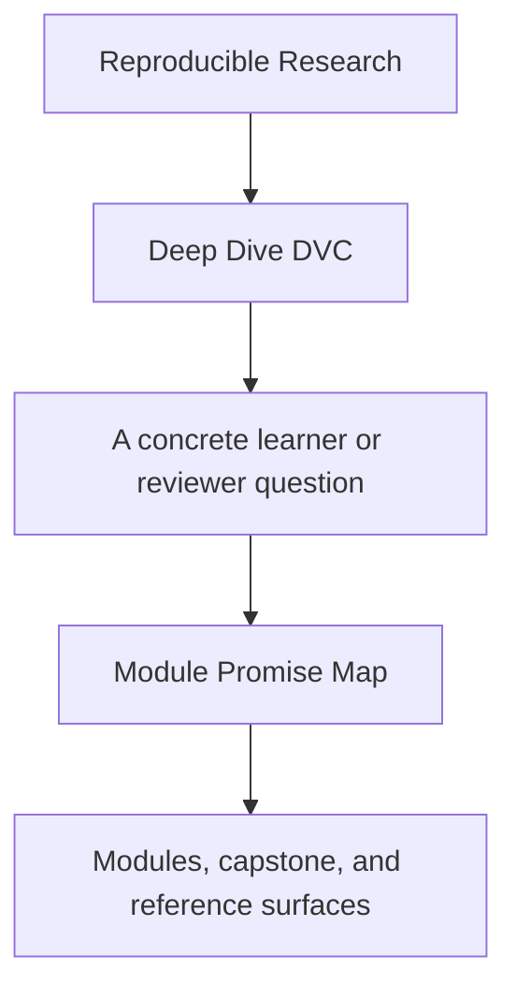
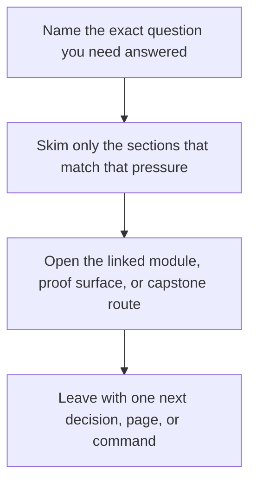

# Module Promise Map

<!-- page-maps:start -->
## Guide Fit

<!-- page-maps:end -->

Read the first diagram as a timing map: this guide is for a named pressure, not for wandering the whole course-book. Read the second diagram as the guide loop: arrive with a concrete question, use only the matching sections, then leave with one smaller and more honest next move.

This page exists because strong module titles are not enough. A learner should be able to
ask, for every module, “what is this module promising me, and how will I know it was
delivered?”

Use this guide when a title sounds right but still feels too broad, too compressed, or
too weakly tied to proof.

---

## How To Read This Page

Each row names four things:

* the module promise
* the boundary of that promise
* the learner outcome the module should leave behind
* the first honest capstone corroboration route

If a module page drifts away from this contract, the drift should become visible here.

[Back to top](#top)

---

## Promise Table

| Module | Promise | Boundary | Learner outcome | First corroboration |
| --- | --- | --- | --- | --- |
| 01 Why Reproducibility Fails | teach why reruns are weaker than explicit state contracts | failure modes, trust questions, state layers | explain why “it runs again” is not enough | `capstone-tour` |
| 02 Data Identity | teach why content-addressed identity matters more than paths | workspace, cache, remote, lockfile identity | distinguish location from durable state identity | `capstone-verify` |
| 03 Environments As Inputs | teach runtime context as part of declared state | environment, toolchain, repo code, validation routes | explain why execution context belongs in the reproducibility story | `capstone-verify` |
| 04 Truthful Pipelines | teach `dvc.yaml` and `dvc.lock` as one explicit execution contract | stages, deps, outs, params, and recorded execution state | review whether a pipeline edge is truly declared | `capstone-repro` |
| 05 Metrics, Parameters, And Meaning | teach semantic comparability instead of metric folklore | params, metrics, reports, publish evidence | say what a metric comparison is allowed to mean | `capstone-verify` |
| 06 Experiments Without Chaos | teach controlled variation without baseline damage | experiment runs, baseline, params, comparison routes | explain how changed runs stay comparable to the baseline | `capstone-experiment-review` |
| 07 Collaboration And CI | teach social contracts around state and verification | reviewability, CI gates, handoff trust, repo policy | explain what another person should be able to rerun and review | `capstone-confirm` |
| 08 Incident Survival | teach production recovery and durability boundaries | cache loss, remote-backed restore, crisis review | explain what survives local loss and why | `capstone-recovery-review` |
| 09 Promotion And Auditability | teach promotion as a smaller trusted boundary | publish surfaces, manifests, release review, promotion evidence | review what is safe for downstream trust | `capstone-release-review` |
| 10 Tool Boundaries | teach stewardship, migration, and handoff judgment | governance, anti-patterns, limits, migration review | decide whether DVC should keep owning the concern | `capstone-confirm` |

[Back to top](#top)

---

## Promise Failures This Page Guards Against

When module titles are strong but unchecked, courses usually fail in one of four ways:

* the title promises judgment, but the module only delivers commands
* the title promises operations, but the proof routes stay abstract
* the title promises promotion or recovery, but the capstone surface never corroborates it
* the title promises governance, but the repository review route remains blurry

This page makes those failures visible before they harden into course drift.

[Back to top](#top)

---

## Best Companion Pages

Use these pages with the promise map:

* [`course-guide.md`](course-guide.md) for the stable learner hub
* [`module-checkpoints.md`](module-checkpoints.md) for the end-of-module review bar
* [`proof-matrix.md`](proof-matrix.md) for claim-to-evidence routing
* [`capstone-map.md`](capstone-map.md) for module-to-capstone entry routes

[Back to top](#top)
