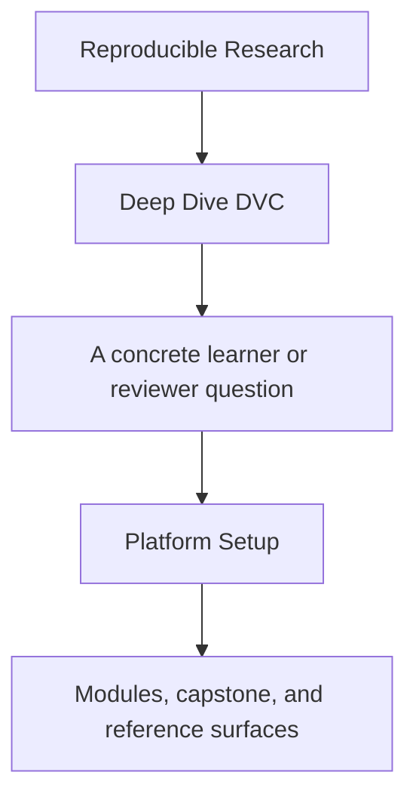
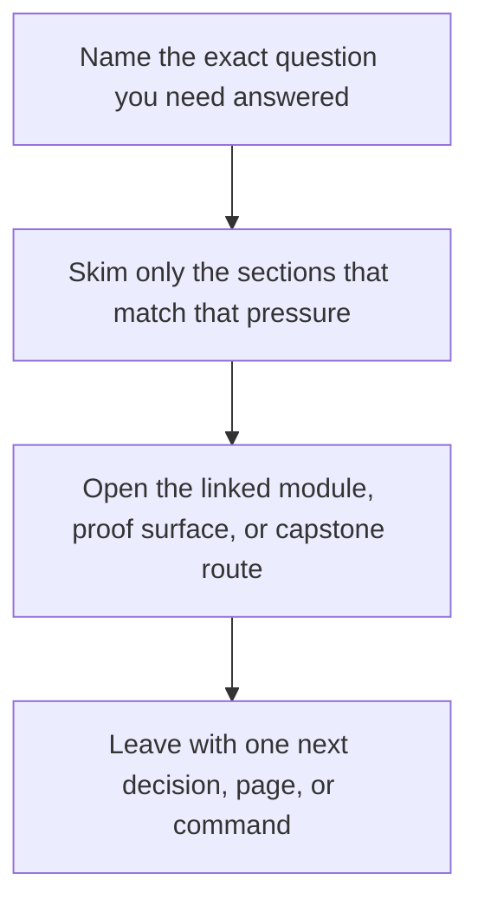

<a id="top"></a>

# Platform Setup


<!-- page-maps:start -->
## Guide Fit




<!-- page-maps:end -->

Read the first diagram as a timing map: this guide is for a named pressure, not for wandering the whole course-book. Read the second diagram as the guide loop: arrive with a concrete question, use only the matching sections, then leave with one smaller and more honest next move.

Deep Dive DVC depends on more than a `dvc` binary existing somewhere on the machine. The
course assumes a small, explicit platform contract.

This page makes that contract clear before the learner hits avoidable setup failures.

Use [`../reference/version-support-guide.md`](../reference/version-support-guide.md) when
you need the longer-lived support contract and drift rules instead of just the initial
setup sequence.

Network note:

- `make install` requires network access the first time because it creates the virtual environment and installs DVC plus the capstone package.
- After that environment exists, the ordinary capstone proof routes are local filesystem workflows unless you deliberately exercise recovery routes that depend on the configured `.dvc-remote/`.

---

## Minimum Tooling

You need:

* Python 3.10 or newer
* Git available on the command line
* DVC available inside the capstone virtual environment
* a writable local filesystem for the capstone remote at `.dvc-remote/`

[Back to top](#top)

---

## Repository Root

The course-level commands use the repository root Makefile:

```sh
make PROGRAM=reproducible-research/deep-dive-dvc program-help
make PROGRAM=reproducible-research/deep-dive-dvc docs-build
```

Use these commands when you want docs or program-level verification.

[Back to top](#top)

---

## Capstone Setup

From `programs/reproducible-research/deep-dive-dvc/capstone/`:

```sh
make install
make platform-report
make dvc-init
make repro
make source-baseline-check
```

That sequence creates the virtual environment, installs DVC plus the capstone package,
prints the supported Python, Git, and DVC versions, initializes `.dvc/`, and configures
the local training remote. `make source-baseline-check` is the fast publish-safety check
when you need to know whether local-only state would leak into a source archive.

On a fresh machine, expect `make install` to be the network-dependent step. If you are
offline, reuse a previously prepared environment instead of assuming the setup flow can
recreate itself.

[Back to top](#top)

---

## Verify Your Setup

From the capstone directory:

```sh
make help
make platform-report
make walkthrough
make verify
```

If `make platform-report` and `make verify` both succeed, the capstone is running inside
the supported toolchain and can validate the publish bundle and read the configured
remote-backed state surfaces.

If you also need a clean learner or review archive, continue with:

```sh
make source-baseline-clean
make source-bundle
```

[Back to top](#top)

---

## Common Setup Failures

| Symptom | Likely cause | Fix |
| --- | --- | --- |
| `python` or `pip` errors during `make install` | missing supported Python | install Python 3.10+ and recreate the virtual environment |
| `dvc` commands fail after install | virtual environment not created or not used through `make` | rerun `make install` and invoke DVC through the Make targets |
| `recovery-drill` fails to restore state | `.dvc-remote/` missing or not writable | rerun `make dvc-init` and verify local filesystem permissions |
| `docs-build` fails while capstone commands work | docs virtual environment missing | run `make PROGRAM=reproducible-research/deep-dive-dvc docs-build` from the repository root |

[Back to top](#top)
