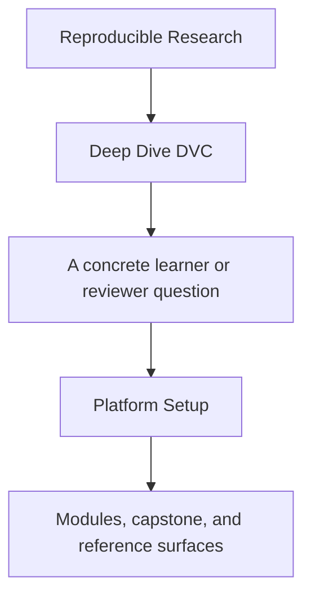
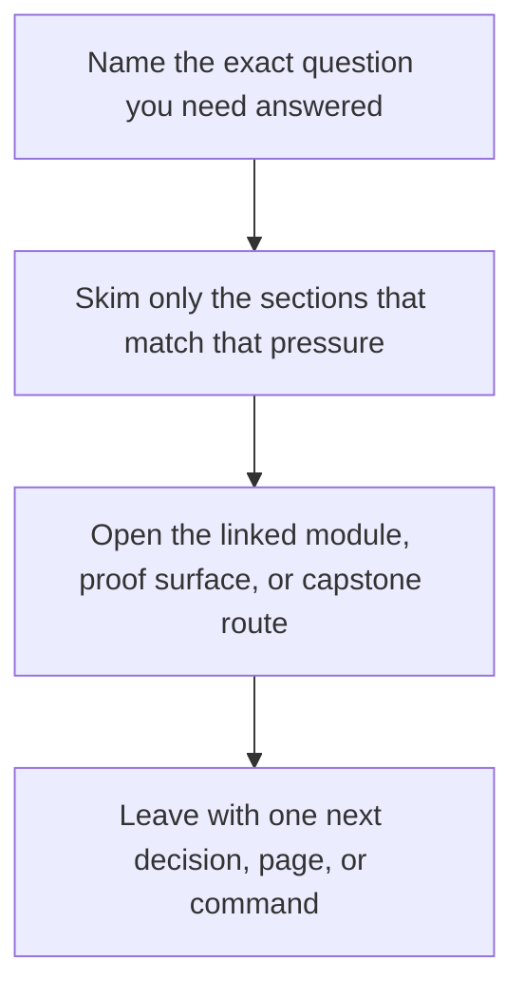

# Platform Setup


<!-- page-maps:start -->
## Guide Fit




<!-- page-maps:end -->

Read the first diagram as a timing map: this guide is for a named pressure, not for wandering the whole course-book. Read the second diagram as the guide loop: arrive with a concrete question, use only the matching sections, then leave with one smaller and more honest next move.

Deep Dive DVC depends on more than a `dvc` binary existing somewhere on the machine. The
course assumes a small, explicit platform contract.

This page makes that contract clear before the learner hits avoidable setup failures.

Network note:

- `make install` requires network access the first time because it creates the virtual environment and installs DVC plus the capstone package.
- After that environment exists, the ordinary capstone proof routes are local filesystem workflows unless you deliberately exercise recovery routes that depend on the configured `.dvc-remote/`.

---

## Minimum Tooling

You need:

* Python 3.10 or newer
* Git available on the command line
* DVC available inside the capstone virtual environment
* a writable local filesystem for the capstone remote at `.dvc-remote/`

---

## Supported Toolchain Contract

These are the supported boundaries for the course and capstone:

- Python 3.10 or newer, matching the floor declared in `capstone/pyproject.toml`
- Git available on the command line
- DVC installed inside the capstone-managed virtual environment through `make install`
- a writable local filesystem remote for `.dvc-remote/`

The support promise is tied to the capstone-managed environment, not to whichever
system-level `dvc` binary happens to be installed on the machine.

The support promise also assumes you distinguish setup-time network requirements from
normal proof routes: creating the environment through `make install` needs package
downloads, while ordinary local verification after setup does not.

---

## Truth Sources For Version Discipline

Use these files and commands as the authoritative support surfaces:

| Surface | What it tells you |
| --- | --- |
| `capstone/pyproject.toml` | the supported Python floor for the packaged capstone |
| `capstone/Makefile` `install` target | how the supported environment is created and which tools are installed into it |
| `capstone/Makefile` `platform-report` target | the actual Python, Git, and DVC versions in the supported environment |
| `make verify` and proof routes | whether the current toolchain still honors the course contract in practice |

If one of these surfaces changes, this guide should change with it.

---

## Repository Root

The course-level commands use the repository root Makefile:

```sh
make PROGRAM=reproducible-research/deep-dive-dvc program-help
make PROGRAM=reproducible-research/deep-dive-dvc docs-build
```

Use these commands when you want docs or program-level verification.

---

## Capstone Setup

From `programs/reproducible-research/deep-dive-dvc/capstone/`:

```sh
make install
make platform-report
make dvc-init
make repro
make source-baseline-check
```

That sequence creates the virtual environment, installs DVC plus the capstone package,
prints the supported Python, Git, and DVC versions, initializes `.dvc/`, and configures
the local training remote. `make source-baseline-check` is the fast publish-safety check
when you need to know whether local-only state would leak into a source archive.

On a fresh machine, expect `make install` to be the network-dependent step. If you are
offline, reuse a previously prepared environment instead of assuming the setup flow can
recreate itself.

---

## Verify Your Setup

From the capstone directory:

```sh
make help
make platform-report
make walkthrough
make verify
```

If `make platform-report` and `make verify` both succeed, the capstone is running inside
the supported toolchain and can validate the publish bundle and read the configured
remote-backed state surfaces.

If you also need a clean learner or review archive, continue with:

```sh
make source-baseline-clean
make source-bundle
```

---

## Common Setup Failures

| Symptom | Likely cause | Fix |
| --- | --- | --- |
| `python` or `pip` errors during `make install` | missing supported Python | install Python 3.10+ and recreate the virtual environment |
| `dvc` commands fail after install | virtual environment not created or not used through `make` | rerun `make install` and invoke DVC through the Make targets |
| `recovery-drill` fails to restore state | `.dvc-remote/` missing or not writable | rerun `make dvc-init` and verify local filesystem permissions |
| `docs-build` fails while capstone commands work | docs virtual environment missing | run `make PROGRAM=reproducible-research/deep-dive-dvc docs-build` from the repository root |

---

## Drift Signals

Treat these as signs that you need to re-check the support contract:

- Python upgraded locally and the capstone virtual environment was not recreated
- Git changed enough to alter repository or line-ending behavior
- DVC was installed or upgraded outside `make install`
- `make verify` or `make recovery-audit` starts failing after tool changes
- the course docs still mention a setup flow that no longer matches the capstone Makefile

---

## What This Guide Deliberately Does Not Promise

- It does not promise support for arbitrary system-wide DVC installs outside the capstone environment.
- It does not treat “the command exists” as enough; the verification route still decides whether the environment is trustworthy.
- It does not promise frozen behavior across every future DVC release without rerunning the course proof routes.

That restraint is intentional. Reproducibility training should be explicit about where
tool support stops and verification begins.

