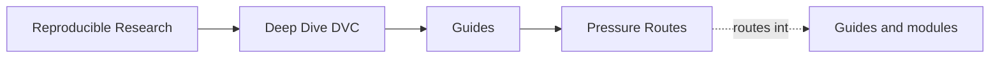
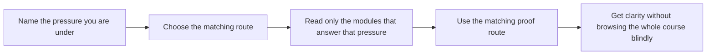

# Pressure Routes

<!-- page-maps:start -->
## Page Maps

<!-- page-maps:end -->

This page fixes a human problem, not a technical one: learners do not always arrive with
the calm, ideal “read everything in order” mindset. Sometimes they are new. Sometimes
they are inheriting a repository with muddy state. Sometimes they are trying to review
promotion or recovery under pressure.

Use this page when your pressure is shaping what you can realistically read.

---

## Four Common Pressures

| Pressure | What you need first | Best route |
| --- | --- | --- |
| first contact | a safe state model and low cognitive load | `start-here` -> Module 00 -> Modules 01-02 -> `capstone-tour` |
| inherited repository repair | fast diagnosis and high-value repairs | Module 01 -> Module 04 -> Module 07 -> `capstone-verify` |
| promotion and stewardship review | downstream trust, auditability, and migration judgment | Module 05 -> Module 08 -> Module 09 -> Module 10 -> `capstone-release-review` |
| recovery pressure | quickest route from lost local state to durable truth | Module 08 -> `verification-route-guide` -> `capstone-recovery-review` |

[Back to top](#top)

---

## Route Details

### First Contact

Use this when DVC still feels foreign.

1. [`start-here.md`](start-here.md)
2. [`module-00-orientation/index.md`](../module-00-orientation/index.md)
3. Modules 01 and 02
4. [`module-checkpoints.md`](module-checkpoints.md)
5. [`readme-capstone.md`](readme-capstone.md)

### Inherited Repository Repair

Use this when you already have a repository that runs but is hard to trust.

1. [`anti-pattern-atlas.md`](../reference/anti-pattern-atlas.md)
2. Module 01
3. Module 04
4. Module 07
5. [`capstone-map.md`](capstone-map.md)

### Promotion And Stewardship Review

Use this when the concern is downstream trust and long-lived ownership.

1. Module 05
2. Module 08
3. Module 09
4. Module 10
5. [`proof-ladder.md`](proof-ladder.md), then `capstone-confirm`

### Recovery Pressure

Use this when the repository already lost local state and you need the shortest route to durable truth.

1. [`verification-route-guide.md`](../reference/verification-route-guide.md)
2. Module 08
3. [`authority-map.md`](../reference/authority-map.md)
4. [`capstone-map.md`](capstone-map.md)
5. `capstone-recovery-review`

[Back to top](#top)

---

## Pressure Mistakes This Page Prevents

This page exists to prevent these clumsy reading mistakes:

* starting in experiments when the real problem is still state identity
* using the capstone as first exposure during panic
* reading every support page when one pressure-specific route would do
* treating governance pages as a substitute for recovery or promotion knowledge

[Back to top](#top)

---

## Best Companion Pages

Use these with the pressure routes:

* [`course-guide.md`](course-guide.md) for the stable support hub
* [`module-promise-map.md`](module-promise-map.md) to keep titles honest
* [`proof-ladder.md`](proof-ladder.md) to size proof correctly
* [`topic-boundaries.md`](../reference/topic-boundaries.md) to know what the course does and does not center

[Back to top](#top)
