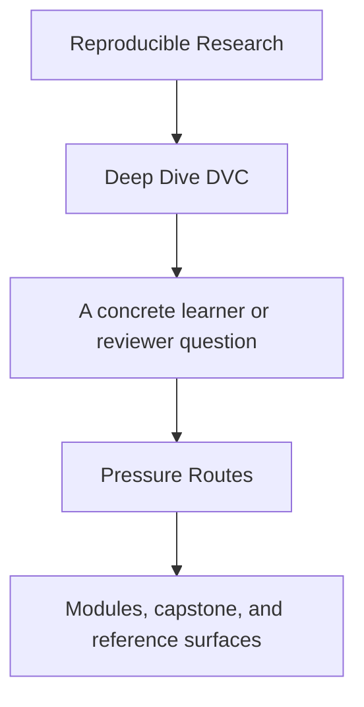
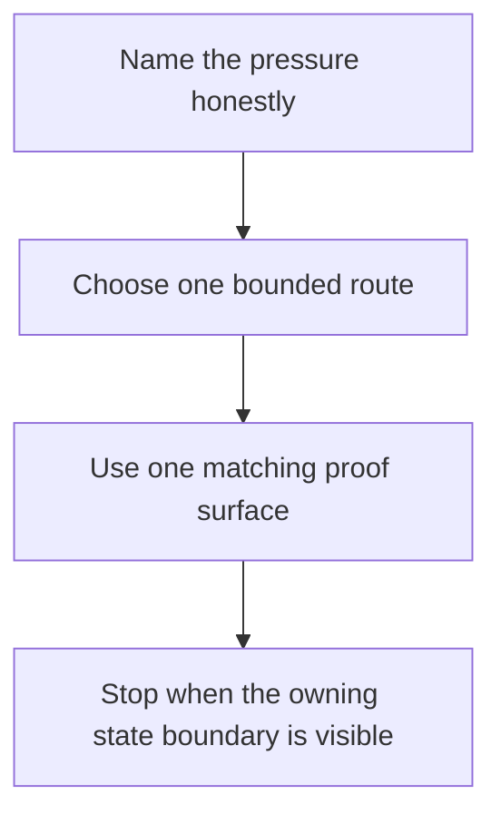

# Pressure Routes

<!-- page-maps:start -->
## Guide Fit

<!-- page-maps:end -->

Read the first diagram as a timing map: this page is for non-ideal reading conditions,
not calm full-course study. Read the second diagram as the loop: name the pressure,
choose one bounded route, use one proof surface, then stop when the owning state
boundary is visible.

Use this page when urgency is shaping what you can realistically read.

## Choose the route that matches the pressure

| Pressure | First page | First module or reference | First proof surface | Stop when you can name... |
| --- | --- | --- | --- | --- |
| first contact | [Start Here](start-here.md) | [Module 00](../module-00-orientation/index.md), [Module 01](../module-01-reproducibility-failures-real-teams/index.md) | [Capstone Guide](../capstone/index.md) | one authoritative state layer and one reason the capstone is not first contact |
| inherited repository repair | [Anti-Pattern Atlas](../reference/anti-pattern-atlas.md) | [Module 01](../module-01-reproducibility-failures-real-teams/index.md), [Module 04](../module-04-truthful-pipelines-declared-dependencies/index.md) | [Command Guide](../capstone/command-guide.md) | whether the failure is identity, pipeline truth, collaboration drift, or recovery |
| promotion and stewardship review | [Course Guide](course-guide.md) | [Module 05](../module-05-metrics-parameters-comparable-meaning/index.md), [Module 09](../module-09-promotion-registry-boundaries-auditability/index.md), [Module 10](../module-10-migration-governance-dvc-boundaries/index.md) | [Release Audit Checklist](../capstone/release-audit-checklist.md) | what downstream trust depends on and what remains internal state |
| recovery pressure | [Verification Route Guide](../reference/verification-route-guide.md) | [Module 08](../module-08-recovery-scale-incident-survival/index.md), [Authority Map](../reference/authority-map.md) | [Capstone Review Worksheet](../capstone/capstone-review-worksheet.md) | what survives local loss, what depends on the remote, and the next confirming command |

## What not to do under pressure

- do not start with the whole capstone repository
- do not escalate to the strongest proof route because the situation feels urgent
- do not read promotion or governance pages before the current state boundary is named
- do not open every support page when one route already matches the pressure

## Good companion pages

- [Module Promise Map](module-promise-map.md) when the route needs a sharper module contract
- [Proof Ladder](proof-ladder.md) when the current command still feels too heavy
- [Capstone Map](../capstone/capstone-map.md) when you know the module but not the repository surface
- [Topic Boundaries](../reference/topic-boundaries.md) when the pressure is really outside the course boundary

## Good stopping point

Stop when you know which state boundary owns the current problem and which next page or
command would test that claim directly. If you still cannot name the boundary, return to
the table above instead of widening the reading surface.
