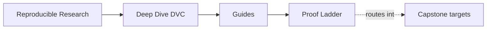
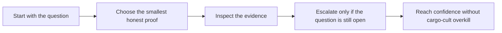

# Proof Ladder

<!-- page-maps:start -->
## Page Maps

<!-- page-maps:end -->

This page fixes a recurring problem: the course has enough proof routes that learners can
easily overreach. They run the strongest command first, get buried in evidence, and lose
the trust question they were trying to settle.

Use this page to keep proof proportional to the question.

---

## The Ladder

Move down this ladder only when the smaller step no longer answers the question honestly.

| Proof level | Command | Best use | Cost |
| --- | --- | --- | --- |
| 1 | `make PROGRAM=reproducible-research/deep-dive-dvc capstone-tour` | first contact with repository meaning | low |
| 2 | `make PROGRAM=reproducible-research/deep-dive-dvc capstone-verify` | ordinary executable proof of current repository truth | low to medium |
| 3 | `make PROGRAM=reproducible-research/deep-dive-dvc capstone-verify-report` | durable saved verification evidence | medium |
| 4 | `make PROGRAM=reproducible-research/deep-dive-dvc capstone-experiment-review` | focused review of changed experiment state | medium |
| 5 | `make PROGRAM=reproducible-research/deep-dive-dvc capstone-recovery-review` | focused review of remote-backed recovery truth | medium |
| 6 | `make PROGRAM=reproducible-research/deep-dive-dvc capstone-release-review` | focused review of published state and promotion trust | medium |
| 7 | `make PROGRAM=reproducible-research/deep-dive-dvc capstone-confirm` | strongest stewardship and confirmation pass | highest |

[Back to top](#top)

---

## Which Questions Belong To Which Level

| Question | Start at |
| --- | --- |
| what is this repository trying to prove | capstone-tour |
| does the current repository state still match the contract | capstone-verify |
| do I need durable verification evidence I can review later | capstone-verify-report |
| how should I compare experiment candidates | capstone-experiment-review |
| what survives cache loss and remote restore | capstone-recovery-review |
| what is safe for downstream trust | capstone-release-review |
| is this repository ready for the strongest stewardship pass | capstone-confirm |

[Back to top](#top)

---

## Anti-Patterns This Ladder Prevents

The ladder exists to prevent these clumsy review habits:

* running `capstone-confirm` when `capstone-tour` would answer the question
* treating one large bundle as automatically better than a narrower one
* confusing recovery review with release review
* burying a first-contact learner in governance evidence before state identity is legible

[Back to top](#top)

---

## Best Companion Pages

Use these with the ladder:

* [`command-guide.md`](command-guide.md) for command-layer boundaries
* [`proof-matrix.md`](proof-matrix.md) for claim-to-evidence routing
* [`capstone-map.md`](capstone-map.md) for module-aware entry routes
* [`verification-route-guide.md`](../reference/verification-route-guide.md) when the question is still too fuzzy to prove well

[Back to top](#top)
