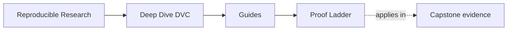
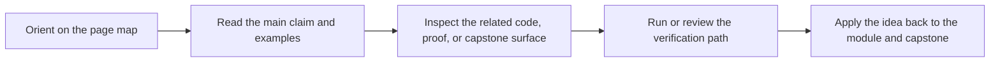

# Proof Ladder

<!-- page-maps:start -->
## Page Maps

<!-- page-maps:end -->

Use this page when you know the question but not the right amount of evidence. The common
failure in this program is not too little effort. It is jumping straight to the strongest
bundle, then losing the original trust question inside the output.

## Rule for using the ladder

Start at the smallest route that could honestly falsify your claim. Move down only when
the smaller route leaves an important part of the question unanswered.

That means:

- first contact should not start with `capstone-confirm`
- a release-boundary question does not need a recovery bundle
- a recovery question should not start with promotion evidence

## The ladder

| Level | Start here when the question is... | First route |
| --- | --- | --- |
| 1 | what is this repository even trying to prove | `make PROGRAM=reproducible-research/deep-dive-dvc capstone-walkthrough` |
| 2 | does the current repository state still match the declared contract | `make PROGRAM=reproducible-research/deep-dive-dvc capstone-verify` |
| 3 | do I need a saved verification bundle I can review later | `make PROGRAM=reproducible-research/deep-dive-dvc capstone-verify-report` |
| 4 | do I need to compare experiment candidates without mutating the baseline story | `make PROGRAM=reproducible-research/deep-dive-dvc capstone-experiment-review` |
| 5 | do I need to inspect what survives local loss and remote restore | `make PROGRAM=reproducible-research/deep-dive-dvc capstone-recovery-review` |
| 6 | do I need to audit what is safe for downstream trust | `make PROGRAM=reproducible-research/deep-dive-dvc capstone-release-review` |
| 7 | am I ready for the strongest stewardship and confirmation pass | `make PROGRAM=reproducible-research/deep-dive-dvc capstone-confirm` |

## Start points by claim

| Claim | Start here |
| --- | --- |
| "I need a bounded first pass through the capstone." | capstone-walkthrough |
| "I need to know whether declared and recorded state still agree." | capstone-verify |
| "I need durable verification evidence, not terminal scrollback." | capstone-verify-report |
| "I need to compare changed runs without confusing them with the baseline." | capstone-experiment-review |
| "I need to know what survives cache loss." | capstone-recovery-review |
| "I need to know what downstream users may trust." | capstone-release-review |
| "I need the strongest overall confirmation before major change." | capstone-confirm |

## Bad escalation habits

If you are using the ladder badly, it usually looks like one of these:

- choosing `capstone-confirm` because you feel uncertain, not because the question needs it
- using `capstone-release-review` when `capstone-verify` would answer the current-state question directly
- reading large saved bundles before you know what claim they are supposed to support
- treating a stronger route as automatically more honest than a narrower one

The stronger route is only better when it answers a different question.

## Best companion pages

- [Proof Matrix](proof-matrix.md) when you know the claim but need the first evidence surface
- [Command Guide](../capstone/command-guide.md) when the command layer itself is unclear
- [Capstone Map](../capstone/capstone-map.md) when you know the module but not the repository route

