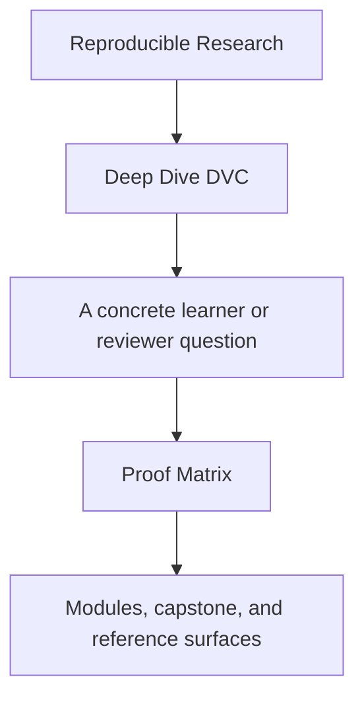
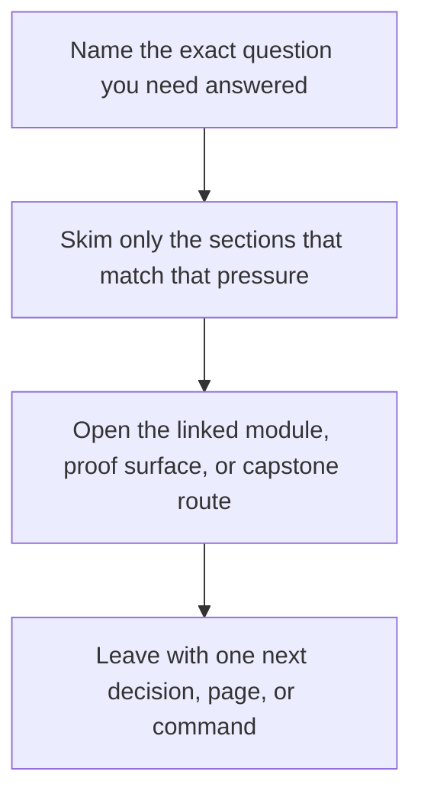

# Proof Matrix

<!-- page-maps:start -->
## Guide Fit

<!-- page-maps:end -->

Read the first diagram as a timing map: this guide is for a named pressure, not for wandering the whole course-book. Read the second diagram as the guide loop: arrive with a concrete question, use only the matching sections, then leave with one smaller and more honest next move.

This page maps the course's main claims to the commands and files that prove them.

Use it when you care about a concept but want the fastest evidence route.

---

## Core State Claims

| Claim | Command | File surfaces |
| --- | --- | --- |
| data identity is not only a path name | `make PROGRAM=reproducible-research/deep-dive-dvc capstone-walkthrough` | `capstone/data/raw/service_incidents.csv`, `capstone/dvc.lock`, `capstone/.dvc-remote/` |
| the pipeline declaration and the recorded run are different evidence types | `make PROGRAM=reproducible-research/deep-dive-dvc capstone-walkthrough` | `capstone/dvc.yaml`, `capstone/dvc.lock` |
| the pipeline declares the real change surface | `make PROGRAM=reproducible-research/deep-dive-dvc capstone-repro` | `capstone/dvc.yaml`, `capstone/dvc.lock`, `capstone/state/` |
| params are part of recorded execution meaning | `make PROGRAM=reproducible-research/deep-dive-dvc capstone-verify` | `capstone/params.yaml`, `capstone/dvc.lock` |
| metrics are reviewable state, not only console output | `make PROGRAM=reproducible-research/deep-dive-dvc capstone-verify` | `capstone/metrics/metrics.json`, `capstone/publish/v1/metrics.json` |
| promoted outputs are smaller than internal repository state | `make PROGRAM=reproducible-research/deep-dive-dvc capstone-tour` | `capstone/publish/v1/`, `capstone/state/`, `course-book/capstone/index.md`, `capstone/publish/v1/manifest.json` |
| repository layers have distinct reading responsibilities | `make PROGRAM=reproducible-research/deep-dive-dvc capstone-walkthrough` | `course-book/capstone/capstone-file-guide.md`, `capstone/dvc.yaml` |

---

## Operational Claims

| Claim | Command | File surfaces |
| --- | --- | --- |
| the repository can rebuild its promoted contract | `make PROGRAM=reproducible-research/deep-dive-dvc capstone-verify` | `capstone/publish/v1/manifest.json`, `capstone/src/incident_escalation_capstone/verify.py` |
| experiments can vary parameters without mutating the baseline contract | `make PROGRAM=reproducible-research/deep-dive-dvc capstone-experiment-review` | `capstone/params.yaml`, `capstone/dvc.lock` |
| another person can run the same proof targets through the public interface | `make PROGRAM=reproducible-research/deep-dive-dvc program-help` | `Makefile`, `programs/reproducible-research/deep-dive-dvc/Makefile`, `capstone/Makefile` |
| remote-backed recovery still works after local loss | `make PROGRAM=reproducible-research/deep-dive-dvc capstone-recovery-drill` | `capstone/.dvc-remote/`, `capstone/publish/v1/` |
| the full repository can defend itself under review | `make PROGRAM=reproducible-research/deep-dive-dvc capstone-confirm` | `course-book/capstone/index.md`, `capstone/dvc.yaml`, `capstone/dvc.lock`, `course-book/capstone/capstone-review-worksheet.md` |
| the promoted bundle can be audited without the whole internal repository story | `make PROGRAM=reproducible-research/deep-dive-dvc capstone-verify` | `capstone/publish/v1/manifest.json`, `course-book/capstone/release-review-guide.md` |

---

## Review Questions

| Question | Best first command | Best first file |
| --- | --- | --- |
| what exactly changed between declaration and recorded execution | `make PROGRAM=reproducible-research/deep-dive-dvc capstone-walkthrough` | `capstone/dvc.lock` |
| which parameters are safe to compare across runs | `make PROGRAM=reproducible-research/deep-dive-dvc capstone-verify` | `capstone/params.yaml` |
| which artifacts are safe for downstream trust | `make PROGRAM=reproducible-research/deep-dive-dvc capstone-tour` | `capstone/publish/v1/manifest.json` |
| which state survives local cache loss | `make PROGRAM=reproducible-research/deep-dive-dvc capstone-recovery-drill` | `course-book/capstone/index.md` |
| which verification route fits my question | `make PROGRAM=reproducible-research/deep-dive-dvc program-help` | `course-book/reference/verification-route-guide.md` |
| what should I inspect before migration | `make PROGRAM=reproducible-research/deep-dive-dvc capstone-confirm` | `capstone/dvc.yaml` |
| how should I read the repository layers | `make PROGRAM=reproducible-research/deep-dive-dvc capstone-walkthrough` | `course-book/capstone/capstone-file-guide.md` |
| how should I audit the promoted release boundary | `make PROGRAM=reproducible-research/deep-dive-dvc capstone-verify` | `course-book/capstone/release-review-guide.md` |

---

## Companion Pages

The most useful companion pages for this matrix are:

* [`capstone/command-guide.md`](../capstone/command-guide.md)
* [`verification-route-guide.md`](../reference/verification-route-guide.md)
* [`authority-map.md`](../reference/authority-map.md)
* [`evidence-boundary-guide.md`](../reference/evidence-boundary-guide.md)
* [`capstone-file-guide.md`](../capstone/capstone-file-guide.md)
* [`capstone-map.md`](../capstone/capstone-map.md)
* [`practice-map.md`](../reference/practice-map.md)
* [`release-review-guide.md`](../capstone/release-review-guide.md)

