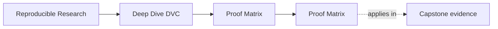
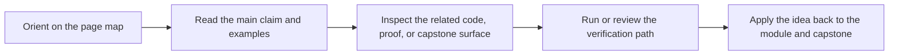

# Proof Matrix

<!-- page-maps:start -->
## Page Maps

<!-- page-maps:end -->

This page maps the course's main claims to the commands and files that prove them.

Use it when you care about a concept but want the fastest evidence route.

---

## Core State Claims

| Claim | Command | File surfaces |
| --- | --- | --- |
| data identity is not only a path name | `make -C capstone walkthrough` | `capstone/data/raw/service_incidents.csv`, `capstone/dvc.lock`, `capstone/.dvc-remote/` |
| the pipeline declaration and the recorded run are different evidence types | `make -C capstone walkthrough` | `capstone/dvc.yaml`, `capstone/dvc.lock` |
| the pipeline declares the real change surface | `make -C capstone repro` | `capstone/dvc.yaml`, `capstone/dvc.lock`, `capstone/state/` |
| params are part of recorded execution meaning | `make -C capstone verify` | `capstone/params.yaml`, `capstone/dvc.lock` |
| metrics are reviewable state, not only console output | `make -C capstone verify` | `capstone/metrics/metrics.json`, `capstone/publish/v1/metrics.json` |
| promoted outputs are smaller than internal repository state | `make -C capstone tour` | `capstone/publish/v1/`, `capstone/state/`, `capstone/README.md`, `capstone/publish/v1/manifest.json` |
| repository layers have distinct reading responsibilities | `make PROGRAM=reproducible-research/deep-dive-dvc capstone-walkthrough` | `course-book/repository-layer-guide.md`, `course-book/capstone-file-guide.md` |

[Back to top](#top)

---

## Operational Claims

| Claim | Command | File surfaces |
| --- | --- | --- |
| the repository can rebuild its promoted contract | `make PROGRAM=reproducible-research/deep-dive-dvc capstone-verify` | `capstone/publish/v1/manifest.json`, `capstone/src/incident_escalation_capstone/verify.py` |
| experiments can vary parameters without mutating the baseline contract | `dvc exp run --cwd capstone` | `capstone/params.yaml`, `capstone/dvc.lock` |
| another person can run the same proof targets through the public interface | `make PROGRAM=reproducible-research/deep-dive-dvc program-help` | `Makefile`, `programs/reproducible-research/deep-dive-dvc/Makefile`, `capstone/Makefile` |
| remote-backed recovery still works after local loss | `make -C capstone recovery-drill` | `capstone/.dvc-remote/`, `capstone/publish/v1/` |
| the full repository can defend itself under review | `make PROGRAM=reproducible-research/deep-dive-dvc capstone-confirm` | `capstone/README.md`, `capstone/dvc.yaml`, `capstone/dvc.lock`, `course-book/capstone-review-worksheet.md` |
| the promoted bundle can be audited without the whole internal repository story | `make -C capstone verify` | `capstone/publish/v1/manifest.json`, `course-book/release-audit-checklist.md` |

[Back to top](#top)

---

## Review Questions

| Question | Best first command | Best first file |
| --- | --- | --- |
| what exactly changed between declaration and recorded execution | `make -C capstone walkthrough` | `capstone/dvc.lock` |
| which parameters are safe to compare across runs | `make -C capstone verify` | `capstone/params.yaml` |
| which artifacts are safe for downstream trust | `make -C capstone tour` | `capstone/publish/v1/manifest.json` |
| which state survives local cache loss | `make -C capstone recovery-drill` | `capstone/README.md` |
| which verification route fits my question | `make PROGRAM=reproducible-research/deep-dive-dvc program-help` | `course-book/verification-route-guide.md` |
| what should I inspect before migration | `make -C capstone confirm` | `capstone/dvc.yaml` |
| how should I read the repository layers | `make PROGRAM=reproducible-research/deep-dive-dvc capstone-walkthrough` | `course-book/repository-layer-guide.md` |
| how should I audit the promoted release boundary | `make -C capstone verify` | `course-book/release-audit-checklist.md` |

[Back to top](#top)

---

## Companion Pages

The most useful companion pages for this matrix are:

* [`command-guide.md`](command-guide.md)
* [`verification-route-guide.md`](verification-route-guide.md)
* [`authority-map.md`](authority-map.md)
* [`evidence-boundary-guide.md`](evidence-boundary-guide.md)
* [`repository-layer-guide.md`](repository-layer-guide.md)
* [`practice-map.md`](practice-map.md)
* [`capstone-file-guide.md`](capstone-file-guide.md)
* [`release-audit-checklist.md`](release-audit-checklist.md)

[Back to top](#top)
