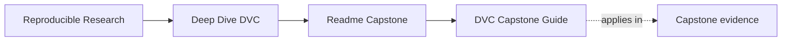

# DVC Capstone Guide


<!-- page-maps:start -->
## Page Maps




<!-- page-maps:end -->

The DVC capstone is the course’s executable proof. It is where the course stops making
claims in prose and starts exposing state that can be inspected, reproduced, compared,
and restored.

## What this capstone is proving

The capstone is a small incident-escalation prediction repository with:

- committed source data
- a truthful four-stage `dvc.yaml` graph
- declared parameters in `params.yaml`
- tracked metrics and predictions
- a stable `publish/v1/` boundary
- a recovery drill that rebuilds the workspace from a DVC remote after cache loss

Its size is deliberate. The repository is small enough to study completely and large
enough to force real design choices about state.

## How to use it while reading

- After Module 02, inspect which artifacts are identity-bearing state and which are projections.
- After Module 04, inspect `dvc.yaml` and `dvc.lock` together and ask whether every meaningful edge is declared.
- After Module 06, inspect `params.yaml`, metrics, and the publish bundle and ask what makes runs comparable.
- After Module 07 and Module 08, inspect the push and recovery targets and ask which guarantees depend on remote durability.
- After Module 09, inspect `publish/v1/`, `manifest.json`, and promoted params or metrics as the release boundary.
- In Module 10, use the repository as a review specimen for stewardship judgment rather than a first-contact example.

If you want a module-by-module route through the repository, start with
[Capstone Map](capstone-map.md).

## Best entrypoints

- Capstone map: [capstone-map.md](capstone-map.md)
- Capstone architecture: [capstone-architecture-guide.md](capstone-architecture-guide.md)
- Repository guide: [`capstone/README.md`](https://github.com/bijux/bijux-masterclass/blob/master/programs/reproducible-research/deep-dive-dvc/capstone/README.md)
- Repository architecture: [`capstone/ARCHITECTURE.md`](https://github.com/bijux/bijux-masterclass/blob/master/programs/reproducible-research/deep-dive-dvc/capstone/ARCHITECTURE.md)
- Experiment route: [`capstone/EXPERIMENT_GUIDE.md`](https://github.com/bijux/bijux-masterclass/blob/master/programs/reproducible-research/deep-dive-dvc/capstone/EXPERIMENT_GUIDE.md)
- Recovery route: [`capstone/RECOVERY_GUIDE.md`](https://github.com/bijux/bijux-masterclass/blob/master/programs/reproducible-research/deep-dive-dvc/capstone/RECOVERY_GUIDE.md)
- Release route: [`capstone/RELEASE_REVIEW_GUIDE.md`](https://github.com/bijux/bijux-masterclass/blob/master/programs/reproducible-research/deep-dive-dvc/capstone/RELEASE_REVIEW_GUIDE.md)
- Pipeline graph: [`capstone/dvc.yaml`](https://github.com/bijux/bijux-masterclass/blob/master/programs/reproducible-research/deep-dive-dvc/capstone/dvc.yaml)
- Declared inputs: [`capstone/params.yaml`](https://github.com/bijux/bijux-masterclass/blob/master/programs/reproducible-research/deep-dive-dvc/capstone/params.yaml)
- Verification logic: [`capstone/src/incident_escalation_capstone/verify.py`](https://github.com/bijux/bijux-masterclass/blob/master/programs/reproducible-research/deep-dive-dvc/capstone/src/incident_escalation_capstone/verify.py)

## Core commands

```bash
make -C capstone walkthrough
make -C capstone repro
make -C capstone verify
make -C capstone confirm
make -C capstone tour
```

## What to inspect during review

- Which state is authoritative and which state is derived?
- Which parameter changes should invalidate comparisons?
- Which artifacts are safe to promote to downstream consumers?
- Which guarantees would disappear if the local cache were deleted today?
