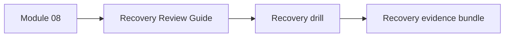
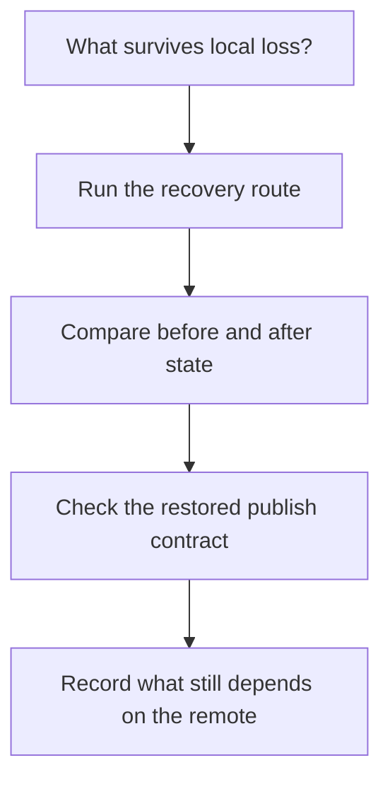

# Recovery Review Guide

<!-- page-maps:start -->
## Page Maps

<!-- page-maps:end -->

Use this guide when studying Module 08 or when reviewing whether the capstone’s recovery
story is real rather than aspirational.

## Questions to answer

- Which restored artifacts came from the remote rather than the working tree?
- Which downstream trust claims survive because `publish/v1/` and `dvc.lock` were restored together?
- Which repository facts still require internal evidence beyond the publish bundle?

## Best route

1. Read [Authority Map](../reference/authority-map.md).
2. Run `make -C capstone recovery-drill`.
3. Run `make -C capstone recovery-review`.
4. Read `capstone/RECOVERY_GUIDE.md`.
5. Inspect the recovery bundle beside [Evidence Boundary Guide](../reference/evidence-boundary-guide.md).
