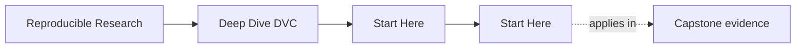
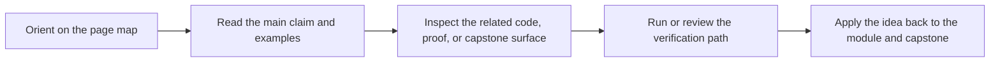

<a id="top"></a>

# Start Here


<!-- page-maps:start -->
## Page Maps




<!-- page-maps:end -->

Deep Dive DVC is not a command catalog. It is a course about making state explicit
enough that another person can recover, compare, release, and defend results later.

Use this page to pick the right entry route before you start reading modules out of
sequence.

---

## Who This Course Helps Most

This course is a strong fit if you are:

* learning DVC for the first time and want a principled state model instead of only commands
* inheriting a repository where data, params, and experiments are hard to trust
* already using DVC but still unsure what state is truly authoritative
* reviewing whether a repository can survive handoff, recovery, and promotion pressure

This course is a weak fit if you only want a quick command reminder without system
design trade-offs.

[Back to top](#top)

---

## Pick Your Route

### Route 1: First Contact

Choose this if DVC still feels new.

1. Read [`course-guide.md`](course-guide.md)
2. Read [`module-00.md`](../module-00-orientation/index.md)
3. Read [`module-01.md`](../module-01.md)
4. Read [`module-02.md`](../module-02.md)
5. Enter the capstone only after the state-layer model feels clear

### Route 2: Repair An Existing Repository

Choose this if you already work on a DVC repository.

1. Read [`authority-map.md`](../reference/authority-map.md)
2. Read [`module-01.md`](../module-01.md)
3. Read [`module-04.md`](../module-04.md)
4. Read [`module-07.md`](../module-07.md)
5. Read [`module-08.md`](../module-08.md)
6. Use [`capstone-map.md`](capstone-map.md) to inspect the reference repository selectively

### Route 3: Reproducibility Stewardship

Choose this if your main concern is promotion, auditability, and long-lived state.

1. Read [`evidence-boundary-guide.md`](../reference/evidence-boundary-guide.md)
2. Read [`module-05.md`](../module-05.md)
3. Read [`module-08.md`](../module-08.md)
4. Read [`module-09.md`](../module-09.md)
5. Read [`module-10.md`](../module-10.md)
6. Finish with the capstone review route

[Back to top](#top)

---

## What Success Looks Like

You are using the course correctly if you can do all of this without hand-waving:

* explain which layer of state is authoritative
* distinguish workspace state, Git state, cache state, and remote durability
* explain why a pipeline stage should or should not rerun
* say which params, metrics, and publish artifacts are safe for downstream trust

If those answers are still vague, stay in the smaller module surfaces before using the
capstone as your main learning surface.

[Back to top](#top)

---

## Best First Commands

From the repository root:

```bash
make PROGRAM=reproducible-research/deep-dive-dvc test
```

From the capstone:

```bash
make -C capstone tour
make -C capstone confirm
```

Then use:

* [`capstone-map.md`](capstone-map.md) when you want the repository route by module
* [`module-00.md`](../module-00-orientation/index.md) when you want the full course arc
* [`course-guide.md`](course-guide.md) when you want the right support page quickly
* [`verification-route-guide.md`](../reference/verification-route-guide.md) when you need the right proof path after the first walkthrough

[Back to top](#top)
