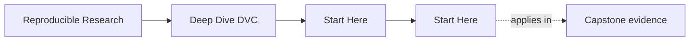
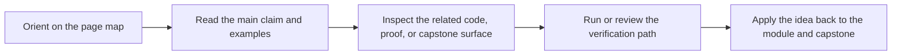

# Start Here

<!-- page-maps:start -->
## Page Maps

<!-- page-maps:end -->

Deep Dive DVC is not a command catalog. It is a course about making state explicit
enough that another person can recover, compare, release, and defend results later.

Use this page to pick the right entry route before you start reading modules out of
sequence.

## Use This Course If

- you are learning DVC and want a principled state model instead of only command recall
- you inherited a repository where data, params, metrics, or experiments are hard to trust
- you already use DVC but still cannot say which state is authoritative
- you review whether a repository can survive handoff, recovery, and promotion pressure

## Do Not Start Here If

- you only want a quick command reminder without system trade-offs
- you want tooling advice before you can explain the repository's state model
- you want to treat remotes, metrics, and publish artifacts as interchangeable surfaces

## Best Reading Route

1. Read [Course Home](../index.md) for the program promise and support surfaces.
2. Read [Course Guide](course-guide.md) for the module arc and page roles.
3. Read [Learning Contract](learning-contract.md) before you start Module 01.
4. Read [Module 00](../module-00-orientation/index.md) for the study model and capstone timing.
5. Use [Module Promise Map](module-promise-map.md) and [Module Checkpoints](module-checkpoints.md) to keep the titles honest as you move forward.
6. Keep [Authority Map](../reference/authority-map.md) and [Capstone Map](capstone-map.md) nearby, but enter the capstone only after the module idea is clear.

## Route By Pressure

### First contact

1. Read [Course Guide](course-guide.md).
2. Read [Module 00](../module-00-orientation/index.md).
3. Read [Module 01](../module-01-why-reproducibility-fails/index.md).
4. Read [Module 02](../module-02-data-identity-and-content-addressing/index.md).
5. Use [Module Checkpoints](module-checkpoints.md) before moving on.

### Repair an existing repository

1. Read [Pressure Routes](pressure-routes.md).
2. Read [Authority Map](../reference/authority-map.md).
3. Read [Module 01](../module-01-why-reproducibility-fails/index.md).
4. Read [Module 04](../module-04-pipelines-as-truthful-dags/index.md).
5. Read [Module 07](../module-07-collaboration-ci-and-social-contracts/index.md).
6. Read [Module 08](../module-08-production-scale-and-incident-survival/index.md).
7. Use [Anti-Pattern Atlas](../reference/anti-pattern-atlas.md) and [Capstone Map](capstone-map.md) to inspect the reference repository selectively.

### Reproducibility stewardship

1. Read [Evidence Boundary Guide](../reference/evidence-boundary-guide.md).
2. Read [Module 05](../module-05-metrics-parameters-and-meaning/index.md).
3. Read [Module 08](../module-08-production-scale-and-incident-survival/index.md).
4. Read [Module 09](../module-09-promotion-registry-boundaries-release-contracts-and-auditability/index.md).
5. Read [Module 10](../module-10-migration-governance-anti-patterns-and-dvc-tool-boundaries/index.md).
6. Finish with [Capstone Review Worksheet](capstone-review-worksheet.md) and [Release Audit Checklist](release-audit-checklist.md).

## Success Signal

You are using the course correctly if you can explain all of this without hand-waving:

- which layer of state is authoritative
- the difference between workspace state, Git state, cache state, and remote durability
- why a pipeline stage should or should not rerun
- which params, metrics, and publish artifacts are safe for downstream trust

## First Pages To Keep Open

- [Course Home](../index.md)
- [Course Guide](course-guide.md)
- [Module 00](../module-00-orientation/index.md)
- [Authority Map](../reference/authority-map.md)
- [Capstone Guide](readme-capstone.md)

[Back to top](#top)
