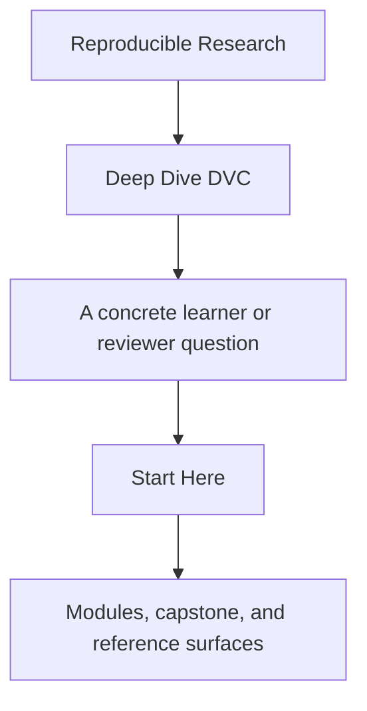
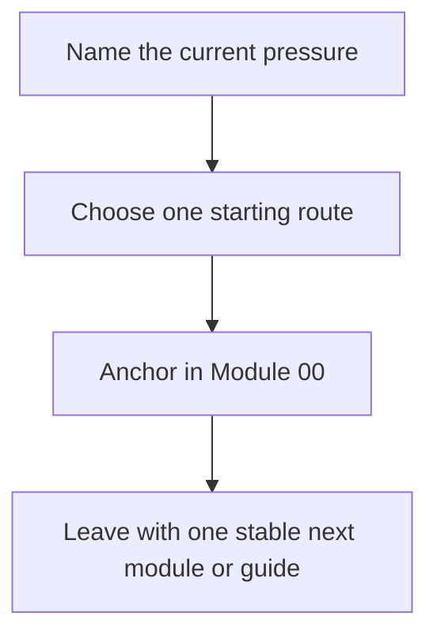

# Start Here

<!-- page-maps:start -->
## Guide Fit

<!-- page-maps:end -->

Read the first diagram as a timing map: this page is for choosing the first honest route,
not for replacing the course. Read the second diagram as the loop: choose one route,
anchor in Module 00, and leave with one stable next move.

Deep Dive DVC is not a command catalog. It is a course about making state explicit
enough that another person can recover, compare, release, and defend results later.

## Use this page when

- DVC still feels new and you want the safest ramp
- the repository is already confusing and you need the smallest justifiable route
- you steward reproducibility and need the course without random browsing

## Do not use this page to

- replace the module sequence with support-page browsing
- enter the capstone before the local concept is legible
- choose the strongest proof route by default

## Best first pass

1. Read [Course Home](../index.md).
2. Read [Course Guide](course-guide.md).
3. Read [Learning Contract](learning-contract.md).
4. Read [Module 00](../module-00-orientation/index.md).
5. Continue to [Module 01](../module-01-reproducibility-failures-real-teams/index.md).

Stop there before opening more shelves. That is enough to make the reading contract,
state contract, and capstone timing visible.

## Choose the route that matches your pressure

| If you need... | Read next | Keep nearby |
| --- | --- | --- |
| first contact with DVC | [Module 01](../module-01-reproducibility-failures-real-teams/index.md), [Module 02](../module-02-data-identity-content-addressing/index.md) | [Module Checkpoints](module-checkpoints.md) |
| repair of an existing repository | [Pressure Routes](pressure-routes.md), [Module 04](../module-04-truthful-pipelines-declared-dependencies/index.md), [Module 08](../module-08-recovery-scale-incident-survival/index.md) | [Authority Map](../reference/authority-map.md) |
| stewardship of a long-lived repository | [Module 05](../module-05-metrics-parameters-comparable-meaning/index.md), [Module 09](../module-09-promotion-registry-boundaries-auditability/index.md), [Module 10](../module-10-migration-governance-dvc-boundaries/index.md) | [Capstone Review Worksheet](../capstone/capstone-review-worksheet.md) |

## What to keep open

- [Course Guide](course-guide.md)
- [Truth Contracts](truth-contracts.md)
- [Module Promise Map](module-promise-map.md)
- [Authority Map](../reference/authority-map.md)
- [Capstone Guide](../capstone/index.md), but only as a later corroboration surface

## Success signal

You are using the course correctly if you can explain:

- which layer of state is authoritative
- why the capstone is not your first lesson
- which support page answers the next question without opening everything
- which proof route is proportionate to the claim in front of you
