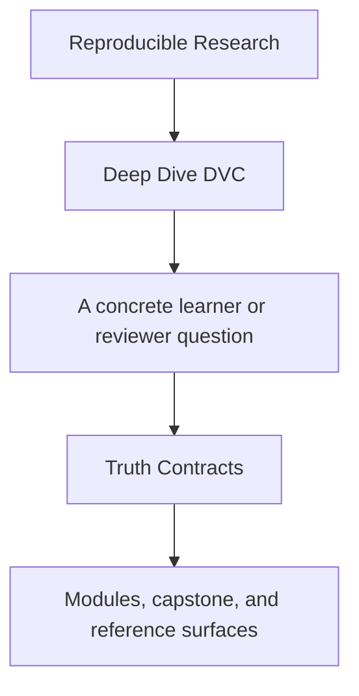
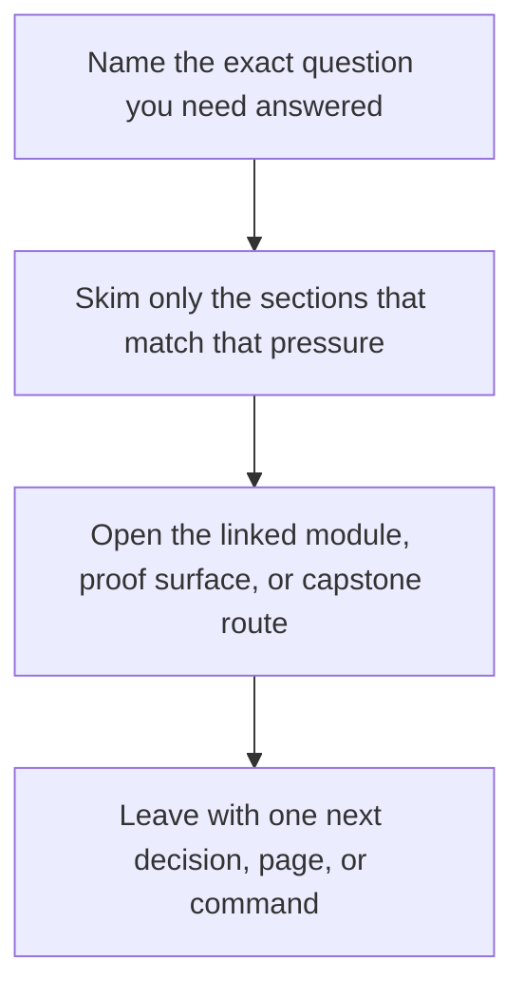

# Truth Contracts

<!-- page-maps:start -->
## Guide Fit

<!-- page-maps:end -->

Read the first diagram as a timing map: this guide is for a named pressure, not for wandering the whole course-book. Read the second diagram as the guide loop: arrive with a concrete question, use only the matching sections, then leave with one smaller and more honest next move.

Use this page when the main question is not "which DVC command exists?" but "what exactly
counts as truth here, and how would I prove it to another person?"

## The Three Questions

For every DVC repository question, answer these in order:

1. What layer is authoritative?
2. What change will DVC actually consider meaningful?
3. What command or file proves that claim?

## Contract Table

| Trust question | Authoritative layer | What DVC considers changed | Strongest proof route |
| --- | --- | --- | --- |
| Did an input dataset change? | `dvc.lock` plus the tracked dependency declaration | dependency hash or declared dependency target changed | `dvc status` plus `dvc.lock` review |
| Did a parameter change in a way the pipeline knows about? | `params.yaml` plus the `params:` declaration in `dvc.yaml` | only declared params keys count toward stage change detection | `dvc repro` or `dvc status`, then inspect `dvc.yaml` and `dvc.lock` |
| Did a metric change in a reviewable way? | tracked metric files plus the producing stage in `dvc.yaml` | the metric artifact changed after a tracked run | `dvc metrics show` or the course proof route, then inspect the metric file |
| Can this experiment be compared honestly? | experiment state plus the same declared deps/params/outs contract | experiment commits or queued experiment state changed; undeclared params remain a blind spot | `dvc exp show` plus declared params review |
| Can another person restore the tracked state after local loss? | DVC remote plus committed declarations | the remote object set and tracked declarations remain sufficient for pull/checkout | `make -C capstone recovery-drill` |

## The Most Common Misread

Changing a parameter does not automatically make it part of DVC's truth contract. The
parameter must be declared under `params:` in `dvc.yaml`, or the repository is relying on
private memory instead of explicit state.

That is why "I changed `params.yaml`" and "DVC will treat that change as stage-relevant"
are not the same claim.

## Minimal Honest Review Loop

1. Read `dvc.yaml` to see what the repository claims to track.
2. Read `dvc.lock` to see the concretized state of the last resolved run.
3. Use one proof command such as `dvc status`, `dvc metrics show`, `dvc exp show`, or the capstone recovery route.
4. State what the evidence proves and what it does not prove.

## Good Review Questions

- If this file changes, where is that dependency declared?
- If this parameter changes, will DVC notice, or are we assuming it will?
- If the workspace disappears, which layer restores it?
- Which proof route would I hand to another maintainer instead of narrating from memory?
