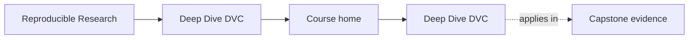
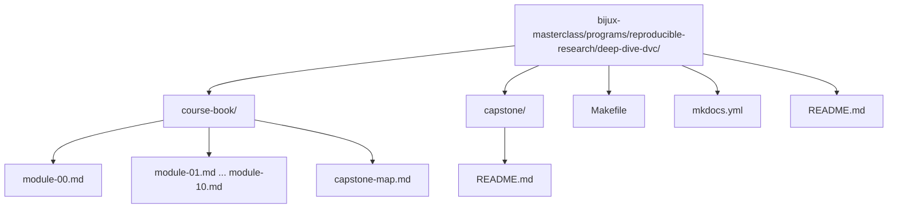

# Deep Dive DVC


<!-- page-maps:start -->
## Page Maps




<!-- page-maps:end -->

Deep Dive DVC teaches reproducibility as a discipline of explicit state. The goal is to
make data, parameters, metrics, experiments, remotes, and recovery boundaries precise
enough that another person can trust them months later.

This course is designed as a guided route, not a loose pile of DVC notes. Start with the
learner path that matches your role, then use the capstone when the concept is clear
enough that executable proof will sharpen it rather than overwhelm it.

## Why this program exists

Many teams can rerun a pipeline once and still fail reproducibility in every way that
matters:

- the dataset path is stable but the bytes are not
- the pipeline reruns but nobody can explain which inputs changed
- metrics are logged but no longer mean the same thing
- experiments exist but baseline history and promotion rules are muddy
- a remote failure or cache loss turns "tracked" state into folklore

This program exists to close that gap.

## Start With One Route

Choose one entry:

1. If you are new to the program, start with [`start-here.md`](start-here.md).
2. If you need a stable route through support pages, use [`course-guide.md`](course-guide.md).
3. If you want the full program shape before reading modules, open [`module-00.md`](module-00.md).
4. If you need the executable repository, start with [`readme-capstone.md`](readme-capstone.md), not the raw capstone directory.

The learner path is deliberate:

1. Start with why reproducibility fails.
2. Learn state identity before pipeline execution.
3. Learn pipeline truth before metric comparison and experimentation.
4. Learn experimentation before governance, retention, and incident survival.
5. Continue into promotion, auditability, migration, and stewardship after the core state model is stable.

If you skip that order, later modules will still be readable, but their rules will feel
administrative instead of necessary.

## Course Shape At A Glance

Use this snapshot when you need the fastest sense of what the modules are doing:

- [Module 00](module-00.md) defines the study strategy, the family context, and the capstone route.
- [Module 01](module-01.md) explains why common Git-and-script workflows still fail reproducibility.
- [Module 02](module-02.md) defines stable data identity through content addressing and state layers.
- [Module 03](module-03.md) explains why execution environments are part of the declared input surface.
- [Module 04](module-04.md) turns pipelines into truthful, inspectable execution graphs.
- [Module 05](module-05.md) explains why parameters and metrics are semantic contracts, not just values.
- [Module 06](module-06.md) formalizes experiments as controlled deviations instead of history damage.
- [Module 07](module-07.md) turns collaboration and CI into enforceable social contracts.
- [Module 08](module-08.md) explains retention, recovery, and long-term survivability under time pressure.
- [Module 09](module-09.md) defines promotion, release contracts, and the evidence needed for downstream trust.
- [Module 10](module-10.md) finishes with migration, governance, anti-patterns, and DVC tool boundaries.
- [Capstone Guide](readme-capstone.md) explains what the executable repository proves.
- [Capstone Map](capstone-map.md) shows which repository surfaces to inspect for each module.

## Support Pages Worth Knowing Early

These pages make the course easier to navigate:

- [`learning-contract.md`](learning-contract.md) clarifies what the course optimizes for and refuses to optimize for.
- [`module-dependency-map.md`](module-dependency-map.md) shows which concepts should be learned before others.
- [`platform-setup.md`](platform-setup.md) explains the local environment assumptions before you run proof commands.
- [`practice-map.md`](practice-map.md) maps each module to its main proof loop and capstone follow-up.
- [`authority-map.md`](authority-map.md) explains which layer of state settles which trust question.
- [`evidence-boundary-guide.md`](evidence-boundary-guide.md) explains what declaration, execution, promotion, and recovery evidence can and cannot prove.
- [`command-guide.md`](command-guide.md) explains where each command belongs.

## How To Use The Capstone While Reading

- After Module 02, inspect how the repository separates workspace state, cache state, and publish state.
- After Module 04, inspect the `dvc.yaml` stages and ask whether every influential edge is declared.
- After Module 06, inspect how parameter changes create comparable experiment runs without mutating the baseline.
- After Module 08, inspect the recovery drill and ask which state survives cache loss and why.
- After Module 09, inspect `publish/v1/`, manifests, and promoted params or metrics as a release boundary.
- In Module 10, use the capstone as a repository review specimen rather than a first-contact example.

When entering the capstone, keep these pages open together:

- [`capstone-map.md`](capstone-map.md)
- [`capstone-file-guide.md`](capstone-file-guide.md)
- [`repository-layer-guide.md`](repository-layer-guide.md)

The capstone should answer the question: "What does this module look like in a real DVC repository?"

## What The Course Is Trying To Prevent

- treating paths as identity
- comparing metrics whose meaning has drifted
- running pipelines with undeclared parameters or environment assumptions
- using experiments without promotion rules
- promoting state without the evidence needed to defend it later
- letting migration or retention policy silently damage authoritative history
- trusting remotes and recovery stories that were never rehearsed

## Working Locally

From the repository root:

```bash
make PROGRAM=reproducible-research/deep-dive-dvc docs-serve
make PROGRAM=reproducible-research/deep-dive-dvc test
```

## Repository Layout


