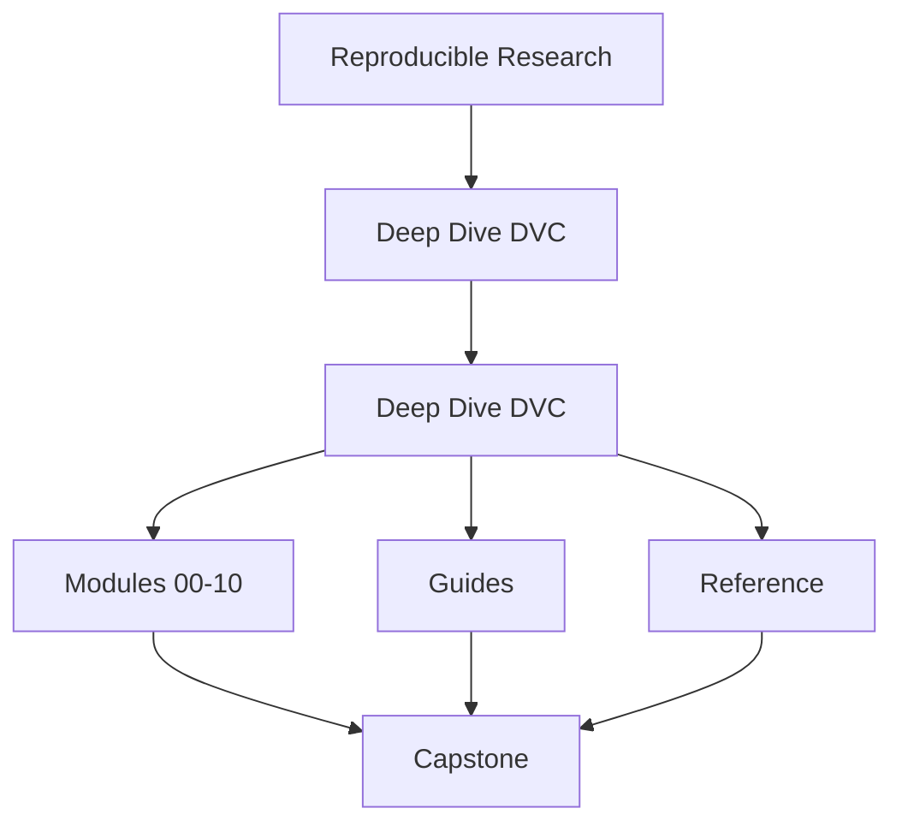
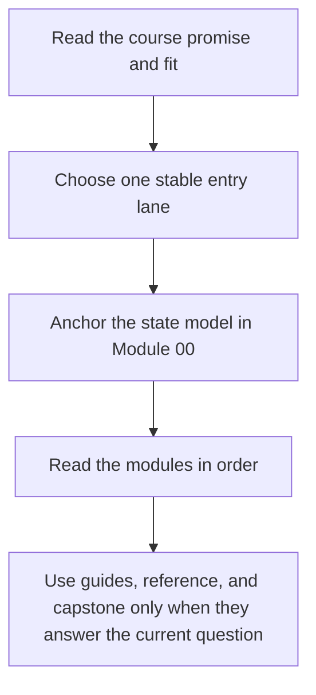

# Deep Dive DVC

<!-- page-maps:start -->
## Course Shape

<!-- page-maps:end -->

Read the first diagram as the shape of the whole book. Read the second diagram as the
intended route through it so the capstone and support shelves do not become accidental
first lessons.

Deep Dive DVC teaches reproducibility as a discipline of explicit state. The goal is not
to memorize commands. The goal is to make data, parameters, metrics, experiments,
promotion, and recovery boundaries precise enough that another person can trust them
later.

## Use this course if

- you want a state model instead of a command catalog
- you inherited a repository where data, params, metrics, or experiments feel muddy
- you already use DVC but still cannot say which state is authoritative
- you review whether a repository can survive handoff, release, and recovery pressure

## Do not use this course as

- a quick command reminder detached from state meaning
- tooling advice before the repository's trust boundaries are clear
- a reason to treat remotes, metrics, publish artifacts, and baseline state as interchangeable

## Choose one starting lane

| If you are here because... | Start with | Stop when you can say... |
| --- | --- | --- |
| DVC is still new | [Start Here](guides/start-here.md), [Course Guide](guides/course-guide.md), [Module 00](module-00-orientation/index.md) | which state layers exist and why the capstone is not your first lesson |
| you need to repair an existing repository | [Pressure Routes](guides/pressure-routes.md), [Module 01](module-01-reproducibility-failures-real-teams/index.md), [Module 04](module-04-truthful-pipelines-declared-dependencies/index.md) | whether the problem is state identity, pipeline truth, collaboration drift, or recovery |
| you steward a long-lived repository | [Course Guide](guides/course-guide.md), [Module 05](module-05-metrics-parameters-comparable-meaning/index.md), [Module 09](module-09-promotion-registry-boundaries-auditability/index.md) | which surfaces are authoritative, which are promotable, and which proof route is proportionate |

## Keep these support pages nearby

| Need | Best page |
| --- | --- |
| shortest stable entry | [Start Here](guides/start-here.md) |
| route shaped by urgency | [Pressure Routes](guides/pressure-routes.md) |
| stable support hub | [Course Guide](guides/course-guide.md) |
| module titles translated into promises | [Module Promise Map](guides/module-promise-map.md) |
| module exit bar | [Module Checkpoints](guides/module-checkpoints.md) |
| state change and comparison rules | [Course Guide](guides/course-guide.md) |
| smallest honest proof route | [Proof Ladder](guides/proof-ladder.md) |
| capstone entry by module and question | [Capstone Map](capstone/capstone-map.md) |

## Module Table of Contents

| Module | Title | Why it matters |
| --- | --- | --- |
| [Module 00](module-00-orientation/index.md) | Orientation and Study Practice | establishes the entry route, proof surfaces, and capstone timing |
| [Module 01](module-01-reproducibility-failures-real-teams/index.md) | Reproducibility Failures in Real Teams | names the failure modes before teaching tools |
| [Module 02](module-02-data-identity-content-addressing/index.md) | Data Identity and Content Addressing | separates stable paths from stable bytes and stable meaning |
| [Module 03](module-03-execution-environments-reproducible-inputs/index.md) | Execution Environments as Reproducible Inputs | treats environment assumptions as part of the contract |
| [Module 04](module-04-truthful-pipelines-declared-dependencies/index.md) | Truthful Pipelines and Declared Dependencies | makes workflow edges visible enough to trust reruns |
| [Module 05](module-05-metrics-parameters-comparable-meaning/index.md) | Metrics, Parameters, and Comparable Meaning | keeps comparisons honest as experiments evolve |
| [Module 06](module-06-experiments-baselines-controlled-change/index.md) | Experiments, Baselines, and Controlled Change | organizes experimentation without mutating the truth surface |
| [Module 07](module-07-collaboration-ci-social-contracts/index.md) | Collaboration, CI, and Social Contracts | makes team pressure and automation part of the state model |
| [Module 08](module-08-recovery-scale-incident-survival/index.md) | Recovery, Scale, and Incident Survival | rehearses failure, recovery, and retained authority under pressure |
| [Module 09](module-09-promotion-registry-boundaries-auditability/index.md) | Promotion, Registry Boundaries, and Auditability | treats release and registry state as explicit trust boundaries |
| [Module 10](module-10-migration-governance-dvc-boundaries/index.md) | Migration, Governance, and DVC Boundaries | finishes with stewardship, migration, and tool-boundary judgment |

## How the capstone fits

The capstone is the executable proof surface for the course. It should corroborate a
module idea that is already legible, not replace first exposure.

Use it in this order:

1. learn the concept in the local module exercise
2. choose the smallest honest route with [Proof Ladder](guides/proof-ladder.md)
3. enter the repository through [Capstone Map](capstone/capstone-map.md) or [Command Guide](capstone/command-guide.md)
4. escalate to stronger review only when the current question actually needs it

## Success signal

The course home has done its job when you know:

- where to start without random browsing
- which support page answers the next question
- why the capstone is a proof surface rather than a first-contact playground
- why later modules are consequences of earlier state identity and pipeline-truth choices

## Failure modes this course is designed to prevent

- treating paths as identity
- trusting a rerun without being able to explain which state changed
- using the capstone as first contact and confusing repository size with conceptual clarity
- treating promotion, recovery, and governance as paperwork instead of consequences of earlier state contracts
