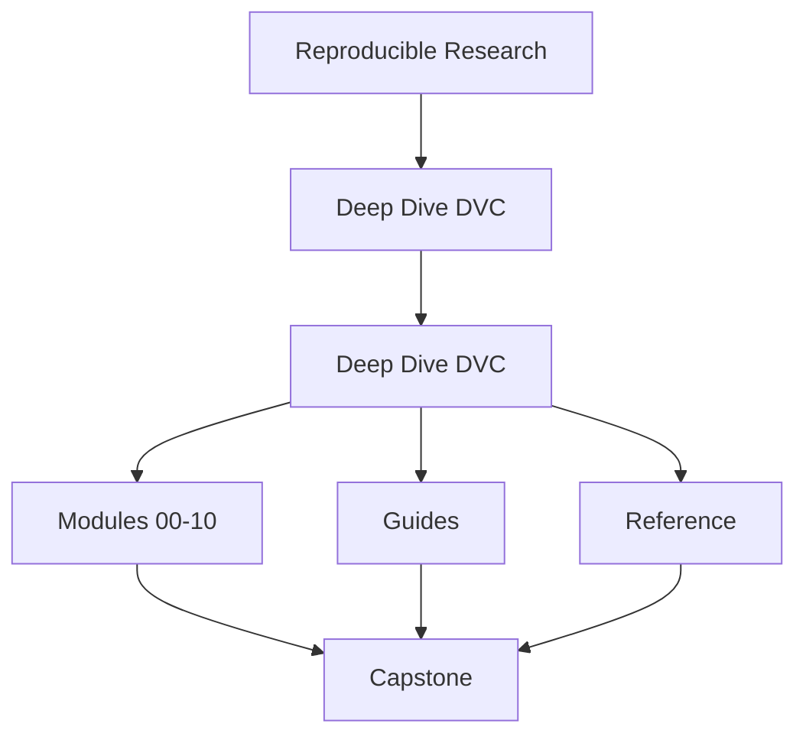
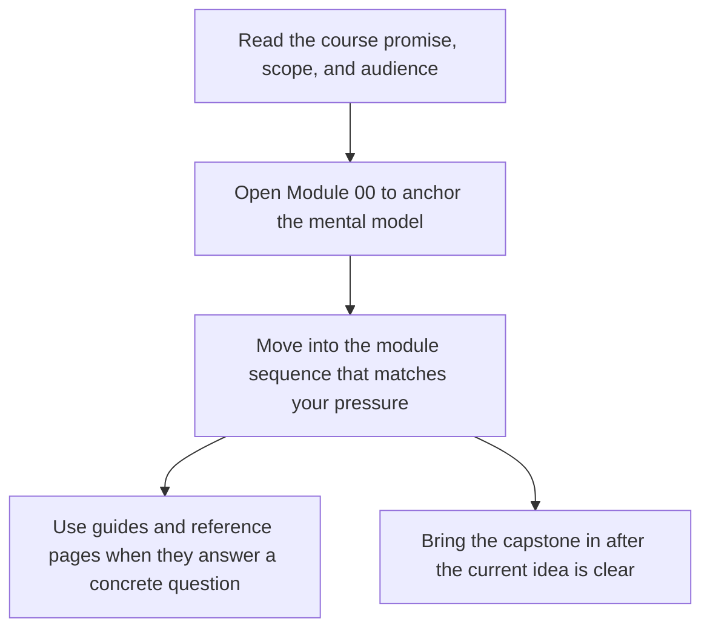
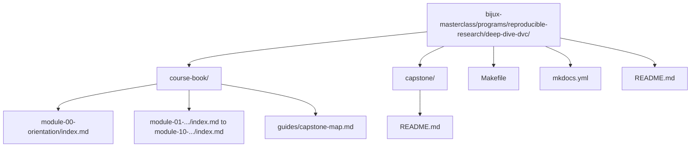

# Deep Dive DVC


<!-- page-maps:start -->
## Course Shape




<!-- page-maps:end -->

Read the first diagram as the shape of the whole book: it shows where the home page sits relative to the module sequence, the support shelf, and the capstone. Read the second diagram as the intended entry route so learners do not mistake the capstone or reference pages for the first stop.

Deep Dive DVC teaches reproducibility as a discipline of explicit state. The goal is to
make data, parameters, metrics, experiments, remotes, and recovery boundaries precise
enough that another person can trust them months later.

This course is designed as a guided route, not a loose pile of DVC notes. Start with the
learner path that matches your role, move through the ten modules in order, and use the
capstone when the concept is clear enough that executable proof will sharpen it rather
than overwhelm it.

The top-level course-book now has three stable surfaces:

- [`guides/`](guides/index.md) for learner routes, pressure routes, promise maps, checkpoints, and capstone entry
- [`reference/`](reference/index.md) for durable maps, glossary pages, anti-pattern routing, and review standards
- module pages for the core ten-module teaching arc

## Why this program exists

Many teams can rerun a pipeline once and still fail reproducibility in every way that
matters:

- the dataset path is stable but the bytes are not
- the pipeline reruns but nobody can explain which inputs changed
- metrics are logged but no longer mean the same thing
- experiments exist but baseline history and promotion rules are muddy
- a remote failure or cache loss turns "tracked" state into folklore

This program exists to close that gap.

## Start here

Choose one entry:

1. If you are new to the program, start with [`start-here.md`](guides/start-here.md).
2. If your route is shaped by urgency or stewardship pressure, use [`pressure-routes.md`](guides/pressure-routes.md).
3. If you need a stable route through support pages, use [`course-guide.md`](guides/course-guide.md).
4. If you want the full program shape before reading modules, open [`module-00.md`](module-00-orientation/index.md).
5. If you need the executable repository, start with [`readme-capstone.md`](guides/readme-capstone.md), not the raw capstone directory.

The learner path is deliberate:

1. Start with why reproducibility fails.
2. Learn state identity before pipeline execution.
3. Learn pipeline truth before metric comparison and experimentation.
4. Learn experimentation before governance, retention, and incident survival.
5. Continue into promotion, auditability, migration, and stewardship after the core state model is stable.

If you skip that order, later modules will still be readable, but their rules will feel
administrative instead of necessary.

## Module Table of Contents

| Module | Title | Why it matters |
| --- | --- | --- |
| [Module 00](module-00-orientation/index.md) | Orientation and Study Practice | establishes the learner route, proof surfaces, and capstone timing |
| [Module 01](module-01-why-reproducibility-fails/index.md) | Reproducibility Failures in Real Teams | names the failure modes before teaching tools |
| [Module 02](module-02-data-identity-and-content-addressing/index.md) | Data Identity and Content Addressing | separates stable paths from stable bytes and stable meaning |
| [Module 03](module-03-execution-environments-as-inputs/index.md) | Execution Environments as Reproducible Inputs | treats environment assumptions as part of the contract |
| [Module 04](module-04-pipelines-as-truthful-dags/index.md) | Truthful Pipelines and Declared Dependencies | makes workflow edges visible enough to trust reruns |
| [Module 05](module-05-metrics-parameters-and-meaning/index.md) | Metrics, Parameters, and Comparable Meaning | keeps comparisons honest as experiments evolve |
| [Module 06](module-06-experiments-without-chaos/index.md) | Experiments, Baselines, and Controlled Change | organizes experimentation without mutating the truth surface |
| [Module 07](module-07-collaboration-ci-and-social-contracts/index.md) | Collaboration, CI, and Social Contracts | makes team pressure and automation part of the state model |
| [Module 08](module-08-production-scale-and-incident-survival/index.md) | Recovery, Scale, and Incident Survival | rehearses failure, recovery, and retained authority under pressure |
| [Module 09](module-09-promotion-registry-boundaries-release-contracts-and-auditability/index.md) | Promotion, Registry Boundaries, and Auditability | treats release and registry state as explicit trust boundaries |
| [Module 10](module-10-migration-governance-anti-patterns-and-dvc-tool-boundaries/index.md) | Migration, Governance, and DVC Boundaries | finishes with stewardship, migration, and tool-boundary judgment |

## Use These Support Pages First

These are the pages that make the course easier to trust and easier to finish:

| Need | Best page |
| --- | --- |
| first learner route | [`start-here.md`](guides/start-here.md) |
| route under repair, stewardship, or recovery pressure | [`pressure-routes.md`](guides/pressure-routes.md) |
| stable support hub | [`course-guide.md`](guides/course-guide.md) |
| what each module title actually promises | [`module-promise-map.md`](guides/module-promise-map.md) |
| whether you are ready to move on | [`module-checkpoints.md`](guides/module-checkpoints.md) |
| smallest honest proof route | [`proof-ladder.md`](guides/proof-ladder.md) |
| capstone entry by module | [`capstone-map.md`](guides/capstone-map.md) |

## Support Pages Worth Knowing Early

These pages make the course easier to navigate:

- [`learning-contract.md`](guides/learning-contract.md) clarifies what the course optimizes for and refuses to optimize for.
- [`module-dependency-map.md`](reference/module-dependency-map.md) shows which concepts should be learned before others.
- [`topic-boundaries.md`](reference/topic-boundaries.md) explains what the course treats as core and what it only touches at the boundary.
- [`platform-setup.md`](guides/platform-setup.md) explains the local environment assumptions before you run proof commands.
- [`practice-map.md`](reference/practice-map.md) maps each module to its main proof loop and capstone follow-up.
- [`authority-map.md`](reference/authority-map.md) explains which layer of state settles which trust question.
- [`evidence-boundary-guide.md`](reference/evidence-boundary-guide.md) explains what declaration, execution, promotion, and recovery evidence can and cannot prove.
- [`anti-pattern-atlas.md`](reference/anti-pattern-atlas.md) routes common reproducibility smells to the right repair path.
- [`command-guide.md`](guides/command-guide.md) explains where each command belongs.
- [`proof-ladder.md`](guides/proof-ladder.md) explains how much proof is enough before you escalate.
- [`guides/index.md`](guides/index.md) collects the full learner and capstone route in one place.
- [`reference/index.md`](reference/index.md) collects the durable review maps in one place.

## How To Use The Capstone While Reading

- After Module 02, inspect how the repository separates workspace state, cache state, and publish state.
- After Module 04, inspect the `dvc.yaml` stages and ask whether every influential edge is declared.
- After Module 06, inspect how parameter changes create comparable experiment runs without mutating the baseline.
- After Module 08, inspect the recovery drill and ask which state survives cache loss and why.
- After Module 09, inspect `publish/v1/`, manifests, and promoted params or metrics as a release boundary.
- In Module 10, use the capstone as a repository review specimen rather than a first-contact example.

When entering the capstone, keep these pages open together:

- [`capstone-map.md`](guides/capstone-map.md)
- [`capstone-file-guide.md`](guides/capstone-file-guide.md)
- [`repository-layer-guide.md`](guides/repository-layer-guide.md)
- [`proof-ladder.md`](guides/proof-ladder.md)

The capstone should answer the question: "What does this module look like in a real DVC repository?"

## Review Surfaces

When you are reviewing whether the course and capstone are actually coherent, use:

* [`topic-boundaries.md`](reference/topic-boundaries.md)
* [`anti-pattern-atlas.md`](reference/anti-pattern-atlas.md)
* [`module-promise-map.md`](guides/module-promise-map.md)
* [`module-checkpoints.md`](guides/module-checkpoints.md)
* [`completion-rubric.md`](reference/completion-rubric.md)

## What The Course Is Trying To Prevent

- treating paths as identity
- comparing metrics whose meaning has drifted
- running pipelines with undeclared parameters or environment assumptions
- using experiments without promotion rules
- promoting state without the evidence needed to defend it later
- letting migration or retention policy silently damage authoritative history
- trusting remotes and recovery stories that were never rehearsed

## Working Locally

From the repository root:

```bash
make PROGRAM=reproducible-research/deep-dive-dvc docs-serve
make PROGRAM=reproducible-research/deep-dive-dvc test
```

## Repository Layout


