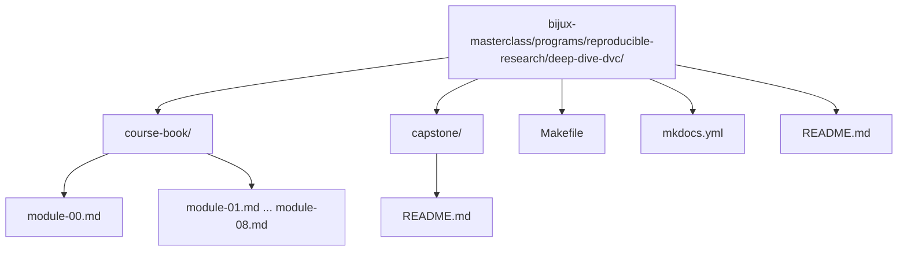

# Deep Dive DVC

Deep Dive DVC teaches reproducibility as a discipline of explicit state. The course is
about more than moving files through a tool. It is about making data, parameters,
metrics, experiments, remotes, and recovery boundaries precise enough that another
person can trust them months later.

## Why this course exists

Many teams can rerun a pipeline once and still fail reproducibility in every way that
matters:

- the dataset path is stable but the bytes are not
- the pipeline reruns but nobody can explain which inputs changed
- metrics are logged but no longer mean the same thing
- experiments exist but baseline history and promotion rules are muddy
- a remote failure or cache loss turns "tracked" state into folklore

This course exists to close that gap.

## Reading contract

This is not a command reference. The learner path is deliberate:

1. Start with why reproducibility fails.
2. Learn state identity before pipeline execution.
3. Learn pipeline truth before metric comparison and experimentation.
4. Learn experimentation before governance, retention, and incident survival.

If you skip that order, later modules will still be readable, but their rules will feel
administrative instead of necessary.

## What each module contributes

- [Module 00](module-00.md) defines the study strategy, the family context, and the capstone map.
- [Module 01](module-01.md) explains why common Git-and-script workflows still fail reproducibility.
- [Module 02](module-02.md) defines stable data identity through content addressing and state layers.
- [Module 03](module-03.md) explains why execution environments are part of the declared input surface.
- [Module 04](module-04.md) turns pipelines into truthful, inspectable execution graphs.
- [Module 05](module-05.md) explains why parameters and metrics are semantic contracts, not just values.
- [Module 06](module-06.md) formalizes experiments as controlled deviations instead of history damage.
- [Module 07](module-07.md) turns collaboration and CI into enforceable social contracts.
- [Module 08](module-08.md) explains retention, recovery, and long-term survivability under time pressure.
- [Capstone](readme-capstone.md) provides the executable repository that keeps the course honest.

## How to use the capstone while reading

- After Module 02, inspect how the repository separates workspace state, cache state, and publish state.
- After Module 04, inspect the `dvc.yaml` stages and ask whether every influential edge is declared.
- After Module 06, inspect how parameter changes create comparable experiment runs without mutating the baseline.
- After Module 08, inspect the recovery drill and ask which state survives cache loss and why.

The capstone should answer the question: "What does this module look like in a real DVC repository?"

## Working locally

From the repository root:

```bash
make PROGRAM=reproducible-research/deep-dive-dvc docs-serve
make PROGRAM=reproducible-research/deep-dive-dvc test
```

## Repository layout



## Common failure modes this course is trying to prevent

- treating paths as identity
- comparing metrics whose meaning has drifted
- running pipelines with undeclared parameters or environment assumptions
- using experiments without promotion rules
- trusting remotes and recovery stories that were never rehearsed
