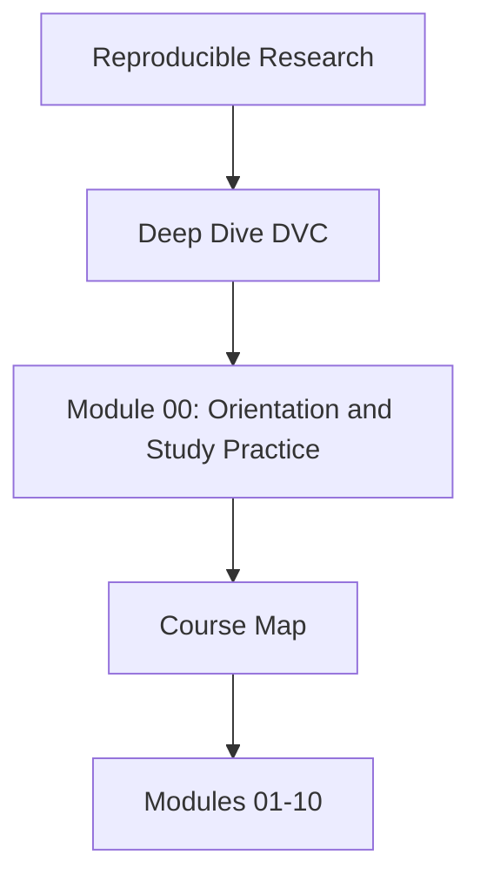

# Course Map

<!-- page-maps:start -->
## Concept Position

<!-- page-maps:end -->

Use this page when you need the whole course visible on one screen before you choose a
reading path.

## Arc 1: identity and truthful pipelines

Modules 01 to 04 establish the state model.

- Module 01 teaches the failure modes that make reproducibility necessary.
- Module 02 teaches content-addressed identity and state layers.
- Module 03 teaches environments as part of the declared input surface.
- Module 04 teaches truthful pipelines and recorded stage transitions.

Leave this arc able to explain what the repository claims and what it actually recorded.

## Arc 2: meaningful comparison

Modules 05 to 06 turn tracked numbers into trustworthy comparison surfaces.

- Module 05 teaches params, metrics, and semantic comparability.
- Module 06 teaches experiments as controlled deviations from a baseline.

Leave this arc able to explain why a changed metric means something rather than merely
moving.

## Arc 3: collaboration, recovery, and promotion

Modules 07 to 09 scale the repository into a long-lived shared system.

- Module 07 teaches collaboration and CI contracts.
- Module 08 teaches recovery, retention, and incident survival.
- Module 09 teaches promotion boundaries and auditability.

Leave this arc able to separate repository-internal evidence from downstream trust.

## Arc 4: governance and migration

Module 10 finishes with stewardship judgment.

- Module 10 teaches migration planning, governance rules, and tool-boundary decisions.

Leave this arc able to review a real DVC repository and justify what should change next.
