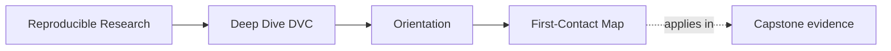
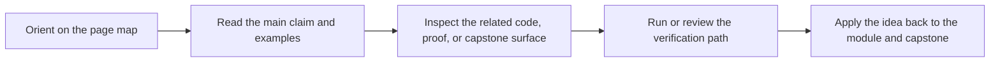

# First-Contact Map

<!-- page-maps:start -->
## Page Maps




<!-- page-maps:end -->

Use this page for your first honest session with the course.

## First session route

1. Read `../index.md` for the program promise.
2. Read `index.md` for the Module 00 role.
3. Read `course-map.md` to see the four course arcs.
4. Read `../guides/start-here.md` when you want the shortest starting route.
5. Read `../capstone/capstone-map.md` only if a repository specimen will clarify, not blur, the current idea.
6. Run one bounded command:

```sh
make PROGRAM=reproducible-research/deep-dive-dvc capstone-walkthrough
```

## What you should know before Module 01

Before the first technical module, you should be able to answer:

- what this course treats as the core promises of a trustworthy DVC repository
- why the capstone is executable corroboration rather than the first thing to read
- which course arc matches your current pressure: state truth, comparability, promotion, or stewardship

## First-week rhythm

Repeat the same rhythm through the first modules:

1. read until the current state question is clear
2. inspect one matching example, exercise, or capstone surface immediately
3. run one bounded command instead of escalating to every proof route
4. stop when you can state one rule and one failure mode in plain language

## When to leave this route

Move to [mid-course-map.md](mid-course-map.md) once Modules 01 to 04 feel stable and the
main question becomes comparison meaning, collaboration trust, recovery, or promotion.
