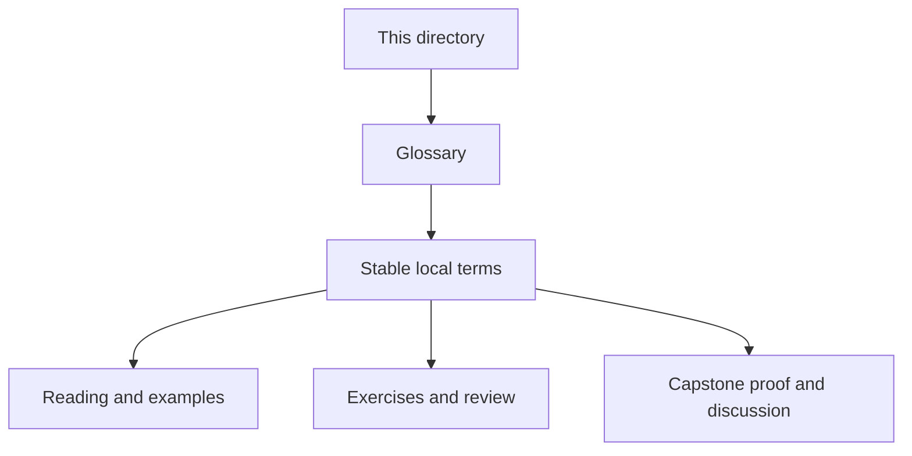
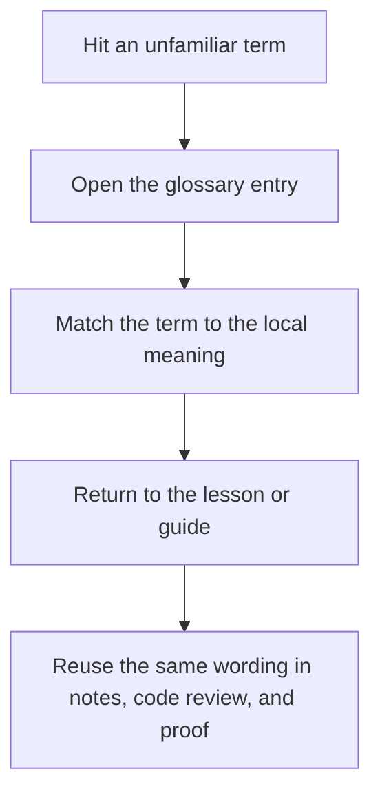

# Module Glossary

<!-- page-maps:start -->
## Glossary Fit

<!-- page-maps:end -->

Use this glossary when a Module 00 page uses a word that feels familiar but still needs a
precise local meaning before Module 01 starts.

## Terms in this module

| Term | Meaning in Deep Dive DVC |
| --- | --- |
| State identity | The rule that data and artifacts are known by what they are, not only where they happen to live. |
| Declared state | The pipeline and parameter surfaces that say what should influence execution. |
| Recorded state | The lock and tracked outputs that show what actually happened after execution. |
| Comparison surface | The params, metrics, and experiment records that must preserve semantic meaning across runs. |
| Promotion | The deliberate act of turning a smaller subset of repository state into a downstream trust surface. |
| Recovery | Restoring tracked state after local loss by using the authoritative remote-backed layers. |
| Publish contract | The smaller versioned output surface another person may trust without private repository context. |
| Verification route | The command or saved bundle that proves a specific repository claim with evidence. |
