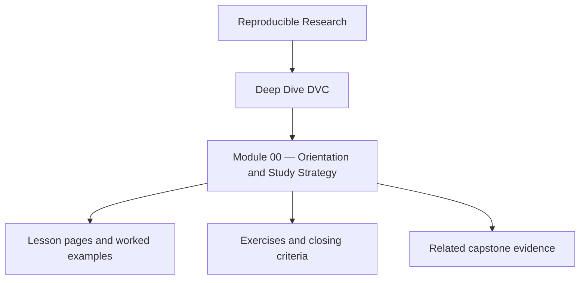
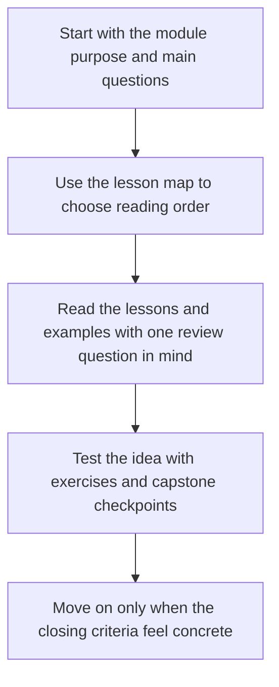

<a id="top"></a>

# Module 00 — Orientation and Study Strategy


<!-- page-maps:start -->
## Module Position




<!-- page-maps:end -->

Read the first diagram as a placement map: this page sits between the course promise, the lesson pages listed below, and the capstone surfaces that pressure-test the module. Read the second diagram as the study route for this page, so the diagrams point you toward the `Lesson map`, `Exercises`, and `Closing criteria` instead of acting like decoration.

Deep Dive DVC is now a ten-module program that starts from first-contact reproducibility
thinking and ends with long-lived state stewardship. The through-line stays constant:

- **Stable identity**: data and artifacts are known by what they are, not only where they live.
- **Truthful state transitions**: pipelines, params, and experiments declare the real change surface.
- **Durable evidence**: metrics, manifests, locks, and publish bundles make claims reviewable.
- **Operational survival**: remotes, retention, recovery, and promotion keep state trustworthy over time.
- **Stewardship judgment**: teams know which state is authoritative and how to migrate it safely.

This repository contains both the program guide in `course-book/` and the executable DVC
reference repository in `capstone/`.

---

## At a Glance

| What this course optimizes for | What this course refuses to optimize for |
| --- | --- |
| explicit state identity | vague claims that a pipeline is "tracked somehow" |
| durable metrics, params, and publish evidence | outputs that only make sense to the original author |
| recovery and promotion discipline | trust based on memory or directory names |
| pedagogy that moves from state model to repository stewardship | dropping the learner into a full repository too early |

## Learning outcomes

- explain the five-course through-lines: stable identity, truthful state transitions, durable evidence, operational survival, and stewardship judgment
- choose when to enter the capstone so the repository stays a proof surface instead of becoming cognitive noise
- identify which later modules answer state identity, pipeline truth, experimentation, collaboration, recovery, promotion, and governance questions

## Verification route

- Run `make -C capstone platform-report` to confirm the supported Python, Git, and DVC versions before you trust later proof routes.
- Run `make -C capstone walkthrough` when you want the first learner-facing repository tour.
- Use `../guides/module-checkpoints.md` to decide whether you are ready to enter the capstone or should stay with the smaller module model first.

---

## Program Arc

### Module 01 — Why Reproducibility Fails

Start from the failure modes that push teams toward DVC in the first place: results that
cannot be defended, datasets that drift silently, and metrics that stop meaning what they
appear to mean.

**Deliverable:** a precise explanation of what problem DVC solves and what it does not solve by itself.

### Module 02 — Data Identity and Content Addressing

Learn why paths are only locators and why reproducibility starts with immutable,
content-addressed identity across workspace, cache, Git, and remote layers.

**Deliverable:** a repository that can distinguish location from identity and explain how a datum is recovered.

### Module 03 — Execution Environments as Inputs

Move beyond code and data alone. Environments, runtime assumptions, and tool versions
become part of the declared input surface rather than invisible luck.

**Deliverable:** a state story that includes the runtime boundary instead of hand-waving it away.

### Module 04 — Pipelines as Truthful DAGs

Turn DVC stages into honest state transitions. Dependencies, outputs, params, and lock
state become a reviewable graph rather than a convenient script wrapper.

**Deliverable:** a `dvc.yaml` pipeline whose stage behavior can be explained and defended under review.

### Module 05 — Metrics, Parameters, and Meaning

Treat numbers as semantic contracts, not just logged values. Parameters and metrics become
first-class state that preserve comparability across time.

**Deliverable:** a repository whose comparisons remain meaningful instead of only mechanically repeatable.

### Module 06 — Experiments Without Chaos

Formalize exploration as a controlled, reversible process. Experiments become comparable
deviations from a baseline rather than local folklore.

**Deliverable:** an experiment workflow that allows change without corrupting baseline history.

### Module 07 — Collaboration, CI, and Social Contracts

Make good behavior enforceable across humans. Reviews, remotes, CI gates, and promotion
habits become social contracts with technical backing.

**Deliverable:** a repository where another person can verify trustworthy state without private context.

### Module 08 — Production, Scale, and Incident Survival

Design for time as an adversary. Retention, garbage collection, cache loss, remote
migration, and recovery drills become part of the system instead of afterthoughts.

**Deliverable:** a repository that can survive time pressure and still restore authoritative state.

### Module 09 — Promotion, Registry Boundaries, Release Contracts, and Auditability

Separate exploratory state from promoted state. Publish surfaces, manifests, params,
metrics, and lock evidence become a defendable release contract for downstream users.

**Deliverable:** a promoted state bundle another reviewer or consumer can validate without guesswork.

### Module 10 — Mastery: Migration, Governance, Anti-Patterns, and DVC Tool Boundaries

Finish with stewardship judgment: reviewing real repositories, planning migrations,
setting governance rules, rejecting recurring anti-patterns, and deciding where DVC
should remain authoritative versus where another system should take over.

**Deliverable:** an evidence-based review and stewardship plan for a real DVC repository.

---

## Study Paths

### Full course path

Use this if you are learning DVC from the ground up.

1. Modules 01-02 for failure modes and state identity
2. Modules 03-05 for environments, pipelines, params, and metrics
3. Modules 06-09 for experiments, collaboration, recovery, and promotion
4. Module 10 for review, migration, and governance

### Working maintainer path

Use this if you already operate a DVC repository.

1. [`pressure-routes.md`](../guides/pressure-routes.md) for the repair-first route
2. Module 04 for truthful pipeline behavior
3. Module 07 for collaboration and CI contracts
4. Module 08 for retention and recovery discipline
5. Module 09 for promotion boundaries
6. Module 10 for stewardship judgment

### Reproducibility steward path

Use this if your role is auditability, release, or long-lived system ownership.

1. Module 05 for semantic state surfaces
2. Module 08 for durability and incident survival
3. Module 09 for publish contracts
4. Module 10 for migration and governance
5. [`module-promise-map.md`](../guides/module-promise-map.md) for title-to-deliverable review

---

## Recommended Reading Path

1. Read Modules 01 to 10 in order.
2. Use support pages to keep the course legible instead of treating them as appendix material.
3. Use the capstone lightly at first, then heavily from Modules 04 to 09.
4. Re-run proof commands as you go instead of trusting prose summaries.
5. Treat Module 10 as the finish of the program, not as optional appendix material.

If you are totally new to DVC, spend extra time in Modules 01 and 02 before rushing into
pipelines or experiments. If you already use DVC in production, Modules 07 to 10 will be
the fastest route to operational value.

---

## Support Pages By Milestone

Use these pages when you reach each milestone:

| Milestone | Best support pages | Why these pages matter |
| --- | --- | --- |
| before Module 01 | `../guides/start-here.md`, `../guides/learning-contract.md`, `../reference/module-dependency-map.md` | establish the learner route and the pedagogical boundaries |
| Modules 01-02 | `../reference/state-glossary.md`, `../reference/authority-map.md` | keep identity, authority, and layer language precise |
| Modules 03-05 | `../reference/practice-map.md`, `../guides/command-guide.md`, `../guides/proof-matrix.md` | connect pipeline and metric concepts to executable proof |
| Modules 06-09 | `../guides/capstone-map.md`, `../guides/capstone-file-guide.md`, `../guides/readme-capstone.md` | move from concept to repository inspection without losing the teaching thread |
| Module 10 and later review | `../reference/completion-rubric.md`, `../guides/capstone-review-worksheet.md`, `../guides/capstone-extension-guide.md` | assess the course and evolve the repository without weakening the contract |

This keeps the support surfaces on the main learner route instead of making them feel
optional.

---

## Capstone Relationship

The capstone is strongest as the executable companion to Modules 04 to 09, where truthful
pipelines, metrics, experiments, promotion, remotes, and recovery become concrete. The
early modules still benefit from smaller mental and local examples first so the learner
can understand state identity before the repository becomes the main teaching surface.

Use [Capstone Map](../guides/capstone-map.md) when you want one clear route from a module concept
to the exact repository files and proof command that demonstrate it.

**Proof command:**

```bash
make PROGRAM=reproducible-research/deep-dive-dvc test
```

---

## Milestones

| Milestone | Modules | What you should be able to do |
| --- | --- | --- |
| State literacy | 01-02 | explain identity, state layers, and why paths are not enough |
| Executable truth | 03-05 | model environments, truthful pipelines, params, and comparable metrics |
| Controlled change | 06-07 | run experiments and collaboration flows without corrupting trust |
| Long-lived trust | 08-10 | recover, promote, review, and govern state over time |

---

## Capstone Timing

Enter the capstone at three deliberate moments:

* after Module 02 to inspect state layers and identity boundaries
* after Module 04 or 05 to inspect truthful pipeline and metric surfaces
* after Modules 08-10 to review recovery, promotion, and stewardship choices

If the capstone ever feels larger than the concept you are studying, return to the module
and restore the smaller state model first.

Use this page sequence when you enter the capstone:

1. [`readme-capstone.md`](../guides/readme-capstone.md)
2. [`capstone-map.md`](../guides/capstone-map.md)
3. [`capstone-file-guide.md`](../guides/capstone-file-guide.md)
4. `make PROGRAM=reproducible-research/deep-dive-dvc capstone-walkthrough`
5. `make -C capstone confirm` when you want the strongest built-in proof route

Use [`module-checkpoints.md`](../guides/module-checkpoints.md) when you are deciding whether the
current module is actually stable enough to justify entering the larger repository.

Keep using the capstone to answer one question: when a result is challenged months later,
which exact state can the repository recover, compare, and prove?

[Back to top](#top)
