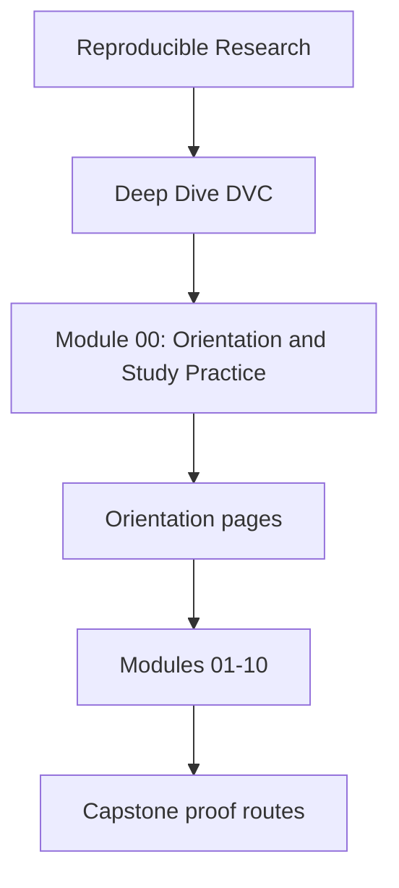
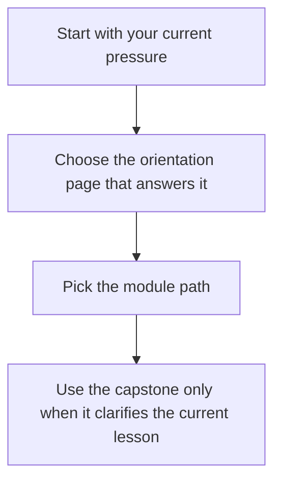

# Module 00: Orientation and Study Practice

<!-- page-maps:start -->
## Module Position




<!-- page-maps:end -->

This module exists to make the course legible before the first technical lesson starts.
Deep Dive DVC is not a collection of pipeline commands. It is a course about stable
state identity, truthful state transitions, meaningful comparison surfaces, deliberate
promotion, remote-backed recovery, and the review habits that keep those claims honest.

## Use this module when

- you want the course shape before committing to a reading path
- you need the shortest honest first session instead of browsing the whole shelf
- you want to know when the capstone helps and when it adds noise

## Start here by question

| If the question is... | Read this first |
| --- | --- |
| what journey does the whole course take | [course-map.md](course-map.md) |
| what should my first session look like | [first-contact-map.md](first-contact-map.md) |
| how should I bridge from state foundations into comparison, recovery, and promotion | [mid-course-map.md](mid-course-map.md) |
| how should I re-enter the course for stewardship, migration, or trust review | [mastery-map.md](mastery-map.md) |
| which recurring terms matter before Module 01 | [glossary.md](glossary.md) |

## What this course is trying to build

By the end of Deep Dive DVC, you should be able to:

- explain which state layer is authoritative for declaration, execution, promotion, and recovery
- keep params, metrics, experiments, and release surfaces semantically meaningful
- separate downstream trust from repository-internal evidence
- judge when DVC still owns a concern and when another boundary should take over

## First proof route

When you want one executable companion route without overcommitting to the capstone:

```sh
make PROGRAM=reproducible-research/deep-dive-dvc capstone-walkthrough
```

Use the walkthrough when the current module is clear enough that a repository specimen
will help. Stay in the smaller lesson model when the capstone starts feeling larger than
the concept you are studying.

## Orientation files in this module

- [course-map.md](course-map.md)
- [first-contact-map.md](first-contact-map.md)
- [mid-course-map.md](mid-course-map.md)
- [mastery-map.md](mastery-map.md)
- [how-to-study-this-course.md](how-to-study-this-course.md)
- [glossary.md](glossary.md)
