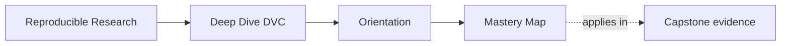
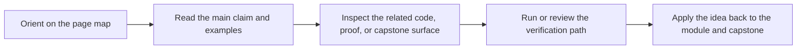

# Mastery Map

<!-- page-maps:start -->
## Page Maps

<!-- page-maps:end -->

Use this page when the course is no longer about first contact or ordinary study rhythm.
The goal here is stewardship: decide what can still be trusted, what must change, and
what no longer belongs inside DVC at all.

## Return by late-course pressure

| If the pressure is... | Revisit | Keep nearby | Capstone cross-check |
| --- | --- | --- | --- |
| what downstream users are actually allowed to trust | Module 09 | [Review Checklist](../reference/review-checklist.md) | [Capstone Review Worksheet](../capstone/capstone-review-worksheet.md) |
| whether the promoted bundle is smaller and clearer than the full repository | Module 09 | [Boundary Review Prompts](../reference/boundary-review-prompts.md) | [Capstone Proof Guide](../capstone/capstone-proof-guide.md) |
| whether a recovery or migration story is still honest | Modules 08 to 10 | [Topic Boundaries](../reference/topic-boundaries.md) | [Capstone Proof Guide](../capstone/capstone-proof-guide.md) |
| whether DVC should keep owning this concern at all | Module 10 | [Anti-Pattern Atlas](../reference/anti-pattern-atlas.md) | [Capstone Review Worksheet](../capstone/capstone-review-worksheet.md) |

## Late-course route

### Module 09: promotion and auditability

Use Module 09 when the review question is downstream trust.

- Re-read the module as a boundary question, not as a release ceremony.
- Ask which surfaces are public contract and which remain repository-internal evidence.

### Module 10: migration and governance

Use Module 10 when the review question is long-lived ownership.

- Re-read the module as a stewardship question, not as a victory lap.
- Ask which responsibilities DVC still owns honestly and which should move to a smaller,
  clearer boundary.

## Good mastery signal

You are using this map well when you can say all three:

- what the authoritative surface is for the current trust claim
- which proof route is proportionate instead of theatrical
- what you would still reject even if the repository currently passes its commands
