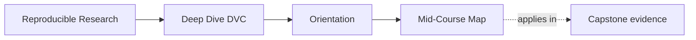
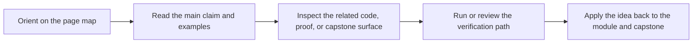

# Mid-Course Map

<!-- page-maps:start -->
## Page Maps

<!-- page-maps:end -->

Use this page when Modules 01 to 04 feel stable and you need a deliberate bridge into
comparison, collaboration, recovery, and promotion. The goal is to stop the middle of the
course from feeling like four separate topics that all happen to mention DVC.

## Use this map for these pressures

| If the pressure is... | Start with | Keep nearby | Capstone cross-check |
| --- | --- | --- | --- |
| what makes a metric or parameter comparison honest | Modules 05 to 06 | [Proof Matrix](../guides/proof-matrix.md) | [Capstone Proof Guide](../capstone/capstone-proof-guide.md) |
| how another maintainer can rerun and review this repository | Module 07 | [Review Checklist](../reference/review-checklist.md) | [Capstone Review Worksheet](../capstone/capstone-review-worksheet.md) |
| what survives local loss and what only looked durable | Module 08 | [Boundary Review Prompts](../reference/boundary-review-prompts.md) | [Capstone Proof Guide](../capstone/capstone-proof-guide.md) |
| what downstream users are actually allowed to trust | Module 09 | [Topic Boundaries](../reference/topic-boundaries.md) | [Capstone Review Worksheet](../capstone/capstone-review-worksheet.md) |

## Module clusters

### Modules 05 to 06: meaningful comparison

Use this cluster when the repository already runs, but the meaning of its comparisons is
still blurry.

- Module 05 teaches params, metrics, and semantic comparability.
- Module 06 teaches experiments as controlled deviations from a baseline rather than as
  disconnected side runs.

Leave this cluster able to say what changed, why the comparison is still honest, and
which files record that meaning.

### Modules 07 to 08: collaboration and recovery

Use this cluster when the pressure is no longer only local correctness.

- Module 07 teaches what another maintainer or CI system should be able to rerun and
  review without oral explanation.
- Module 08 teaches what survives local loss because the remote-backed layers still own
  authority.

Leave this cluster able to separate collaboration trust from recovery trust.

### Module 09: promotion and downstream trust

Use this step when the question becomes smaller public trust rather than repository-wide
state.

- Module 09 teaches promotion as a smaller boundary than the full repository.

Leave this step able to explain what belongs in the promoted bundle and what must remain
internal evidence.

## When to leave this route

Move to [mastery-map.md](mastery-map.md) once the question becomes stewardship,
migration, or whether DVC should keep owning the concern at all.

## Good next move after this map

Open exactly one of these before resuming:

- [Module Checkpoints](../guides/module-checkpoints.md) if you need the exit bar
- [Pressure Routes](../guides/pressure-routes.md) if urgency is shaping the reading order
- [Capstone Map](../capstone/capstone-map.md) if the module is clear but the repository
  surface is not
