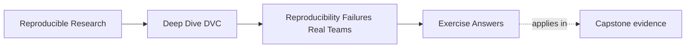

# Exercise Answers

<!-- page-maps:start -->
## Page Maps

<!-- page-maps:end -->

These answers are model explanations, not the only acceptable wording.

What matters is whether the reasoning makes the workflow story more honest.

## Answer 1: Separate repeatability from reproducibility

What the claim does show:

- one person achieved a local rerun with a matching result

What it does not show yet:

- whether another person could recover the same result later
- whether the same data identity, environment, and parameters were actually preserved
- whether the repository explains the run without relying on memory

Stronger next question:

- what would another teammate need in order to recover this result from the repository and
  declared artifacts alone

The main lesson is that local rerun success is evidence, but it is not the whole proof.

## Answer 2: Find the hidden state

Strong answers should include items like:

- the exact identity of `train.csv`
- the manual cleaning step that produced `train.csv`
- the threshold sometimes passed via CLI
- the environment used by the original author
- any dependency versions in that environment
- the command history or shell practice used to launch the run
- the exact relationship between the dataset and `results/metrics.csv`

The important point is that the real workflow already includes these influences whether or
not the repository has described them well.

## Answer 3: Name Git's real boundary

A strong review note would say:

> Git is preserving source code, visible configs, and textual instructions well. The gap
> is that the full result story still includes data identity, derived artifacts, and
> execution assumptions that source history alone does not make explicit. That matters
> because a team can version code carefully and still fail to recover or defend the result
> later.

The main lesson is to respect Git's strengths while refusing to overload its authority.

## Answer 4: Draw the DVC boundary honestly

What DVC is likely to help with:

- tracked data and artifact identity
- visible pipeline relationships
- recorded stage outputs and recoverable workflow state

What DVC does not settle by itself:

- whether the data is scientifically valid
- whether the workflow is fully deterministic everywhere
- whether the team's published outputs are interpreted responsibly
- whether undocumented manual behavior has been removed

Why the distinction matters:

- it keeps tool expectations honest and makes later workflow design more precise

## Answer 5: Write your first workflow inventory

There is no single correct inventory, but strong answers will clearly name:

- where the source data comes from
- what parameters or defaults shape behavior
- what environment or machine assumptions still matter
- which outputs people actually trust
- which parts of the story still depend on memory, luck, or undeclared state

The main lesson is that the inventory should describe the present workflow truth, not an
imagined future one.

## Self-check

If your answers consistently explain:

- why team-grade reproducibility is harder than a local rerun
- which hidden inputs are influencing the workflow
- what Git is and is not preserving
- what DVC can improve without pretending to own everything

then you are using Module 01 correctly.
