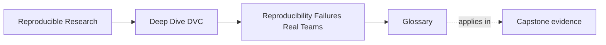

# Glossary

<!-- page-maps:start -->
## Page Maps

<!-- page-maps:end -->

This glossary keeps the language of Module 01 stable.

The goal is practical clarity: when you use the same words for the same failure patterns,
the rest of Deep Dive DVC becomes easier to reason about.

## Terms

| Term | Meaning in this module |
| --- | --- |
| repeatability | The ability to rerun a workflow in roughly the same local setup and get the same or similar result. |
| reproducibility | The ability for another person to recover the same result later from the recorded artifacts, rules, and declared inputs rather than from private memory. |
| hidden state | Any influential condition, input, or side effect that shapes the result without being made explicit enough for others to inspect and recover. |
| undeclared input | A file, parameter, environment assumption, or manual step that affects a result but is not represented clearly in the workflow story. |
| local success | A result that seems fine for one person on one machine right now, without proving that the team can recover it later. |
| source-control boundary | The set of things Git is naturally strong at preserving, especially textual source history and deliberate edits. |
| result story | The full explanation of how a result came to exist, including data, parameters, environment, workflow steps, and trusted outputs. |
| social memory | Important workflow knowledge that lives mainly in people's recollection rather than in durable artifacts. |
| mechanical reproducibility | The part of reproducibility concerned with explicit state, recorded relationships, and recoverable artifacts. |
| tool boundary | The line between what DVC is meant to own and what still belongs to environment discipline, governance, scientific judgment, or release review. |
| trusted output | A file, report, or metric the team actually treats as authoritative in decisions, reviews, or releases. |
| workflow inventory | A structured description of a workflow's real inputs, assumptions, trusted outputs, and weak points before redesign begins. |

## How to use these terms

If a discussion in Module 01 starts getting vague, ask which term has become unclear:

- are we describing repeatability or reproducibility?
- is this input explicit, or is it hidden state?
- is Git preserving this well, or is it outside the source-control boundary?
- is this something DVC should own, or does it belong to a different tool boundary?

Those questions usually turn a fuzzy complaint into a useful diagnosis.
