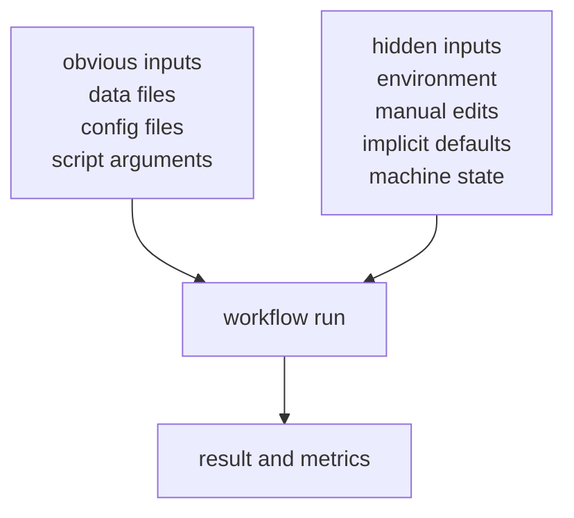

# Hidden State and Undeclared Inputs

Most fragile workflows do not fail because people forgot the main script.

They fail because influential inputs were present, mattered, and never became part of the
recorded story.

That is hidden state.

## What counts as hidden state

Hidden state is any input, condition, or side effect that influences the result without
being made explicit enough for others to inspect and recover.

Typical examples include:

- local data copies that differ from what the repository implies
- environment versions that changed quietly
- notebook cells run in a particular order
- parameters typed into commands but never saved
- helper files or preprocessing steps performed outside the visible workflow
- random seeds, filesystem order, or machine-specific behavior

The details vary. The pattern is stable.

## Why hidden state hurts teams

Hidden state makes teams ask the wrong question:

> what changed?

The harder truth is:

> what was influencing the result all along without being recorded?

That is why reproducibility failure often feels mysterious. The workflow is not always
breaking in front of you. Sometimes it is only revealing that the original run was never
fully described.

## A helpful way to sort inputs

The learner does not need to fear this diagram. They need to use it.

Every real workflow has both categories at first. The engineering work is deciding which
hidden inputs must become explicit.

## A small example

Imagine this repository:

- `train.py`
- `config.yaml`
- `data/raw.csv`
- `README.md` with the command

That looks respectable.

But the real run may also depend on:

- `pandas` and `scikit-learn` versions
- a local preprocessing notebook that cleaned the CSV once
- a remembered seed the author passed via CLI
- an untracked feature-selection file under `/tmp`
- the order in which a folder of inputs was enumerated

The repo did not lie exactly. It simply did not tell the whole story.

## Common hidden inputs learners should look for first

Start with these categories:

| Category | Common example |
| --- | --- |
| data identity | a file path exists, but the exact bytes are not controlled |
| parameters | command-line flags were used but not captured |
| preprocessing | a one-off step happened outside the recorded pipeline |
| environment | library versions or system tools changed |
| execution state | notebook order, temp files, caches, or machine-local defaults |

This list is intentionally ordinary. Hidden state usually lives in mundane places.

## Why notebooks amplify the problem

Notebooks are valuable, but they make hidden state easier to accumulate:

- cells can run out of order
- intermediate values can live in memory
- edits can happen without a clear input-output contract
- saved outputs can look authoritative even when the path to them is unclear

This is not an anti-notebook argument.

It is an argument for being more honest about the state notebooks often carry.

## What "undeclared input" means in practice

An undeclared input is not only a missing file in a manifest.

It can also be:

- a parameter that exists only in shell history
- a default threshold buried inside code
- a path assumed by convention but never tracked
- a cloud or local dataset that multiple people call "the same" without byte identity

Once learners start seeing this pattern, later DVC concepts have a place to land.

## A good first inventory question

Ask of any result you care about:

1. what files influenced this
2. what settings influenced this
3. what environment influenced this
4. what manual steps influenced this

If any answer starts with "well, usually..." or "we just know that...", the workflow still
contains hidden state worth surfacing.

## Keep this standard

Do not define a workflow only by the script you can see.

Define it by the full set of things that had the power to change the result.

That shift is what lets DVC later act on something real instead of on a simplified story
that never matched the work.
