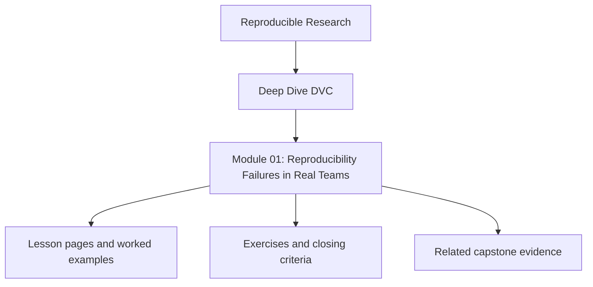
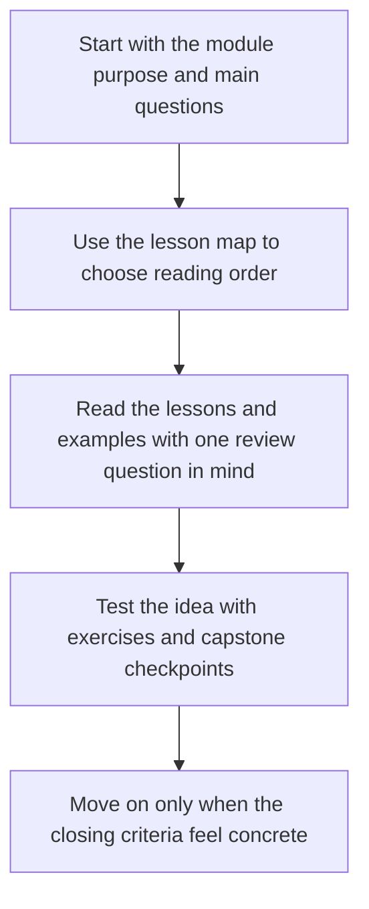
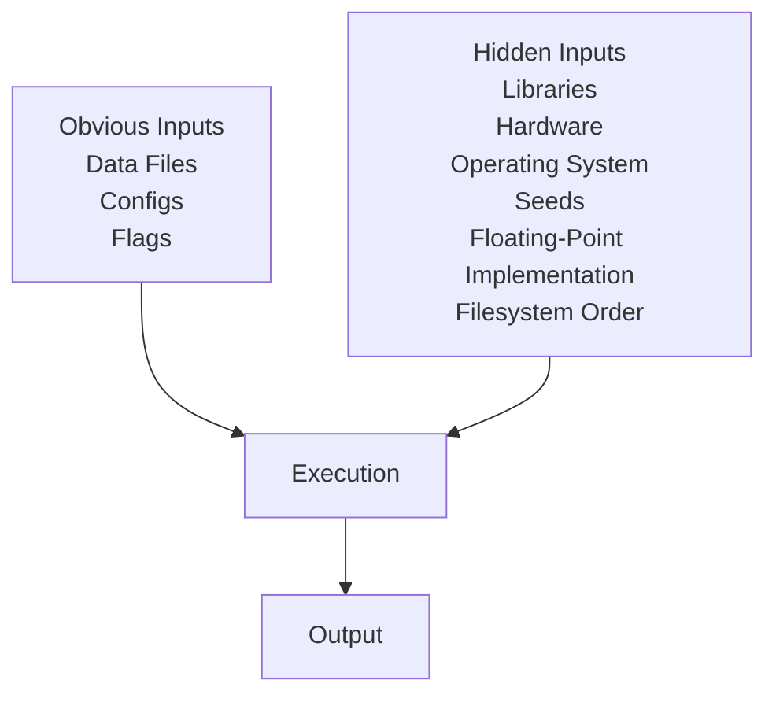

# Module 01: Reproducibility Failures in Real Teams


<!-- page-maps:start -->
## Module Position




<!-- page-maps:end -->

Read the first diagram as a placement map: this page sits between the course promise, the lesson pages listed below, and the capstone surfaces that pressure-test the module. Read the second diagram as the study route for this page, so the diagrams point you toward the `Lesson map`, `Exercises`, and `Closing criteria` instead of acting like decoration.

*Motivation, mental models, and the problem DVC actually solves*

---

## Purpose of this Module

This module starts from the failure surface, not from the tool. Before DVC can make
sense, the learner has to see why ordinary Git-plus-script workflows still leave teams
unable to recover, compare, or defend results later.

Use this module to answer three questions clearly:

1. What usually breaks first when a workflow claims reproducibility but cannot defend it?
2. Why are Git, notebooks, and ad hoc scripts helpful but insufficient?
3. What problem does DVC solve, and what problem remains outside its authority?

If those answers stay vague, the rest of the course will feel like features instead of a
coherent state model.

---

## At a Glance

| Focus | Learner question | Capstone timing |
| --- | --- | --- |
| reproducibility failure | "Why does rerunning code still fail trust?" | use the capstone lightly here, mainly as a specimen |
| tool boundary | "What problem does DVC solve, and what does it not solve?" | enter only after the failure model feels concrete |
| hidden state | "Which influential inputs are usually missing from the story?" | expect later modules to make the boundary explicit |

## Learning outcomes

- distinguish repeatability from reproducibility without collapsing them into one vague success criterion
- identify the hidden inputs that make Git-plus-script workflows structurally fragile
- explain what DVC solves and which governance problems remain outside DVC’s authority

## Verification route

- Read the simplified workflow specimen in this module, then inspect the capstone only lightly as a failure specimen rather than as a full solution surface.
- Write down at least five hidden inputs from one of your own workflows and compare that list to what the module calls out as undeclared state.
- Use the readiness checklist at the end of this module as the proof bar before moving to Module 02.

---

## 1.1 A Familiar Scenario (Grounded in Practice)

Examine a standard ML workflow, illustrated with simplified elements:

- A dataset resides in `data/raw.csv`.
- A script, `train.py`, processes the data and trains a model (e.g., via scikit-learn or PyTorch).
- Metrics (e.g., accuracy) are output to the console or a file like `metrics.csv`.
- Code and results are committed to Git, perhaps with a README outlining execution steps.

Months later:
- Rerunning `train.py` yields divergent metrics.
- The cause is unclear: perhaps the dataset was subtly altered, preprocessing occurred offline, or library versions changed.
- A team member asserts no modifications were made, yet outcomes differ.

No overt errors occur—no crashes or exceptions. Nonetheless, the outcome is irreproducible.

The module is doing its job only if the learner leaves with a sharper question, not just
with a stronger preference for DVC.

This reflects not individual error, but the inherent outcome of ML processes lacking formalized dependencies. To illustrate, consider this pseudo-code snippet from `train.py`:

```python
import pandas as pd
import numpy as np  # Version implicitly affects random seeding

data = pd.read_csv('data/raw.csv')  # Assumes unchanged file
np.random.seed(42)  # Seed set, but environment may influence behavior

# Training logic...
```

Such setups invite silent inconsistencies.

---

## 1.2 Repeatability vs. Reproducibility: A Key Differentiation

These terms are frequently conflated, yet they denote distinct concepts.

### Repeatability
> Executing identical code repeatedly within the same environment and machine, yielding consistent results.

This is localized and vulnerable, achievable through minimal interventions such as avoiding system restarts, library updates, or data modifications. Failures often manifest subtly.

### Reproducibility
> Recreating equivalent results over time, across machines, and among individuals via documented artifacts and protocols.

This is broader and resilient, enduring fresh repository clones, varied environments, team transitions, continuous integration (CI) pipelines, and audits.

Most ML processes offer transient repeatability but are structurally irreproducible. DVC prioritizes the latter.

**Key Takeaway**: Distinguishing these fosters precise expectations from tools like DVC.

---

## 1.3 Limitations of Git in ML Contexts

Git excels in many domains but is often inappropriately extended to ML.

### Git's Strengths
- Versioning textual content.
- Capturing deliberate modifications.
- Facilitating branching and merging of source code.
- Enabling granular line-by-line differences.

### Git's Gaps
- Handling voluminous binary files.
- Managing derived outputs.
- Recording runtime contexts.
- Linking causal dependencies among stages.

Git logs alterations, not derivations. This fosters the misconception: "Versioned code implies versioned results." In reality, outcomes hinge on precise data, parameters, sequencing, environments, and randomness—elements Git overlooks.

DVC complements Git by addressing these omissions in data-centric systems.

---

## 1.4 Overlooked Inputs in ML Scripts

Inputs transcend explicit files and arguments, even in straightforward scripts.

### Evident Inputs
- Training datasets.
- Configuration YAML or JSON files.
- Command-line parameters.

### Concealed Inputs (Commonly Overlooked)
- Library versions (e.g., NumPy vs. TensorFlow).
- Hardware-specific behaviors (e.g., BLAS for linear algebra, CUDA for GPU acceleration).
- System settings (e.g., locale, operating system).
- Random seeds.
- Floating-point precision variations.
- Filesystem enumeration order.

These elements impact results tracelessly unless documented. A reproducible framework must address: *What inputs were present, and how did they shape the output?* Few ML initiatives can respond comprehensively.

**Illustration**:



---

## 1.5 ML's Unique Reproducibility Challenges Compared to Software Engineering

Traditional software features explicit inputs, deterministic outputs, and inherently repeatable builds. In contrast, ML involves expansive, mutable inputs; probabilistic outputs; amplified effects from minor changes; and evaluative rather than absolute correctness.

Consequently:
- Unnoticed drifts prevail.
- Troubleshooting is historical.
- Reliability diminishes progressively.

In ML, reproducibility safeguards against inadvertent errors, rendering it indispensable.

---

## 1.6 Boundaries of Reproducibility

Precision in scope is vital.

Reproducibility excludes:
- Uniform floating-point outcomes across hardware.
- Perpetual cloud storage access.
- Data semantic accuracy.
- Conclusion validity.

DVC avoids:
- Data validation.
- Determinism assurance.
- Experimental methodology substitution.
- Comprehensive environment oversight.

It upholds mechanical invariants, not empirical veracity. Misaligned expectations often underlie DVC dissatisfaction.

---

## 1.7 Foundational Principle

Reproducibility inheres not in isolated scripts, but in integrated systems encompassing data, code, execution, storage, personnel, and temporal factors. Implicit elements render it fortuitous.

DVC renders pivotal components explicit, versioned, and verifiable, underpinning the course.

---

## 1.8 Initial Reflective Exercise (Pre-DVC)

Engage earnestly:
1. Select a prior project.
2. Document: data origins, alterations, key parameters, and environment.
3. Evaluate: Could another reproduce it in six months? Could you?

Affirmative uncertainty is typical; this course aims to resolve it.

**Guidance**: Note findings in a journal for later comparison.

---

## 1.9 Course Overview

Subsequent modules establish enforceable invariants:
- **Module 02**: Immutable, content-based data identity.
- **Module 03**: Environments as declared inputs.
- **Module 04**: Pipelines as verifiable directed acyclic graphs (DAGs).
- **Module 05**: Metrics and parameters as interpretive agreements.
- **Module 06**: Experiments as managed variations.
- **Module 07**: Collaborative and CI-driven safeguards.
- **Module 08**: Endurance against scale and incidents.

Each invariant is defined, exemplified, and failure-tested rigorously.

---

## Module 01: Readiness Checklist

Affirm readiness by confirming:
- [ ] Explanation of Git's inadequacy for reproducibility.
- [ ] Differentiation between repeatability and reproducibility.
- [ ] Identification of at least five hidden inputs in personal workflows.
- [ ] Awareness of DVC's exclusions.
- [ ] Recognition of reproducibility as systemic.

Clarify uncertainties before advancing; foundational precision enables depth.

---

### Transition to Module 02

With the challenge articulated, we introduce DVC's initial assurance: *Data identity stems from content, independent of location, naming, or purpose.* Module 02 codifies this, establishing its foundational role.

## Directory glossary

Use [Glossary](glossary.md) when you want the recurring language in this module kept stable while you move between lessons, exercises, and capstone checkpoints.
