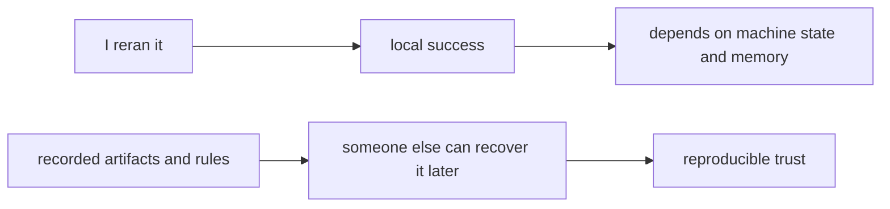

# Repeatability Versus Reproducibility

These two words are often used as if they mean the same thing.

They do not.

That confusion is one of the main reasons teams think they are in better shape than they
really are.

## The short version

Repeatability means:

- I can run the same workflow again in roughly the same setup
- I get the same or similar result right now

Reproducibility means:

- another person can recover the same result later
- on another machine
- from the recorded artifacts and rules rather than from private memory

Repeatability is local and fragile.

Reproducibility is social and durable.

## Why the difference matters

A workflow can be repeatable for one person on one laptop and still be irreproducible for
the team.

That happens when success depends on things like:

- a local copy of the right data
- remembered setup steps
- a library stack nobody recorded precisely
- a notebook state that only the author understands

The run can still "work." The trust story is what fails.

## A practical contrast

| Question | Repeatability answers | Reproducibility answers |
| --- | --- | --- |
| can I rerun this today | often yes | maybe, but that is not the whole test |
| can a teammate rerun it next month | not necessarily | this is the real target |
| does the repository explain what mattered | often only partly | it has to |
| does history survive machine changes and team turnover | usually no | it must |

This table is the first mental shift the module needs.

## A small example

Imagine a teammate says:

> I reran `train.py` and got the same metric, so the workflow is reproducible.

That statement is too strong.

At best, it shows a narrow form of repeatability.

It does not yet answer:

- did they use the same exact data bytes
- did they use the same environment
- did the same parameters and preprocessing steps apply
- could someone else repeat the run from the repository alone

The gap between those questions is the gap between the two terms.

## A human way to think about it

Repeatability often ends at local success.

Reproducibility has to survive transfer.

## Why teams overestimate repeatability

Teams often confuse the two because:

- the original author still remembers the setup
- the right files are still sitting on disk
- the environment has not drifted enough yet to cause visible breakage
- the workflow has not been pressure-tested by turnover, CI, or audit questions

In other words, the workflow can appear healthy while it is still relying on luck.

## Good questions to ask early

When someone says a workflow is reproducible, ask:

1. could another person recover the run from the repo and declared inputs
2. could the same result be recovered after a clean clone
3. which parts of the story are still living only in memory

Those questions are not nitpicking. They are the beginning of engineering honesty.

## What DVC is not solving here

DVC does not magically make every workflow deterministic or scientifically valid.

What it helps with is the mechanical side of reproducibility:

- tracked data identity
- visible stage relationships
- recoverable artifacts

That is why this distinction belongs before any DVC command.

## Keep this standard

Do not let "I reran it" end the discussion.

Treat that as a useful signal, not as final proof.

If the result cannot survive transfer across people, machines, and time, the workflow may
be repeatable today and still irreproducible in the way teams actually care about.
