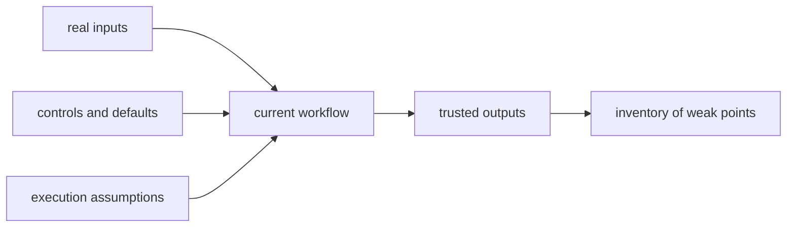

# The First Honest Workflow Inventory

Before learners start using DVC, they need one skill that is more basic than any command:

they need to describe their current workflow without flattering it.

That is what this inventory is for.

## What the inventory is trying to reveal

The goal is not to embarrass anyone or prove the workflow is bad.

The goal is to answer, in plain language:

- what inputs really matter
- what outputs people actually trust
- what steps are still manual or implicit
- what parts of the story still live in memory

Without that inventory, tool adoption often becomes cosmetic.

## A simple inventory structure

Use five sections:

1. source inputs
2. control inputs
3. execution assumptions
4. outputs and who trusts them
5. weak points and missing evidence

This is enough for Module 01. The later modules will sharpen each section.

## Section 1: Source inputs

Write down:

- which datasets or raw inputs exist
- where they come from
- whether the team knows their exact identity or only their path

Bad sign:

> the data is in `data/final.csv`

Stronger note:

> the workflow reads `data/final.csv`, but the team does not yet have a durable way to
> prove which exact bytes that filename referred to over time.

That sentence already points toward why DVC will matter later.

## Section 2: Control inputs

List the things that change behavior:

- config files
- parameter files
- CLI flags
- seeds
- thresholds or defaults buried inside code

If an important setting is remembered socially rather than recorded somewhere durable, put
it in the inventory as a weakness.

## Section 3: Execution assumptions

Ask what the run is quietly assuming:

- a particular Python or R environment
- local caches or temp directories
- notebook state
- machine-specific filesystems or services
- manually prepared folders

This is often the hardest section because teams are so used to these assumptions that they
stop seeing them as inputs at all.

## Section 4: Outputs and trust

Not every output is equally important.

Ask:

- which files or reports people actually share
- which files are only internal intermediates
- which outputs are treated as authoritative in meetings, pull requests, or releases

This matters because reproducibility work is partly about protecting what people truly
trust, not every file in the working tree equally.

## Section 5: Weak points and missing evidence

Finish by naming the weak points directly:

- unknown data identity
- undocumented manual preprocessing
- environment drift risk
- outputs trusted without a clear contract
- one-person memory bottlenecks

The point is not to fix them all in Module 01.

The point is to stop pretending they are not there.

## A small example

Imagine a learner writes this inventory:

- source input: `customers.csv`
- control input: `threshold=0.8` inside `score.py`
- execution assumption: runs only from one laptop with a specific Conda env
- trusted output: `metrics.csv` emailed to the team
- weak point: nobody can prove which raw CSV produced last quarter's metric

That is already a strong Module 01 result.

It is concrete, honest, and ready for later modules.

## A useful diagram for learners

This is not a future-state diagram. It is a present-state mirror.

## What a good inventory feels like

A good inventory often feels mildly uncomfortable because it replaces confidence with
specificity.

That is useful discomfort.

The inventory is working when the learner can say:

- here is what we really trust
- here is what still depends on memory
- here is what we cannot yet recover cleanly

That is a much better starting point than "our workflow is fine, we just want better tooling."

## Keep this standard

Do not let the first inventory turn into a wishlist about future tools.

Keep it about the present workflow:

- what it depends on
- what it produces
- what it cannot currently defend

That honesty is the real prerequisite for everything that follows in Deep Dive DVC.
