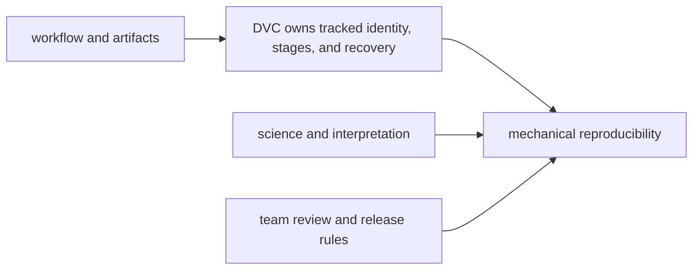

# What DVC Does and Does Not Own

One of the fastest ways to get confused about DVC is to expect it to solve every problem
that appears in a data workflow.

It does not.

DVC is useful precisely because its job is narrower than that.

## What DVC is good at owning

DVC helps make parts of the workflow story explicit and recoverable, especially around:

- data and artifact identity
- declared pipeline stages
- recorded execution state
- experiment context and comparison
- recovery of tracked artifacts from durable storage

These are mechanical reproducibility problems.

They matter a lot, and many teams handle them badly without a tool boundary like DVC.

## What DVC does not own

DVC does not guarantee:

- that the data is semantically correct
- that the science or analysis is valid
- that the workflow is fully deterministic on every machine
- that undocumented manual work has magically become part of the system
- that downstream consumers understand the meaning of what was published

Those are important concerns. They simply belong to other boundaries as well:

- data quality practices
- experimental design
- environment discipline
- team governance
- release and review contracts

## A useful mental model

DVC is part of the trust story. It is not the whole trust story.

## Why this distinction matters in Module 01

If learners expect DVC to solve everything, later frustrations will sound like:

- "DVC tracked the data, but the dataset was still wrong"
- "DVC recorded the run, but the model is still a bad model"
- "DVC restored the files, but the team still argues about what is safe to publish"

Those are not evidence that DVC failed. They are evidence that the workflow has more than
one authority boundary.

## A small example

Suppose DVC tracks:

- the exact training dataset
- the pipeline stages
- the resulting metrics and model artifacts

That is useful and important.

But the workflow can still fail in other ways:

- the labels may be wrong
- the evaluation split may be scientifically weak
- the published report may mislead downstream readers
- a teammate may still make an undocumented manual change before release

DVC can make some of these failures easier to detect or discuss. It does not own all of
their repair.

## What honest tool boundaries sound like

Strong statement:

> DVC helps us track what data and derived artifacts were used, what the pipeline declared,
> and what recorded state can be recovered later.

Weak statement:

> DVC makes the whole ML workflow reproducible and trustworthy.

The first one names a boundary. The second one hides one.

## How the capstone helps

The DVC capstone is useful here because it separates several layers cleanly:

- `dvc.yaml` and `dvc.lock` for declared and recorded workflow state
- the remote and recovery route for durability
- `publish/v1/` for downstream review

That separation is the lesson.

It shows that no single file or tool is carrying the whole meaning of the system.

## Good questions to ask once DVC is introduced

When evaluating a DVC-based repo, ask:

1. which part of the workflow story is now explicit because of DVC
2. which important risk still lives outside DVC
3. where do governance, environment control, and release review still need to do work

Those questions keep tool expectations honest.

## Keep this standard

Use DVC as a way to reduce hidden state and improve recoverability.

Do not use DVC as a way to avoid naming the rest of the system.

The strongest workflows are the ones where DVC's contribution is clear, useful, and not
mythologized into authority it never had.
