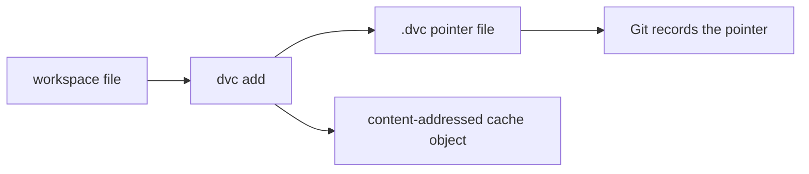

# Content Addressing, Cache, and Pointer Files

Once paths stop being mistaken for identity, the next question becomes:

> how does DVC represent identity instead?

The answer is content addressing plus recorded references.

## The core claim

In DVC, two artifacts are treated as the same data when their content is the same.

That sounds simple, but it changes the whole trust model:

- renaming a file does not create a new identity
- moving a file does not create a new identity
- changing even one byte creates a different identity

This is much stronger than path-based naming conventions.

## The three pieces you need to understand

When you run `dvc add`, three ideas matter most:

1. DVC reads the content and computes a content-derived identifier
2. DVC stores the content in the cache
3. DVC records a small pointer file that refers to that identity

Those three pieces are enough for Module 02.

## What the pointer file is doing

A `.dvc` file is not the data itself.

It is a recorded claim about the data:

- which path in the workspace is being tracked
- which content-derived identity it points to
- what size or metadata is associated with that tracked artifact

That means Git can version the pointer while DVC manages the actual data identity and
recovery story.

## A practical picture

This diagram matters because it is easy to blur the pointer and the content together.

They are related, but they are not the same layer.

## A small example

Suppose you track `data/raw.csv` with DVC.

What matters most is not the exact cache path syntax.

What matters is:

- the workspace still has a file at `data/raw.csv`
- DVC now has a content-addressed cached copy
- a `.dvc` file now tells Git and the team which data identity the workspace path refers to

Once you see that, later recovery commands stop feeling magical.

## Why the cache matters

The cache is what makes identity reusable and restorable.

Without the cache, the pointer would be only a label.

With the cache, the recorded identity can be connected back to real bytes again.

That is why cache layout is not just a storage detail. It is part of how DVC turns an
identity claim into something operationally useful.

## Why this supports collaboration

Content addressing helps collaboration because:

- identical content does not need to be treated as unrelated just because it moved
- the system can reuse stored artifacts instead of duplicating them blindly
- teams can compare and recover data based on identity rather than on guesswork

This is one of the biggest reasons DVC is more than "Git for big files."

## What this page is not claiming

This page is not claiming that content identity tells you whether the data is good,
meaningful, or scientifically valid.

It only tells you whether the system is talking about the same bytes.

That is a narrower claim, but it is a necessary one.

## Keep this standard

When teaching or reviewing DVC, avoid saying only:

> the file is tracked now.

Say something stronger:

> the workspace path now refers to a recorded content identity, and that identity can be
> recovered through DVC's cache and storage layers.

That is the level of precision Module 02 is trying to build.
