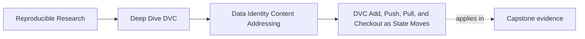

# DVC Add, Push, Pull, and Checkout as State Moves

<!-- page-maps:start -->
## Page Maps

<!-- page-maps:end -->

It is easy to memorize DVC commands before you understand what state each command is
changing.

That creates brittle knowledge.

Module 02 should leave you with a clearer question:

> when I run this command, which layer moves, and what kind of trust does that create?

## The four commands in plain language

| Command | Main state move | What it is really doing |
| --- | --- | --- |
| `dvc add` | workspace -> cache plus pointer record | creates a tracked identity for existing content |
| `dvc push` | local cache -> remote | makes tracked content durably recoverable off-machine |
| `dvc pull` | remote -> local cache | retrieves tracked content back into local durable storage |
| `dvc checkout` | cache -> workspace | reconstructs workspace files from recorded tracked state |

This table is the heart of the page.

## Why this framing matters

If you think only in command names, you will ask:

- when should I run `pull` again
- why did `checkout` touch my files
- why does `push` matter if my local run already worked

If they think in state moves, those questions become easier:

- did the content move into the right durability layer
- did the workspace get reconstructed from tracked identity
- is the remote now part of the recovery story

## A clean picture

This is the simplest useful command model for Module 02.

## `dvc add`: make identity explicit

`dvc add` matters because it is the first command that turns:

- "there is a file here"

into:

- "this workspace path now refers to recorded content identity"

You should leave this section understanding that `dvc add` is not mostly about moving
files around. It is about making a content claim explicit and locally restorable.

## `dvc push`: make recovery durable

`dvc push` does not make the result more scientifically valid.

What it does is move tracked content into a recovery layer that survives local loss.

This is a huge difference.

Without `push`, a local cache may still work for one machine. With `push`, the team can
start talking about durable recovery rather than lucky persistence.

## `dvc pull`: restore local durable state

`dvc pull` brings tracked content back from the remote into the local cache.

That means it is not only "download the file." It is:

- recover tracked identity into local durable storage
- make later workspace reconstruction possible

This is why `pull` and `checkout` are related but not identical.

## `dvc checkout`: rebuild the workspace projection

`dvc checkout` is about the workspace view.

It reconstructs or aligns workspace files from tracked content already available in the
cache.

That is why you can have content present in the cache and still need `checkout` to make
the workspace match the recorded state.

## A small example

Suppose you lose your working copy of a tracked dataset.

The honest recovery story is not only:

- run one magic command

It is:

1. the remote still holds the tracked content
2. `dvc pull` restores that content into the local cache
3. `dvc checkout` rebuilds the workspace file from the cached content

This three-layer explanation is much healthier than magical thinking.

## Common confusions

### "I pushed, so the workspace is fixed"

No. `push` is about remote durability, not local workspace reconstruction.

### "I checked out, so the remote must be fine"

No. `checkout` can succeed from local cache even when the remote has never been updated.

### "I added the file, so the team can recover it"

Not yet. `add` created recorded local identity. Durable team recovery depends on the
remote story too.

## Keep this standard

When teaching or reviewing DVC commands, always pair the command with its state move.

Do not say only:

- add tracks files
- push uploads
- pull downloads
- checkout restores

Say:

- `add` creates recorded identity
- `push` adds remote durability
- `pull` restores local durable state
- `checkout` rebuilds the workspace projection

That is the level of clarity Module 02 is aiming for.
