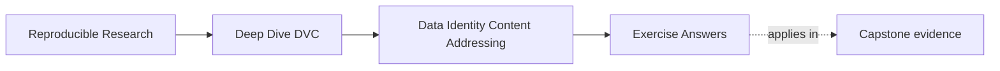

# Exercise Answers

<!-- page-maps:start -->
## Page Maps

<!-- page-maps:end -->

These answers are model explanations, not the only acceptable wording.

What matters is whether the reasoning keeps identity, state layers, and recovery claims
separate.

## Answer 1: Explain why the path is too weak

What the path does tell you:

- where a file is expected to exist in the workspace right now

What it does not tell you:

- whether the bytes changed over time
- whether the same data exists at a different path elsewhere
- whether the path now points to a new export or overwrite

Why that matters:

- reproducibility needs an identity claim that survives rename, move, overwrite, and
  cross-machine transfer

The main lesson is that location is useful but weaker than identity.

## Answer 2: Separate pointer, cache, and workspace

Strong explanation:

- the `.dvc` file records the tracked identity reference
- the cache stores the actual tracked content in DVC's local durable layer
- the workspace file is the local projection you see and use day to day

Why this matters:

- the pointer, cache, and workspace participate in one story, but they are not the same
  layer and should not be treated as interchangeable

## Answer 3: Name the authoritative layer

1. what did the pipeline actually record as executed?
   - recorded execution state, usually `dvc.lock`
2. what may a downstream reviewer safely trust?
   - published release state such as `publish/v1/`
3. what survives local cache loss?
   - remote-backed recovery durability
4. what files are visible in the working tree right now?
   - workspace state

The main lesson is to stop answering every question with "the repo."

## Answer 4: Explain the commands as state moves

Strong explanation:

- `dvc push` moves tracked content from local cache into remote durability
- `dvc pull` restores tracked content from remote into local cache
- `dvc checkout` rebuilds the workspace from tracked content already available locally

What new trust they add:

- `push` adds durable off-machine recovery
- `pull` reestablishes local durable state
- `checkout` realigns the workspace, but does not by itself prove remote durability

## Answer 5: Diagnose a recovery claim

What the success does prove:

- tracked content was recoverable and the workspace could be rebuilt

What it does not prove yet:

- that the full published release contract and the whole repository story are identical
- that every possible internal or semantic question is settled

What the team may be confusing:

- remote-backed recovery durability with downstream release trust or full repository meaning

The main lesson is that recovery is strong evidence, but still a bounded kind of evidence.

## Self-check

If your answers consistently explain:

- why paths are weaker than identity
- how pointer, cache, workspace, remote, and publish layers differ
- what each major DVC command really moves
- what recovery proves and what it does not

then you are using Module 02 correctly.
