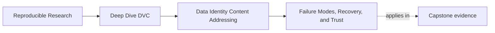

# Failure Modes, Recovery, and Trust

<!-- page-maps:start -->
## Page Maps

<!-- page-maps:end -->

Identity matters because failure eventually arrives.

Module 02 is not finished when you can explain hashes in the abstract. It is finished when
you can explain what a broken recovery or identity story actually means.

## What good recovery is proving

When a DVC repository restores tracked content after loss, it is proving something narrow
but important:

- the tracked identity was recorded
- the durable storage layer still has the content
- the workspace can be rebuilt from that recorded state

That is a strong claim.

It is not the same as proving every part of the project is correct or complete.

## Common failure questions

When recovery or identity seems broken, ask:

1. which layer is missing or inconsistent
2. whether the content identity was recorded but not stored durably
3. whether the workspace is out of sync with recorded state
4. whether a published artifact is being confused with full repository state

This keeps the diagnosis grounded.

## A practical failure table

| Symptom | Likely meaning |
| --- | --- |
| tracked file is missing after checkout | cache may not contain the needed content |
| `pull` cannot restore an object | remote durability is incomplete or misconfigured |
| local file exists but hash or identity does not match expectations | workspace drift or external modification occurred |
| published bundle exists but full repository state cannot be rebuilt | published trust and recovery durability are being confused |

These are not random operational annoyances. They are boundary clues.

## A small recovery picture

The last step matters just as much as the restoration commands.

## Why verification still matters after recovery

A restored file in the workspace is not automatically the whole trust story.

You still need to ask:

- did we restore the tracked content we expected
- what layer is authoritative for that claim
- is the published contract still valid after restore

This is why the capstone's recovery route includes review artifacts and not only commands.

## A small example

Suppose you delete local tracked data and then use the remote-backed recovery route.

Strong explanation:

> the repository restored the tracked content from remote to cache and rebuilt the
> workspace from that content. This proves the durable recovery path for tracked artifacts
> is working.

Too-strong explanation:

> everything about the project is now fully recovered.

The second statement overreaches. Recovery is powerful, but it still has a scope.

## Two confusions to avoid

### Confusing published release state with full recovery state

`publish/v1/` may be enough for downstream trust, but it is not the full internal
repository state. A published bundle can remain valid while broader repository recovery is
still a separate question.

### Confusing local convenience with durable truth

If a file still happens to exist on disk, that does not prove the remote story is sound.

Recovery discipline is about surviving loss, not merely about noticing that the workspace
is currently populated.

## What a healthy recovery review sounds like

Good review language sounds like this:

> The remote-backed recovery route successfully restored tracked content and allowed the
> workspace to be rebuilt. The publish bundle also verified after restore. This proves the
> tracked artifact durability story is working for those surfaces.

That sentence is strong because it says what was proven and stops there.

## Keep this standard

Whenever a recovery story sounds vague, ask:

- what exactly was restored
- from which layer
- into which layer
- what evidence confirms the result

Those questions keep Module 02 grounded in trust rather than in command mythology.
