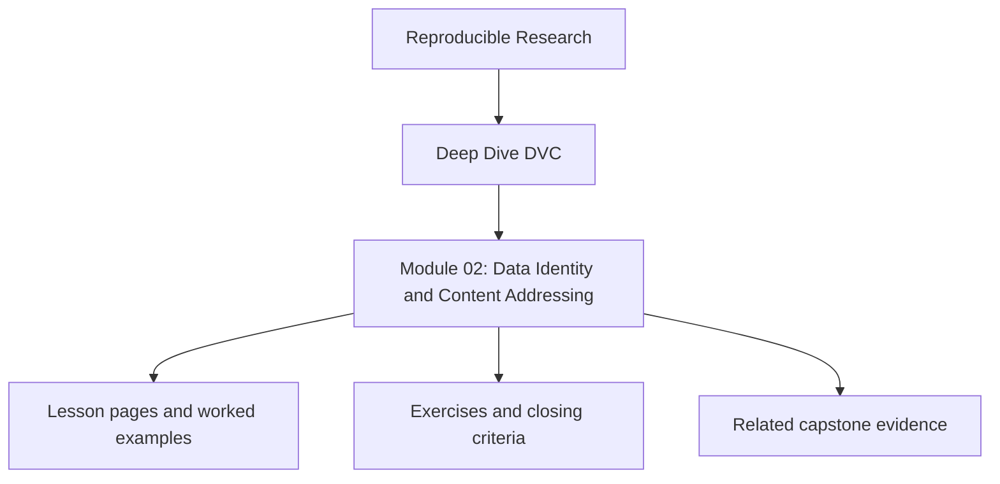
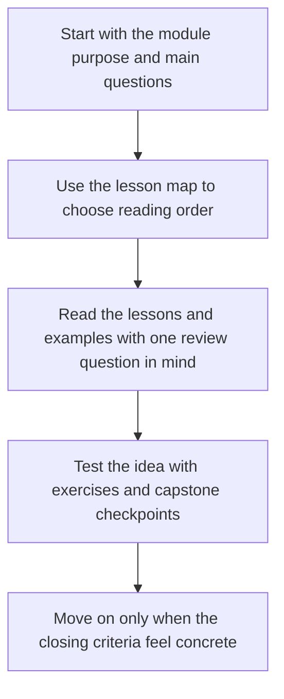
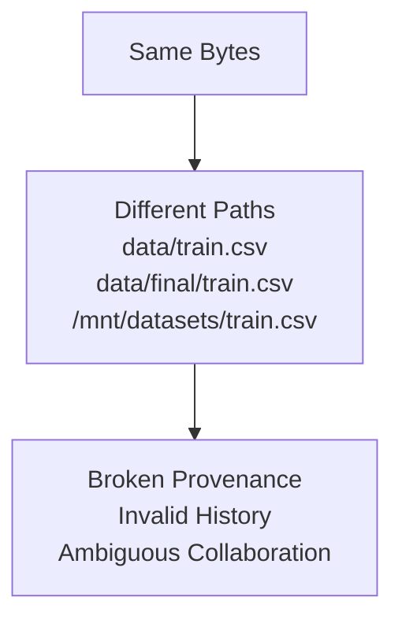

# Module 02: Data Identity and Content Addressing


<!-- page-maps:start -->
## Module Position




<!-- page-maps:end -->

Read the first diagram as a placement map: this page sits between the course promise, the lesson pages listed below, and the capstone surfaces that pressure-test the module. Read the second diagram as the study route for this page, so the diagrams point you toward the `Lesson map`, `Exercises`, and `Closing criteria` instead of acting like decoration.

*Why data must be immutable, and how DVC enforces identity*

---

## Purpose of this Module

This module makes the first non-negotiable rule explicit: paths are not identity. A
reproducible system needs a way to say what a datum is, not only where it happened to
live when someone last touched it.

Use this module to shift from location-based thinking to identity-based thinking. By the
end, you should be able to explain why content addressing, caches, remotes, and recovery
boundaries are all part of the same trust story.

If that foundation is weak, later lessons about pipelines and experiments will rest on
the wrong assumption that filenames preserve truth.

## Why this module matters in the course

This is the first module where the course stops talking about failure symptoms and starts
defining a repair boundary. If the learner leaves this module still thinking that
`data/train.csv` is the identity of the data, every later practice will be brittle:

- pipeline reruns will be hard to interpret
- experiment comparisons will be weak
- remote recovery will feel magical instead of mechanical

The point of this module is not merely to explain DVC's cache layout. It is to replace
"where the file lives" with "what bytes the system is claiming."

## Questions this module should answer

By the end of the module, you should be able to answer:

- Why is a path only a locator and not an identity?
- What is the difference between workspace state, Git state, cache state, and remote state?
- Which layer is mutable, and which layer is authoritative?
- Why does content addressing make collaboration and recovery possible?

If those answers are still fuzzy, pause here before moving on to pipeline semantics.

## At a Glance

| Focus | Learner question | Capstone timing |
| --- | --- | --- |
| content identity | "What makes two datasets the same?" | use the capstone after you can name the state layers clearly |
| state layers | "Which copy is mutable, and which one is authoritative?" | inspect `dvc.lock`, cache, remote, and publish state deliberately |
| recovery logic | "How does content identity make restoration possible?" | do not let remote behavior feel magical |

## Learning outcomes

- explain why paths are locators rather than identity and why content addressing changes the trust story
- distinguish workspace, Git, cache, remote, and promoted state without treating them as one blob of “the repo”
- describe how content identity enables recovery and collaboration instead of relying on private memory

## Verification route

- Inspect `capstone/dvc.lock`, the local cache, and the configured remote together so each state layer has a concrete artifact.
- Run `make PROGRAM=reproducible-research/deep-dive-dvc capstone-state-summary` after the module’s state layers feel legible.
- Confirm that you can explain which copy is mutable, which copy is authoritative, and which copy is only a recovery source before moving on.

## What to inspect in the capstone

Keep the capstone open while reading this module and inspect:

- `data/raw/service_incidents.csv` as committed source state
- `dvc.lock` as the recorded state transition after execution
- `.dvc/cache/` and the configured remote as content-addressed storage layers
- `publish/v1/` as a versioned projection for downstream consumers

That contrast matters. The course is trying to teach that these locations do different
jobs even when they all contain "the data."

If the learner still thinks a filename is the identity of the data, this module is not
done yet.

---

## 2.1 The Fundamental Error: Equating Paths with Identity

Conventional machine learning (ML) workflows tacitly presume: "This file constitutes the data," where "this file" denotes a path, filename, or directory. This presumption proves profoundly erroneous.

### Limitations of Path-Based Identity
Paths exhibit mutability, context-dependence, machine specificity, and reliance on interpersonal consensus. For instance, identical byte sequences might reside at:

- `data/train.csv`
- `data/final/train.csv`
- `/mnt/datasets/train.csv`
- `~/Downloads/train.csv`

Path-dependent identity undermines refactoring, invalidates historical records, and complicates collaboration. Paths signify location, not essence; systems anchoring identity to location are inherently unstable.

**Illustration**:



---

## 2.2 Content-Derived Identity as the Sole Viable Approach

DVC asserts unequivocally: **Two data artifacts are identical if, and only if, their byte sequences match.**

This is a deliberate architectural decision, representing the singular definition aligned with reproducibility imperatives.

### Advantages of Content-Based Identity
Such identity remains location-agnostic, resilient to renames and restructurings, facilitates deduplication, and permits mathematical corroboration. Files sharing a content hash are substitutable, cacheable singularly, and recoverable universally. A single-byte divergence designates distinct data, precluding conflation and mandating divergent downstream results. No intermediary states exist.

---

## 2.3 The Four Layers of State: A Precise Delineation

DVC repositories comprise four stratified layers, each with delineated duties.

### 1. Workspace (Working Tree)
- Visible disk files.
- Inherently mutable.
- Entirely deletable without loss.

The workspace serves as a transient projection, not an authoritative repository.

### 2. Git Repository
- Versions compact text artifacts, including `.dvc` files, `dvc.yaml`, `params.yaml`, and `dvc.lock`.
- Manages references, excluding raw data.

Git documents intended existence, not actual presence.

### 3. Local DVC Cache
- Content-addressed storage mechanism.
- Append-only structure.
- Branch-agnostic sharing.

Objects reside under hash-derived paths, such as `.dvc/cache/ab/cdef1234...`. This layer holds local authority but lacks cross-machine durability.

### 4. Remote Storage
- Persistent backend (e.g., S3, GCS, SSH).
- Hash-indexed.
- Supports recovery and cooperative workflows.

The remote constitutes the definitive recovery source, superseding Git.

### Layer Hierarchy
Authority propagates downward: Remote → Cache → Git pointers → Workspace. Upward flows are precluded.

**Illustration**:


---

## 2.4 Mechanics of `dvc add`: A Stepwise Analysis

Users often overlook these intricacies; this section provides clarity.

Executing `dvc add data/raw.csv` entails three indivisible operations:

1. **Byte Reading and Hashing**: Computes a cryptographic hash (MD5 default).

2. **Cache Storage**: Places bytes under a hash-derived path, ensuring immutability post-writing.

3. **Pointer File Generation**: Creates `data/raw.csv.dvc`, embedding hash, size, and path metadata.

Git subsequently versions the pointer, decoupling data from direct management. Resultantly, data achieves path independence, rename resilience, and global identifiability.

**Example Command Output (Illustrative)**:
```
$ dvc add data/raw.csv
Adding...
!WARNING! "data/raw.csv" is located outside of Git repository.
To track the contents with Git, run:

    git add data/raw.csv.dvc

Use `dvc push` to send it to remote storage.
```

---

## 2.5 Elements Explicitly Excluded from DVC Tracking

Understanding omissions is paramount.

DVC omits: semantic interpretation, accuracy, schema integrity, timestamps, permissions, ownership, and intent. Erroneous data (e.g., mislabeled CSV columns) is versioned indifferently. This reflects deliberate separation of concerns: DVC assures identity, not quality.

---

## 2.6 Immutability of Identity and Its Implications

Cached objects remain unaltered, unoverwritable, and unupdatable. File modifications generate new hashes and objects, preserving predecessors. This enables branch-efficient operations, historical retrieval, audit trails, and reliable comparisons. Mutable historical systems compromise provenance.

---

## 2.7 Empirical Verification: The Destruction Test

Assertions demand validation.

### Clean-Room Recovery Protocol
1. Commit `.dvc` files and metadata to Git.
2. Upload cache objects remotely.
3. Erase the workspace completely.
4. Clone afresh on another machine.
5. Execute: `dvc pull` followed by `dvc checkout`.

Byte-for-byte restoration affirms the invariant; discrepancies indicate implicit dependencies. This procedure defines success, not an elective.

**Guidance**: Perform in a controlled environment to avoid data loss; document outcomes for reference.

---

## 2.8 Failure Modes and Interpretations

Failures serve diagnostic purposes.

| Symptom                      | Interpretation                |
| ---------------------------- | ----------------------------- |
| Data absence post-checkout   | Incomplete cache or remote    |
| Hash mismatch                | External workspace alteration |
| Inter-machine data variance  | Uncaptured identity           |
| `dvc pull` failure           | Absent remote objects         |

Each aligns with an invariant breach; DVC's rigor prioritizes clarity over leniency.

---

## 2.9 Prevalent Anti-Patterns and Their Detriments

- **Redownloading Data**: Eradicates historical identity.
- **Git LFS for Data**: Sustains storage but neglects semantics and lineage.
- **Reliance on Trust**: Fails at scale; systemic safeguards prevail.

---

## 2.10 Essential Conceptual Framework

> **Git manages decisions; DVC manages facts; the workspace is expendable.**

Discomfort with this paradigm signals productive reevaluation of prior practices.

---

## Module 02: Invariants Checklist

Affirm and justify:
- [ ] Data identity derives exclusively from content.
- [ ] Paths do not constitute identity.
- [ ] Identity remains immutable.
- [ ] Workspace is disposable.
- [ ] Cache holds local authority.
- [ ] Remote facilitates recovery.
- [ ] Recovery validates correctness.

Resolve ambiguities before advancement.

---

## Transition to Module 03

This module resolves data identification and recovery comprehensively. Yet reproducibility persists in faltering due to unaddressed execution environments as inputs. Module 03 illuminates this concealed factor undermining robust systems.

## Directory glossary

Use [Glossary](glossary.md) when you want the recurring language in this module kept stable while you move between lessons, exercises, and capstone checkpoints.
