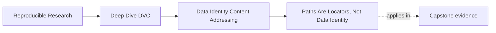
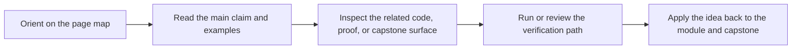
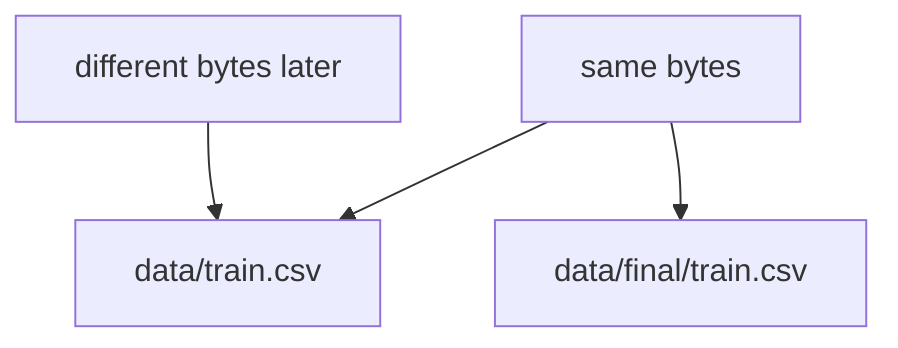

# Paths Are Locators, Not Data Identity

<!-- page-maps:start -->
## Page Maps

<!-- page-maps:end -->

Most teams start from a habit that feels obvious:

> the data is `data/train.csv`

That sentence is convenient. It is also too weak for reproducibility.

## What a path actually tells you

A path tells you:

- where a file is currently expected to live
- how some part of the workflow refers to it

A path does not tell you:

- whether the bytes changed
- whether the file was renamed or moved
- whether another machine has the same content at a different location
- whether two files with different names are actually identical

That is why Module 02 has to start here.

## A practical contrast

| Claim | What it really means |
| --- | --- |
| `data/train.csv` exists | a file is present at that path right now |
| `data/train.csv` is the dataset | too strong; the path is being mistaken for identity |
| these exact bytes produced the run | this is an identity claim, not only a path claim |

The problem is not that paths are useless.

The problem is that they are often asked to carry more truth than they can.

## Why path-based thinking breaks quickly

The same bytes can live at:

- `data/train.csv`
- `data/final/train.csv`
- `/mnt/datasets/train.csv`
- `~/Downloads/train.csv`

And different bytes can still live at the exact same path over time.

That means path and identity can drift apart in both directions:

- same data, different location
- same location, different data

## A human way to picture it

Once you see this, many later DVC ideas become less mysterious.

## A small example

Imagine a team renames:

- `data/train.csv` to `data/archive/2025-02-train.csv`

If the bytes are unchanged, the data identity has not changed even though the path has.

Now imagine the team overwrites `data/train.csv` in place with a newer export.

The path stayed the same, but the data identity changed.

This is the exact reason location-based thinking is too weak for reproducibility work.

## Why teams still rely on paths

Paths are easy to say out loud, easy to put in scripts, and easy to remember.

That convenience creates a trap:

- filenames begin to stand in for byte identity
- directories begin to stand in for versioning
- "the latest file" begins to stand in for a recoverable historical record

That is normal beginner behavior. Module 02 is the course correcting it.

## What stronger identity needs

A durable identity story needs something the path cannot provide on its own:

- a content-derived identifier
- a recorded reference to that identifier
- a way to restore the content later even if the workspace copy disappears

This is where DVC starts to become meaningful.

## The right question to ask

Instead of asking:

> where is the file?

start asking:

> what exact content is the system claiming, and where is that claim recorded?

That question prepares you for pointer files, cache objects, remotes, and recovery routes.

## Keep this standard

Whenever a path starts sounding like a version, pause.

Treat the path as a locator.

Then ask what the actual identity mechanism is. If that question has no clear answer yet,
the workflow is still relying on naming convention where it really needs content truth.
