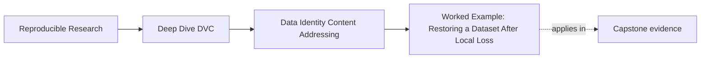

# Worked Example: Restoring a Dataset After Local Loss

<!-- page-maps:start -->
## Page Maps

<!-- page-maps:end -->

This example shows how Module 02 ideas fit together when you stop talking about files
abstractly and start asking what survives real failure.

The story is intentionally simple.

That helps the module show the important boundaries without burying them in platform detail.

## The situation

Suppose you have a DVC-tracked dataset in the workspace and say:

> the data is `data/raw/service_incidents.csv`, and we should be fine because it is already
> in the repo.

Then the local tracked file and local cache are removed.

Now the comforting sentence disappears, and the real questions begin.

## Step 1: Name the boundary problem correctly

The first correction is conceptual:

- `data/raw/service_incidents.csv` was never the identity by itself
- it was the workspace path pointing at tracked content identity

That sounds like small wording, but it changes how the whole incident is understood.

You are not asking:

> where did the file go?

You are now asking:

> can the repository recover the tracked content that this path used to project?

## Step 2: Check which layers still exist

At this point, you inspect:

- Git-tracked DVC files and `dvc.lock`
- the configured remote
- the recovery route and state summaries

What matters most is that:

- the recorded identity still exists in the repo story
- the remote still has the needed content

The missing workspace file is serious, but it is not the whole story.

## Step 3: Use the command model honestly

The recovery explanation is:

1. `dvc pull` restores tracked content from remote into local durable storage
2. `dvc checkout` rebuilds the workspace path from that tracked content

That is stronger than saying:

> we downloaded the file again.

The restored file matters because it came back through a recorded identity path, not only
through luck or a teammate copying something over Slack.

## Step 4: Ask what this proves

After the restore, you can now say:

- the workspace path was reconstructed
- the tracked content identity was durably recoverable
- local loss did not erase the repository's data story

That is a strong and valuable claim.

But Module 02 keeps the scope honest:

- this does not prove the dataset is semantically correct
- this does not replace the downstream publish contract
- this does not mean every internal file in the project is equally recoverable

## Step 5: Compare the layers explicitly

This is the moment where the module's state-layer vocabulary becomes useful:

- workspace: restored local file
- Git: recorded pointers and declarations
- cache: local durable copy now available again
- remote: the source of durability after loss
- publish: a narrower downstream trust surface, not the whole recovery story

Once you can say that in plain language, Module 02 is doing real work.

## What you should not say anymore

After this example, weak sentences should sound weak:

- the file is the identity
- Git had the data
- DVC magically rebuilt everything
- publish state is the whole repository story

The module is succeeding when you now notice those shortcuts on your own.

## The review note you would want

> The local workspace file was lost, but the tracked data identity remained recoverable
> because the repository still had recorded DVC state and the remote still held the
> content. `dvc pull` restored the durable local content, and `dvc checkout` rebuilt the
> workspace projection. This proves the recovery path for the tracked dataset is working.
> It does not by itself settle broader questions about data quality or the full published
> release boundary.

That is the level of precision Module 02 is trying to teach.

## Why this is a mastery example

This one story exercises the whole module:

- Core 1: the path stopped being mistaken for identity
- Core 2: content identity and pointer files became the real reference point
- Core 3: the layers were named distinctly
- Core 4: commands were explained as state moves
- Core 5: recovery was described as a bounded proof rather than as magic
