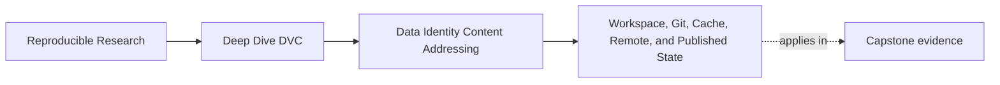
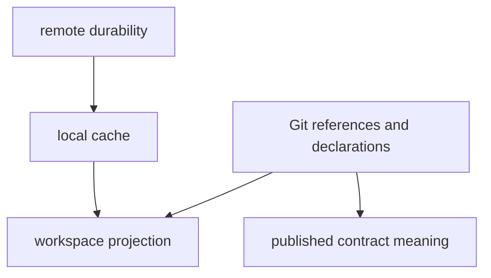

# Workspace, Git, Cache, Remote, and Published State

<!-- page-maps:start -->
## Page Maps

<!-- page-maps:end -->

One of the most important DVC habits is learning that the repository does not contain only
one kind of state.

Different layers answer different questions.

If you blur them together, recovery and trust will keep feeling magical.

## The five layers that matter in practice

| Layer | Main role | What it is good for |
| --- | --- | --- |
| workspace | current local files | active editing and local execution |
| Git | textual history and references | source review, pointer history, declared configuration |
| local DVC cache | content-addressed local storage | restoring tracked artifacts locally |
| remote storage | durable off-machine artifact storage | collaboration and recovery after loss |
| published release state | downstream contract surface | reviewable outputs other people may trust |

These layers are related. They are not interchangeable.

## A clean authority picture

This is not a strict implementation graph.

It is a teaching picture for a more important question:

which layer is authoritative for which fact?

## What the workspace is and is not

The workspace is where you see the familiar files.

It is useful for:

- running commands
- reading outputs
- editing code and configs

But the workspace is not the whole trust story.

Workspace files can be:

- deleted
- overwritten
- stale
- present without a durable recovery path

That is why the working tree alone is too weak as an authority layer.

## What Git is and is not

Git is authoritative for:

- source code history
- pointer files
- stage declarations
- configs and docs

Git is not authoritative for the actual bytes of tracked data artifacts.

That distinction is the bridge from Module 01 into DVC thinking.

## What the local cache is and is not

The local DVC cache is the local content store that connects recorded identity to actual
bytes.

It is useful for:

- reusing tracked artifacts
- restoring files back into the workspace
- keeping content identity operational rather than theoretical

But local cache is still only local durability.

If the machine is lost and nothing was pushed, the story is incomplete.

## What the remote is and is not

The remote is part of the repository's recovery story.

It matters because it lets the team say:

- these tracked artifacts survive local loss
- another machine can retrieve them
- collaboration does not depend on one laptop's cache

But remote storage is not the same thing as the whole published contract. Durability and
downstream trust are related, but they are not identical questions.

## What published state is and is not

Published release state such as `publish/v1/` answers a narrower question:

- what may a downstream reviewer or consumer trust

It is smaller than the full repository story on purpose.

That means published state is not:

- the entire execution history
- the whole internal cache
- a replacement for `dvc.lock`

This separation becomes very important in later modules.

## A small example

Suppose you ask:

> I can see `metrics.json` in my workspace. Doesn't that mean the result is safe?

The answer depends on the layer question:

- workspace says the file exists locally
- Git may record how the pipeline refers to it
- cache may make it locally restorable
- remote may make it durably recoverable
- published state may decide whether it is part of the downstream contract

One visible file can participate in several different stories.

## A good discipline question

Whenever you inspect a DVC repo, ask:

1. which layer am I currently looking at
2. what kind of authority does that layer actually have
3. which layer would I need to inspect next to answer the full question honestly

That habit makes Module 02 much easier to carry forward.

## Keep this standard

Do not let the repository collapse into one mental bucket called "the state."

Keep asking:

- is this mutable local state
- is this recorded reference state
- is this recovery state
- is this downstream trust state

That vocabulary is what keeps DVC legible rather than mystical.
