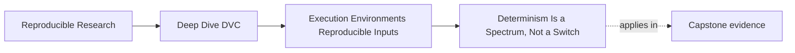
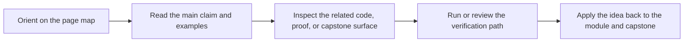
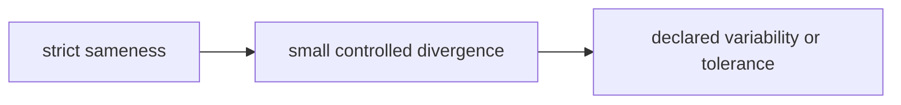

# Determinism Is a Spectrum, Not a Switch

<!-- page-maps:start -->
## Page Maps

<!-- page-maps:end -->

Teams often talk as if workflows are either deterministic or not.

That is usually too blunt to be useful.

Module 03 gets more accurate by treating determinism as a spectrum of control and
sensitivity.

## Why this matters

If you imagine determinism as an all-or-nothing property, you make bad diagnoses:

- small numeric drift looks like chaos
- any mismatch looks like user error
- environment strategy becomes moralized instead of engineered

A spectrum model is calmer and more honest.

## Three broad zones

| Zone | Typical situation | What it means for review |
| --- | --- | --- |
| strongly deterministic | simple sequential logic with tightly controlled inputs | divergence is usually a strong signal of a real change |
| conditionally deterministic | many ML and numerical workflows | divergence may reflect environment or execution differences rather than human error |
| inherently variable | asynchronous, hardware-sensitive, or stochastic behavior | the workflow may need declared tolerance or comparison policy rather than exact sameness |

Most real DVC workflows live in the middle zone more often than teams admit.

## A small example

Suppose two honest runs differ by a tiny metric change.

Weak interpretation:

> someone must have changed the code or the data.

Stronger interpretation:

> the workflow may be conditionally deterministic, and the environment or execution context
> may have shifted enough to change the result slightly.

That second explanation is not hand-waving. It is often the correct starting point.

## Where conditional determinism comes from

Examples include:

- floating-point reductions
- threaded numerical libraries
- GPU kernels
- ordering-sensitive file enumeration
- stochastic algorithms whose seeds or runtime behavior are only partly controlled

These do not mean the workflow is hopeless.

They mean the team needs to know what exact sameness is realistic and what evidence is
needed when results differ.

## A practical picture

The point of the picture is not classification for its own sake. It is to help you choose
the right response.

## What strong response looks like

When divergence appears, ask:

1. is the workflow expected to be strongly deterministic here
2. what environment or runtime conditions could move it into conditional behavior
3. what level of difference is meaningful for this workflow

Those questions produce better engineering choices than reflexively pinning everything or
blaming the user.

## Why this matters for DVC specifically

DVC helps keep data, stages, and recorded state explicit.

That makes divergence easier to interpret, but it does not force the runtime world into
perfect sameness.

So you need two ideas at once:

- DVC makes important parts of the workflow more inspectable
- inspectable is not the same as mathematically identical under every runtime condition

## A helpful discipline

If a workflow is only conditionally deterministic, the team should be able to say:

- which sources of variance are expected
- which ones are unacceptable
- which environment evidence matters most when reviewing drift

That is much stronger than saying only "sometimes CI is weird."

## Keep this standard

Do not force every divergence into one of two simplistic stories:

- perfect sameness should always happen
- nothing can ever be trusted

Most real workflows need a better sentence:

> this pipeline is deterministic only under certain declared conditions, and we need to
> review those conditions honestly.
