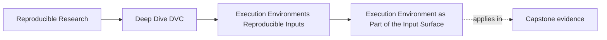
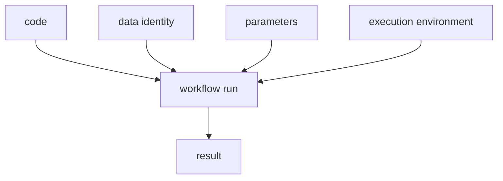

# Execution Environment as Part of the Input Surface

<!-- page-maps:start -->
## Page Maps

<!-- page-maps:end -->

One of the most persistent reproducibility mistakes is treating the environment as if it
were just background scenery.

It is not.

If the environment can change the result, then it belongs in the workflow story.

## What counts as environment here

In this module, environment means the runtime facts that influence execution even when
they are not part of the data files or source code:

- interpreter version
- library versions
- system tools
- CPU or GPU behavior
- thread settings
- locale, timezone, and filesystem behavior
- randomness sources and seeds

The list can grow, but the main idea stays stable:

if it can change the result, it is part of the input surface.

## Why this matters after Module 02

Module 02 taught that data identity is not the same thing as a path.

Module 03 adds the next layer:

even if the same exact data identity is present, the run may still differ because the
environment changed.

That is why byte-stable data alone is not enough for a full reproducibility story.

## A practical contrast

| Workflow claim | Too weak because it ignores environment |
| --- | --- |
| the code is unchanged | runtime behavior may still differ |
| the data is unchanged | environment may still influence output |
| the parameters are unchanged | the stack and execution context may still drift |

This is not a niche edge case. It is ordinary in real teams.

## A small example

Imagine two teammates both run the same training script with:

- the same Git commit
- the same DVC-tracked data
- the same parameter file

But one person uses:

- a newer Python interpreter
- a slightly different numerical library stack
- a different CPU architecture

If the metric drifts, that is not automatically a sign of carelessness.

It may simply mean the environment was part of the real input surface all along.

## A human picture

You do not need to worship this diagram. You need to use it as a reminder not to drop one
whole class of inputs from the story.

## Why teams overlook this

Environment is easy to ignore because:

- it feels shared until it stops being shared
- it changes gradually
- the original author's machine keeps working for a while
- "works on my machine" can look like a small nuisance instead of a structural clue

That is why this module names the issue directly before later modules rely on it.

## What this page is not claiming

This page is not claiming that every tiny environment detail must be pinned perfectly for
all work.

It is claiming something more basic:

the team must know which environment facts are influential enough to deserve explicit
control, evidence, or declared tolerance.

That is the start of engineering judgment.

## A good first review question

Ask of any surprising result:

1. what data changed
2. what code changed
3. what parameters changed
4. what environment facts may also have changed

If the first three questions are treated as serious but the fourth is treated as folklore,
the workflow is still missing part of its own input surface.

## Keep this standard

Do not let runtime be treated as weather.

If the environment can influence the result, then it belongs in the causal story of the
run, even when no one meant it to.
