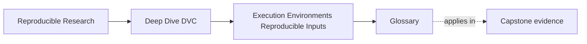
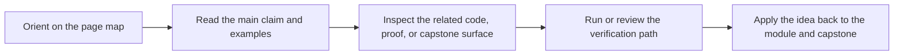

# Glossary

<!-- page-maps:start -->
## Page Maps

<!-- page-maps:end -->

This glossary keeps the language of Module 03 stable.

The goal is practical runtime clarity: when you keep environment, determinism, and tool
boundaries distinct, drift becomes reviewable instead of spooky.

## Terms

| Term | Meaning in this module |
| --- | --- |
| execution environment | The runtime surface that can influence results beyond data, code, and declared parameters, such as interpreters, libraries, OS/runtime behavior, or hardware. |
| environment input surface | The subset of runtime facts that matter enough to belong in the causal story of a run. |
| environment drift | Meaningful runtime difference between executions that can influence behavior even when other workflow state still matches. |
| deterministic | A run whose outputs stay the same under the conditions that matter for review. |
| conditionally deterministic | A run whose sameness depends on certain runtime conditions being held stable. |
| canonical executor | The environment a team treats as the authoritative reference for proof, usually a CI context or similarly controlled runtime. |
| runtime evidence | Concrete artifacts or reports that help explain environment state, such as version reports, lockfiles, container definitions, or CI metadata. |
| lockfile | A dependency-resolution artifact that records package versions more explicitly than loose dependency declarations alone. |
| container strategy | A runtime-control approach that standardizes more of the software image across machines and automation. |
| CI authority | The practice of treating one automated execution environment as the shared proof route for the team. |
| DVC environment boundary | The line between what DVC helps make diagnosable and what still belongs to lockfiles, containers, CI, or policy. |
| acceptable drift | A declared level of result variation that the workflow or team considers consistent with its current runtime strategy. |

## How to use these terms

If Module 03 starts feeling vague, ask which term has blurred:

- is this a data or parameter problem, or is it environment drift?
- is the workflow deterministic here, or only conditionally deterministic?
- is this evidence about DVC-recorded state, or runtime evidence from another layer?
- is the team using CI as a canonical executor, or only as another machine?

Those questions usually turn a fuzzy runtime complaint into a reviewable explanation.
