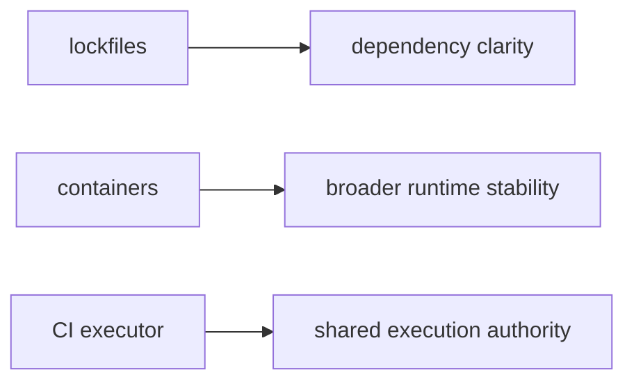

# Lockfiles, Containers, and CI as Environment Strategies

Once the environment is treated as part of the input surface, the next question is:

> how should we control it?

There is no single correct answer for every workflow.

Module 03 goes better when learners see lockfiles, containers, and CI as different
strategies with different strengths rather than as competing slogans.

## Three common strategies

| Strategy | What it is best at | What it does not solve fully |
| --- | --- | --- |
| lockfiles | making dependency resolution explicit and reviewable | OS, driver, and hardware variation may still matter |
| containers | standardizing more of the runtime image across machines | some hardware and runtime differences still remain |
| CI as canonical executor | giving the team one trusted execution environment for comparison and review | local exploration may still differ and needs interpretation |

These are not mutually exclusive. Mature teams often combine them.

## Lockfiles

Lockfiles are a good first step when the team needs:

- explicit dependency versions
- fast iteration
- reviewable environment change history

They are especially useful because they keep environment drift from staying completely
implicit.

But they do not magically erase:

- operating system differences
- low-level library behavior
- machine-specific runtime details

So lockfiles are important, but they are not the whole environment story.

## Containers

Containers standardize more of the runtime surface by packaging a broader environment
image.

That helps with:

- portability across machines
- CI consistency
- reducing local setup drift

But containers still do not guarantee:

- identical host hardware behavior
- every GPU or driver detail
- perfect determinism in all numerical workloads

Containers are stronger control, not total control.

## CI as a canonical executor

Sometimes the most pragmatic answer is not "every machine must match perfectly."

Sometimes it is:

> the workflow is considered reproducible when it can be run and reviewed in one trusted CI environment.

This is powerful because it gives the team:

- a shared reference executor
- one consistent place for proof routes
- a practical standard for release and review

It also reduces arguments about whose laptop is "the real environment."

## A practical picture

The point is not to rank them absolutely. The point is to see what kind of control each
one contributes.

## A small example

Suppose a team keeps seeing tiny differences between local laptops.

A weak response is:

> let's promise exact sameness everywhere.

A stronger response might be:

- use lockfiles so dependency change is reviewable
- use containers for broader runtime consistency in automation
- treat CI as the canonical proof route

That answer is more realistic and easier to govern.

## Why combinations are normal

Real teams often need more than one strategy:

- lockfiles for reviewable dependency change
- containers for CI and portability
- CI for authoritative comparison and release proof

This is not overengineering by default. It is often the honest way to separate local
convenience from canonical execution.

## What DVC contributes inside these strategies

DVC does not replace these environment tools.

What it contributes is that data, stages, parameters, and recorded execution stay visible
while the environment strategy does its own job.

That combination is what makes later diagnosis and review sane.

## Keep this standard

Do not ask:

> which environment strategy is universally best?

Ask:

> which strategy gives this workflow the right balance of explicitness, stability, and
> shared authority?

That is the question Module 03 wants learners to carry forward.
