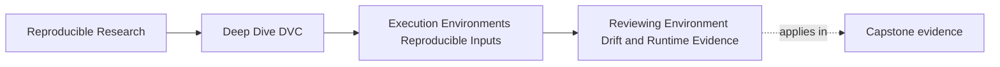
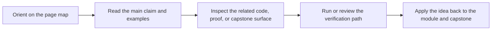
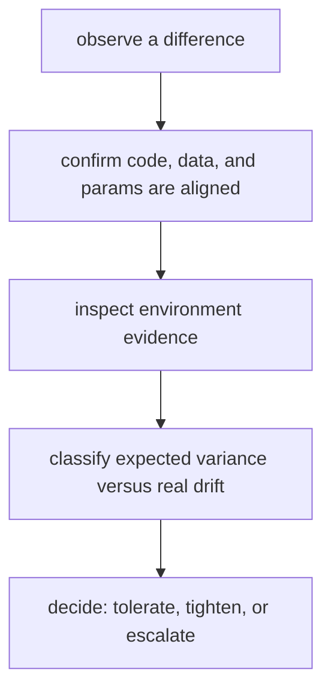

# Reviewing Environment Drift and Runtime Evidence

<!-- page-maps:start -->
## Page Maps

<!-- page-maps:end -->

Environment drift is easy to talk about loosely and hard to review honestly.

This page is about turning it into a sequence of concrete questions.

## The main review question

When a run differs unexpectedly, ask:

> what evidence suggests this is an environment difference rather than data, parameter, or
> stage drift?

That question matters because "it must be the environment" is only slightly better than
guessing.

## A practical drift ladder

This ladder keeps the diagnosis from collapsing into folklore.

## Start with what you can rule out

Before blaming the environment, confirm:

- the same tracked data was used
- the same declared parameters were used
- the same recorded workflow route applies

This is exactly where DVC's explicit state helps. It narrows the search space.

## Then inspect runtime evidence

For Module 03, useful environment evidence includes:

- tool and interpreter versions
- local versus CI platform reports
- declared install surface
- any documented environment strategy such as lockfiles or containers

The capstone's `make platform-report` is helpful because it gives you a concrete example of
environment evidence that is small, reviewable, and relevant.

## Distinguish three kinds of findings

| Finding | Meaning |
| --- | --- |
| expected variance | the workflow is only conditionally deterministic here, and the difference is within declared tolerance |
| environment drift | a meaningful runtime change likely affected the result |
| deeper workflow issue | the environment was blamed too early, and the real problem lives elsewhere |

This distinction is what keeps the review disciplined.

## A small example

Suppose local and CI metrics differ slightly.

A calm review might say:

1. data identity matches
2. `params.yaml` matches
3. pipeline declaration matches
4. platform-report shows a Python or DVC version difference
5. the metric delta is small enough to treat as conditional determinism, or large enough to escalate

That is much stronger than:

> CI is flaky again.

## Why tolerances need honesty

Not every difference deserves panic.

But tolerance needs to be declared, not assumed retroactively after every surprise.

Strong teams can say:

- this amount of drift is expected under our current environment strategy
- this amount of drift is not acceptable for release or comparison

That is what turns runtime variability into something governable.

## When to escalate

Escalate when:

- the drift is too large to fit the workflow's declared tolerance
- a release or comparison claim depends on stronger sameness
- the team does not yet have enough environment evidence to explain the difference

Escalation here does not mean panic. It means the current evidence is no longer enough.

## Keep this standard

Do not let "environment issue" become a polite way of saying "we do not know."

Ask for:

- the evidence
- the ruled-out alternatives
- the expected tolerance
- the next action

That is the review discipline Module 03 is trying to build.
