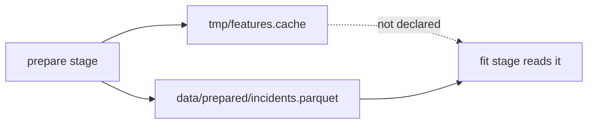

# Dependency, Parameter, and Output Boundaries

The hardest part of a truthful DVC stage is often not the command. It is the boundary
judgment around the command.

Learners need to decide:

- which files are real dependencies
- which values are parameters rather than code details
- which artifacts are outputs owned by the stage
- which files are temporary scratch and should not become part of the public graph

These decisions make `dvc repro` predictable. They also make review conversations less
vague, because the team can point to the exact field that carries the claim.

## Dependencies are real reads

A dependency is something the command reads to produce its result.

Good dependency questions are concrete:

- Would changing this file possibly change the output?
- Would removing this file make the command fail or produce a different result?
- Does the command read this path directly or through a library call?
- Is this source file part of the implementation that should trigger rerun when changed?

Example:

```yaml
stages:
  evaluate:
    cmd: python -m incident_escalation_capstone.evaluate
    deps:
      - data/prepared/incidents.parquet
      - models/escalation-model.json
      - src/incident_escalation_capstone/evaluate.py
    params:
      - evaluate.threshold
    outs:
      - reports/evaluation.json
```

This tells the reviewer that evaluation depends on the prepared data, the model, the
evaluation implementation, and a threshold value. If the command also reads
`data/reference/team_roster.csv`, the declaration is incomplete.

That missing file is not a small clerical issue. It means `dvc repro` may skip evaluation
after a roster change even though the report is stale.

## Parameters are reviewable controls

Parameters are not just variables. They are values the team wants to change, compare, and
review as controls.

Good parameter candidates include:

- thresholds
- train/test split values
- random seeds
- model family choices
- feature toggles
- filtering limits

Bad parameter candidates include values that are only implementation plumbing or values
that would be clearer as ordinary code constants.

The key question is:

> If this value changed, would a reviewer want the pipeline to notice and the history to
> explain it?

If yes, it probably belongs in `params.yaml` and under the stage's `params`.

Example:

```yaml
# params.yaml
fit:
  model_family: logistic_regression
  regularization: 0.2
  random_seed: 20260411
```

```yaml
# dvc.yaml
stages:
  fit:
    cmd: python -m incident_escalation_capstone.fit
    deps:
      - data/prepared/incidents.parquet
      - src/incident_escalation_capstone/fit.py
    params:
      - fit.model_family
      - fit.regularization
      - fit.random_seed
    outs:
      - models/escalation-model.json
```

Now a change to `fit.regularization` is not hidden inside Python. It becomes a declared
control change.

## Outputs are owned artifacts

An output is an artifact the stage is responsible for producing.

Good output questions:

- Does this stage create or replace the artifact?
- Would downstream stages treat this artifact as an input?
- Should DVC record the content identity of this artifact?
- Would losing this artifact require rerunning this stage or restoring from cache?

Outputs should be specific enough to make ownership clear. A broad output directory can
be right when the stage truly owns the whole directory. It is risky when multiple stages
write into the same directory.

Weak:

```yaml
outs:
  - reports/
```

Clearer:

```yaml
outs:
  - reports/evaluation.json
  - reports/error-slices.csv
```

The clearer version says exactly what the evaluation stage owns.

## Scratch space is not an output contract

Many commands create temporary files while they run.

Not every temporary file belongs in `outs`. If a file is purely scratch, the better design
is often to keep it under an internal work directory and remove it or keep it outside the
review contract.

The danger is accidental reliance:



In this diagram, `fit` has a hidden dependency on scratch. The pipeline may appear to
work on one machine and break or go stale on another.

If the file matters to a later stage, promote it into a declared output of the producer
and a declared dependency of the consumer. If it does not matter, keep later stages from
reading it.

## A placement table for review

| Influence | Best placement | Why |
| --- | --- | --- |
| raw CSV read by a command | `deps` | content change should influence rerun |
| Python module containing the command behavior | `deps` | implementation change should be visible |
| threshold chosen by the team | `params` | control change should be reviewable |
| model file produced by training | `outs` | DVC should record and restore it |
| log file used only for debugging | usually outside `outs` | it is not part of the result contract |
| shared feature file used downstream | producer `outs`, consumer `deps` | ownership and use must both be declared |

The table is not a law book. It is a way to slow down and ask the right question.

## Review checkpoint

You understand this core when you can inspect one command and separate:

- real reads from convenient nearby files
- reviewable controls from ordinary implementation detail
- owned outputs from temporary run artifacts
- shared intermediates from accidental leftovers

The goal is simple: after reading `dvc.yaml`, a reviewer should understand what can
legitimately change the result and where that change is recorded.
