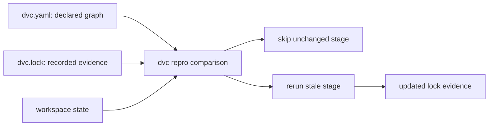

# DVC Repro, Staleness, and Lock Evidence

`dvc repro` is easiest to misunderstand when you treat it like a smarter shell script.

It is better to treat it as a graph reviewer:

> Compare declared current state with recorded previous state, then rerun the stages whose
> declaration no longer matches the evidence.

This is why Module 04 keeps pairing `dvc.yaml` and `dvc.lock`. One file declares the
pipeline. The other records what happened when that declaration was last executed.

## The two files answer different questions

`dvc.yaml` answers:

- which stages exist
- which command each stage runs
- which files, directories, and parameters each stage declares
- which outputs each stage owns

`dvc.lock` answers:

- which dependency versions were recorded
- which parameter values were used
- which outputs were produced
- which command text was associated with the recorded run

Reading only `dvc.yaml` tells you the intended contract. Reading only `dvc.lock` tells
you recorded evidence without enough design context. Reading them together gives you a
reviewable execution story.



## What staleness means

A stage is stale when its current declared state no longer matches the recorded lock
evidence.

Common reasons include:

- a declared dependency changed content
- a declared parameter value changed
- the command text changed
- a declared output is missing
- an upstream stage changed and the downstream stage depends on its output

Notice the repeated word: declared.

DVC is comparing what it knows. If a command secretly reads an undeclared file, a change
to that file does not automatically make the stage stale. That is not a mysterious DVC
failure. It is a graph truth failure.

## A small rerun story

Imagine this graph:

```yaml
stages:
  prepare:
    cmd: python -m incident_escalation_capstone.prepare
    deps:
      - data/raw/service_incidents.csv
    params:
      - prepare.minimum_severity
    outs:
      - data/prepared/incidents.parquet
  fit:
    cmd: python -m incident_escalation_capstone.fit
    deps:
      - data/prepared/incidents.parquet
    params:
      - fit.model_family
    outs:
      - models/escalation-model.json
```

If `prepare.minimum_severity` changes, `prepare` becomes stale. If `prepare` produces a
new `data/prepared/incidents.parquet`, then `fit` becomes stale because its dependency
changed.

That downstream rerun is not noise. It is the graph doing the honest thing.

If `fit.model_family` changes, `fit` becomes stale, but `prepare` does not need to rerun.
The change belongs to model fitting, not preparation.

This is the kind of prediction you should make before running `dvc repro`.

## What the lock file records

A simplified lock excerpt might look like this:

```yaml
stages:
  fit:
    cmd: python -m incident_escalation_capstone.fit
    deps:
      - path: data/prepared/incidents.parquet
        hash: md5
        md5: 7d793037a0760186574b0282f2f435e7
    params:
      params.yaml:
        fit.model_family: logistic_regression
    outs:
      - path: models/escalation-model.json
        hash: md5
        md5: 0c4d6a2f1eb4c6e4f2e2a2f2b913f5c8
```

The exact lock schema can vary by DVC version and output type. The lesson is more stable
than the formatting:

- dependencies have recorded content identity
- parameters have recorded values
- outputs have recorded content identity
- the command is part of the recorded stage evidence

Treating `dvc.lock` as disposable generated clutter breaks the review chain. Without it,
the repository keeps a declaration but loses the recorded result of that declaration.

## Why prediction matters

Before running `dvc repro`, make a prediction:

- which stage should rerun
- which stage should stay unchanged
- which downstream stages should rerun because their inputs changed
- which lock evidence should update afterward

Then compare the prediction with the actual result.

If a stage reruns unexpectedly, the graph may be broader than you thought. If a stage
does not rerun when it should, the graph may be missing a real influence. Both outcomes
are useful evidence.

The point is not to memorize DVC output text. The point is to make your mental graph meet
the declared graph.

## Review checkpoint

You understand this core when you can answer:

- what `dvc.yaml` declares
- what `dvc.lock` records
- why a declared dependency or parameter change makes a stage stale
- why undeclared influence is invisible to `dvc repro`
- why downstream reruns can be evidence of a correct graph
- why lock evidence should be committed with the declaration it records

Once that is clear, `dvc repro` stops feeling mystical. It becomes a consistency check
between declaration, workspace state, and recorded evidence.
