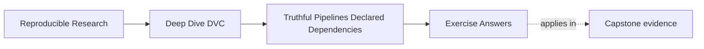

# Exercise Answers


<!-- page-maps:start -->
## Page Maps




<!-- page-maps:end -->

These answers are model explanations, not the only acceptable wording.

What matters is whether the reasoning keeps the declared graph, real command behavior, and
lock evidence connected.

## Answer 1: Read a stage contract

The stage promises:

- run `python -m incident_escalation_capstone.prepare`
- read `data/raw/service_incidents.csv`
- produce `data/prepared/incidents.parquet`

The stage should become stale when:

- the raw incidents file changes
- the command text changes
- the declared output is missing
- lock evidence no longer matches the declared current state

What still needs inspection:

- whether the command reads any other files, such as reference tables or schemas
- whether it uses control values that belong in `params.yaml`
- whether it writes additional artifacts that should be declared
- whether implementation files should be listed as dependencies in this course's chosen convention

The main lesson is that the YAML is a claim. Reviewers still need to verify that the claim
matches the real read and write behavior.

## Answer 2: Place each influence

Strong placement:

```yaml
deps:
  - models/escalation-model.json
  - data/prepared/incidents.parquet
  - data/reference/escalation_policy.csv
params:
  - evaluate.threshold
outs:
  - reports/evaluation.json
```

The model, prepared data, and policy CSV are file reads, so they belong in `deps`.

The threshold is a reviewed control value, so it belongs in `params`.

The temporary log should usually stay outside the output contract unless it is a reviewed
artifact that downstream readers rely on. If it is only debugging residue, declaring it as
an output makes the stage noisier without improving the provenance story.

## Answer 3: Predict reruns

If the raw incidents file changes and `prepare` produces a new prepared output:

- `prepare` should rerun because its declared input changed
- `fit` should rerun because it depends on the prepared output
- `evaluate` should rerun if it depends on either the prepared output or the model output

If `fit.model_family` changes:

- `fit` should rerun because its declared parameter changed
- `evaluate` should rerun if the model output changes and evaluation depends on that model
- `prepare` should not rerun because the change does not belong to preparation

If `evaluate.threshold` changes:

- `evaluate` should rerun
- `prepare` and `fit` should not rerun unless their declared state also changed

If an unrelated README changes:

- no DVC stage should rerun unless the README is declared as a dependency somewhere

The main lesson is to predict from declared edges, not from a vague feeling that "the
pipeline changed."

## Answer 4: Diagnose stale output risk

Strong review response:

> The evaluation stage likely has a missing dependency. If the command reads
> `data/reference/escalation_policy.csv`, that path should appear in the stage's `deps`.
> This is more dangerous than an extra rerun because DVC can skip evaluation even after a
> meaningful input changes, leaving a stale report that looks current. Add the policy CSV
> to `deps`, rerun the stage, and confirm `dvc.lock` records the policy dependency and the
> updated evaluation output evidence.

Concrete repair:

```yaml
deps:
  - models/escalation-model.json
  - data/prepared/incidents.parquet
  - data/reference/escalation_policy.csv
```

The exact list may include the evaluation implementation file too, depending on the
course repository convention.

## Answer 5: Refactor a mixed stage

A strong split answer:

```yaml
stages:
  fit:
    cmd: python -m incident_escalation_capstone.fit
    deps:
      - data/prepared/incidents.parquet
    params:
      - fit.model_family
    outs:
      - models/escalation-model.json
  evaluate:
    cmd: python -m incident_escalation_capstone.evaluate
    deps:
      - data/prepared/incidents.parquet
      - models/escalation-model.json
    params:
      - evaluate.threshold
    outs:
      - reports/evaluation.json
```

Why this is stronger when the model is a meaningful intermediate:

- a model control change reruns fitting and then evaluation
- an evaluation threshold change reruns only evaluation
- the model artifact has a clear owner
- review can separate "why did the model change?" from "why did the report change?"

A defensible keep-together answer is possible only if the model has no independent review
or reuse value and the combined command truly owns both outputs as one cohesive result.
In that case, you should still explain why both outputs share the same inputs and
controls.

## Self-check

If your answers consistently explain:

- what the stage declaration promises
- where each real influence belongs
- how rerun prediction follows declared state
- why stale output risk should be repaired before convenience cleanup
- how graph shape affects provenance clarity

then you are using Module 04 correctly.
