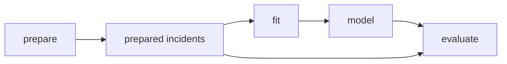

# Exercises

Use these exercises to practice pipeline judgment, not only DVC vocabulary.

The strongest answers will explain the declared graph, the hidden influence risk, and the
evidence you would expect from `dvc.lock`.

## Exercise 1: Read a stage contract

You see this stage:

```yaml
stages:
  prepare:
    cmd: python -m incident_escalation_capstone.prepare
    deps:
      - data/raw/service_incidents.csv
    outs:
      - data/prepared/incidents.parquet
```

Write a short explanation of:

- what the stage promises
- what changes should make it stale
- what you still need to inspect before trusting the declaration

## Exercise 2: Place each influence

An evaluation command reads:

- `models/escalation-model.json`
- `data/prepared/incidents.parquet`
- `data/reference/escalation_policy.csv`
- a threshold value from `params.yaml`
- a temporary log file written during the run

Decide which items belong in `deps`, which belong in `params`, which belong in `outs`, and
which should probably stay outside the output contract.

Explain your reasoning.

## Exercise 3: Predict reruns

Use this graph:



Predict what should rerun when:

- the raw incidents file changes and `prepare` produces a new prepared output
- `fit.model_family` changes
- `evaluate.threshold` changes
- an unrelated README changes

Explain each prediction in terms of declared dependencies and parameters.

## Exercise 4: Diagnose stale output risk

You review this report:

> I changed `data/reference/escalation_policy.csv`, ran `dvc repro`, and evaluation did not
> rerun. But the evaluation command uses that file.

Write a review response that explains:

- the likely graph problem
- why this is more dangerous than an extra rerun
- the concrete declaration repair
- what lock evidence should show after the repair and rerun

## Exercise 5: Refactor a mixed stage

A stage currently fits a model and evaluates it in one command:

```yaml
stages:
  train_and_evaluate:
    cmd: python -m incident_escalation_capstone.train_and_evaluate
    deps:
      - data/prepared/incidents.parquet
    params:
      - fit.model_family
      - evaluate.threshold
    outs:
      - models/escalation-model.json
      - reports/evaluation.json
```

Propose either:

- a split into clearer stages, if you think the model is a meaningful intermediate
- a justification for keeping it together, if you think the combined boundary is more honest

Your answer should explain how the refactor affects rerun behavior and review clarity.

## Mastery check

You have a strong grasp of this module if your answers consistently keep five ideas
visible:

- a stage contract is a reviewable promise, not only a command
- file reads and control values belong in different declaration fields
- `dvc repro` only reacts to declared influence
- stale outputs are a correctness risk, while false reruns are usually visible waste
- graph refactoring is safe when it preserves the provenance story
